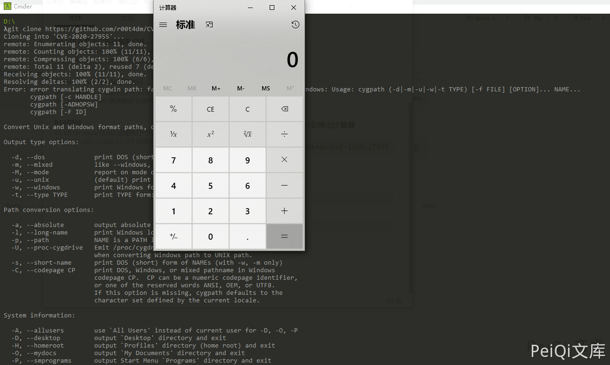

# Git-LFS 远程命令执行漏洞 CVE-2020-27955

## 漏洞描述

Git LFS 是 Github 开发的一个 Git 的扩展，用于实现 Git 对大文件的支持

一些受影响的产品包括Git，GitHub CLI，GitHub Desktop，Visual Studio，GitKraden，SmartGit，Sourcetree等

该漏洞影响仅windows平台

## 漏洞影响

```
Git-LFS（git-lfs）<= 2.12
```

## 漏洞复现

运行下列的命令，如果版本在影响范围则会弹出计算器

```plain
git clone https://github.com/r00t4dm/CVE-2020-27955
```




## 漏洞POC

```plain
https://github.com/r00t4dm/CVE-2020-27955
```

