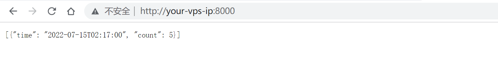
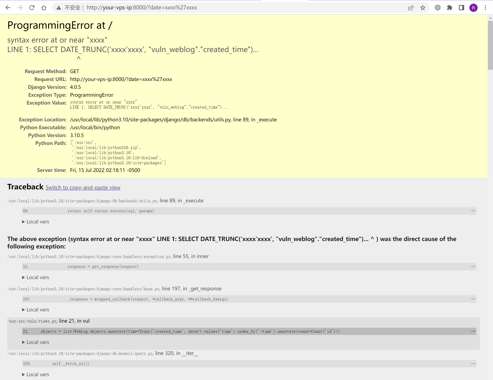

# Django Trunc(kind) and Extract(lookup_name) SQL 注入漏洞 CVE-2022-34265

## 漏洞描述

Django 在 2022 年 7 月 4 日发布了安全更新，修复了在数据库函数 `Trunc()` 和 `Extract()` 中存在的 SQL 注入漏洞。

参考链接：

- https://www.djangoproject.com/weblog/2022/jul/04/security-releases/

## 漏洞环境

启动一个 Django 4.0.5 版本的服务器：

```
docker-compose up -d
```

环境启动后，你可以在 `http://your-ip:8000` 看到一个页面。这个页面使用了 Trunc 函数来聚合页面点击数量，比如使用 `http://your-ip:8000/?date=minute` 即可看到按照分钟聚合的点击量：



## 漏洞复现

修改 `date` 参数即可复现 SQL 注入漏洞：

```
http://your-ip:8000/?date=xxxx'xxxx
```


